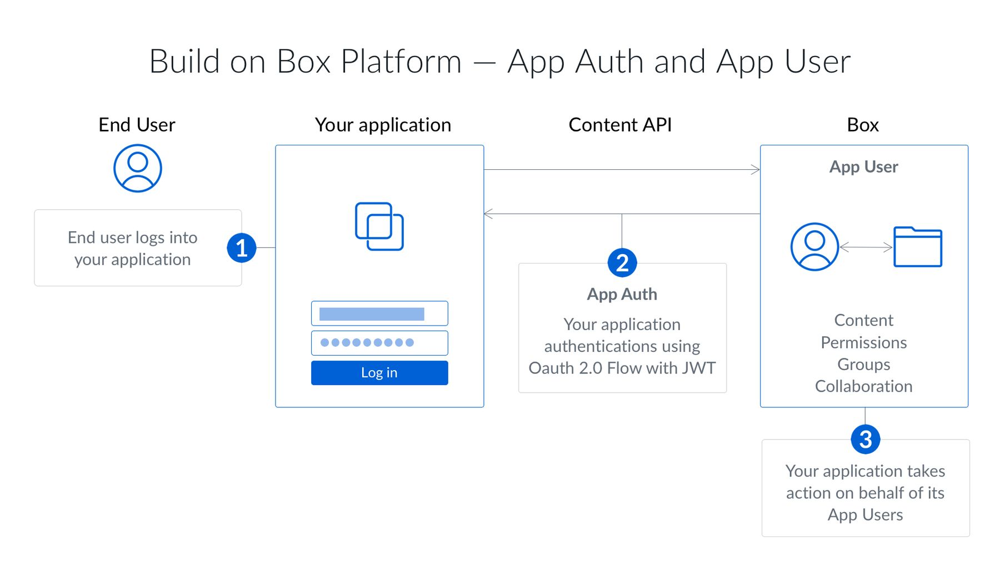

# JWT認証

JWTを使用するサーバー側の認証は、Box APIで認証するための最も強力な方法の1つです。JWTは、効果的にサーバー間認証を実現するよう設計された[オープンスタンダード](https://jwt.io/)です。

<ImageFrame border>

</ImageFrame>

JSON Web Token (JWT)を使用するサーバー側の認証は、カスタムアプリと企業統合のみで使用できます。ユーザーが承認フローに関与することはないため、社内の任意のユーザーの代わりに処理を実行するために使用できます。JWTでは、公開/秘密キーペアを使用してアプリケーションの権限を確認します。

## JWTの制限

JWTを使用するサーバー側の認証は、アプリケーションのサーバーで要求を作成し、アプリケーションの秘密キーを使用してこれに署名することで機能します。 その要求は、サーバーがBoxアプリケーションに代わって動作することを許可されている場合がほとんどです。

このため、JWTを使用するすべてのアプリケーションには、デフォルトユーザーとして認証する[サービスアカウント](g://authentication/user-types)が関連付けられています。このユーザーは管理者に似たユーザーであるため、JWTアプリケーションを使用するには、実際のBox管理者の承認が必要になります。

## JWTを使用する場合

JWTを使用するサーバー側認証は、以下に当てはまるアプリに最適な認証方式です。

* Boxアカウントを持たないユーザーを使用する
* 独自のIDシステムを使用する
* ユーザーにBoxを使用していることを認識させたくない
* アプリケーションのBoxアカウントにデータを保存し、ユーザーのBoxアカウントには保存しない
