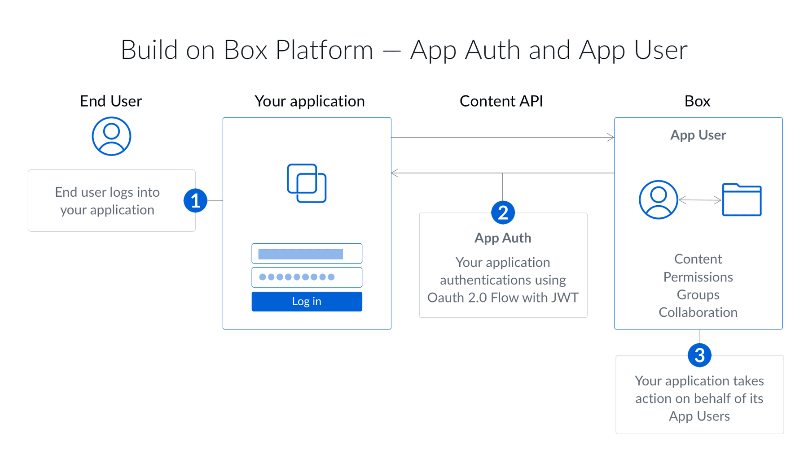

# JWT認証

JSONウェブトークン (JWT) を使用するサーバー側の認証は、Box APIで認証するための最も一般的な方法です。JWTは、効果的にサーバー間認証を実現するよう設計された[オープンスタンダード](https://jwt.io/)です。

<ImageFrame border>

</ImageFrame>

JWTを使用するサーバー側の認証は、[アプリの種類][app-type]がカスタムアプリケーションの場合のみ使用できます。この認証方法ではエンドユーザーによる操作が必要ありません。また、適切な権限が付与されていれば、この認証方法を使用して、社内の任意のユーザーの代理で操作することができます。

アプリケーションの権限を確認する方法は2つあります。

* 公開キーと秘密キーのペアを使用する
* クライアントIDとクライアントシークレット ([クライアント資格情報許可][cca]) を使用する

これらのオプションの詳細については、[SDKを使用しないJWT][jwtnosdk]の使用に関するガイドを参照してください。

Box管理コンソールでJWTアプリケーションを承認すると、[サービスアカウント][sa]が自動的に生成され、認証時に使用されるデフォルトのアクセストークンになります。これは、管理者に似たユーザーであり、JWTを利用するアプリケーションを使用する前にBox管理者による明示的な承認が必要となる理由です。

## JWTを使用する場合

JWTを使用するサーバー側認証は、以下に当てはまるアプリに最適な認証方法です。

* Boxアカウントを持たないユーザーを使用する
* 独自のIDシステムを使用する
* ユーザーにBoxを使用していることを認識させたくない
* アプリケーションのBoxアカウントにデータを保存し、ユーザーのBoxアカウントには保存しない

[app-type]: g://applications/app-types/select

[sa]: page://platform/user-types/#service-account

[jwtnosdk]: g://authentication/jwt/without-sdk

[cca]: g://authentication/client-credentials
