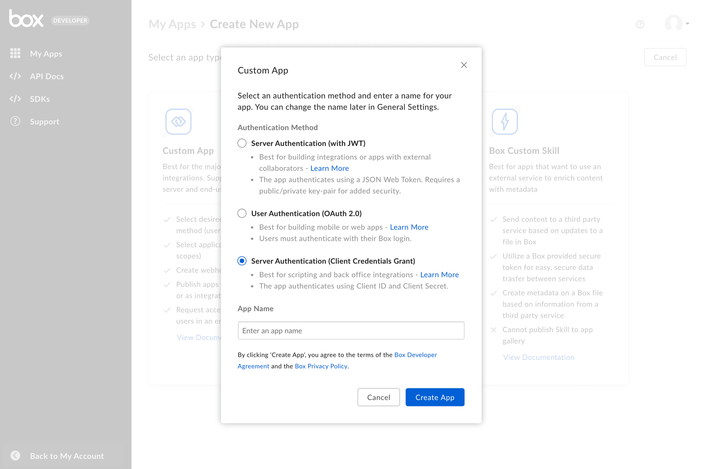
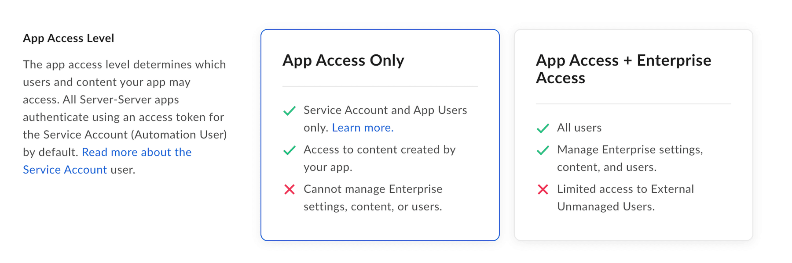

# JWTを使用した設定

カスタムアプリは、[JWT][jwt]によるサーバー側認証を使用するよう設定できます。

<CTA to="g://authentication/jwt">

JWT認証のしくみを確認する

</CTA>

## 前提条件

サーバー側認証を使用してカスタムアプリを設定するには、Box Enterpriseアカウントから[開発者コンソール][devconsole]にアクセスできることを確認する必要があります。または、[Developerアカウント][devaccount]にサインアップすることもできます。

## アプリの作成手順

### 1. 開発者コンソールに移動する

Boxにログインし、[開発者コンソール][devconsole]に移動して、\[**アプリの新規作成**] を選択します。

### 2. アプリケーションの種類を選択する

アプリケーションの種類のリストから \[**カスタムアプリ**] を選択します。次の手順を促すモーダルが表示されます。

<ImageFrame border center>


</ImageFrame>

### 3. 認証の種類とアプリケーション名を選択する

[キーペアを使用して][kp]アプリケーションIDを確認する場合は、\[**サーバー認証 (JWT使用)**] を選択します。その後、アプリケーションの名前を入力し、\[**アプリの作成**] をクリックします。

<Message warning>

選択すると、新しいアプリケーションを作成しない限り、別の認証方法に変更できません。

</Message>

<ImageFrame border width="600" center>



</ImageFrame>

## 公開キーと秘密キーのペア

<Message>

このセクションは、認証方法として \[サーバー認証 (クライアント資格情報許可)] を選択した場合はスキップできます。

</Message>

\[サーバー認証 (JWT使用)] を利用してカスタムアプリを作成すると、[開発者コンソール][devconsole]の \[構成] タブでキーペアを生成できます。また、独自のキーペアを生成して、その公開キーをBoxに提供することもできます。選択する方法に関係なく、セキュリティの目的で、Boxアカウントでは[2FA][2fa]を有効にしておく必要があります。

### キーペアの生成 (推奨)

Boxで生成されたキーペアを使用する場合は、[開発者コンソール][devconsole]に移動し、そこで構成ファイルを生成できます。このファイルには、公開/秘密キーペアのほか、認証に必要なその他さまざまなアプリケーションの詳細が含まれています。

このファイルを生成するには、[開発者コンソール][devconsole]の \[**構成**] タブに移動し、\[**公開キーの追加と管理**] セクションまで下にスクロールします。

<ImageFrame border width="600" center>


</ImageFrame>

\[ **公開/秘密キーペアを生成**] ボタンをクリックすると、Boxによってキーペアが生成されます。これにより、アプリケーションコードに移すことができるJSON構成ファイルのダウンロードが開始されます。

<Message danger>

セキュリティ上の理由により、Boxには秘密キーが保存されません。秘密キーを紛失した場合は、キーペア全体のリセットが必要になります。

</Message>

### 手動によるキーペアの追加

代わりに、独自のキーペアを生成し、その公開キーを[開発者コンソール][devconsole]にアップロードすることもできます。

OpenSSLを使用してキーペアを作成するには、ターミナルウィンドウを開き、以下のコマンドを実行します。

```shell
openssl genrsa -des3 -out private.pem 2048
openssl rsa -in private.pem -outform PEM -pubout -out public.pem
```

<Message>

# Windowsシステムの場合

Windowsユーザーは、[Cygwin][cygwin]パッケージをインストールして使用することで、OpenSSLを実行できます。

</Message>

その後、[開発者コンソール][devconsole]でアプリケーションの \[構成] タブに移動し、\[**公開キーの追加と管理**] セクションまで下にスクロールします。

<ImageFrame border width="600" center>


</ImageFrame>

\[**公開キーを追加**] ボタンをクリックし、上記の手順で生成された公開キーを入力して、\[**確認して保存**] をクリックします。

## アプリの承認

アプリケーションを使用するには、Box管理者がBox管理コンソールでそのアプリケーションを承認しておく必要があります。

[開発者コンソール][devconsole]で、目的のアプリケーションの \[**承認**] タブに移動します。

<ImageFrame border width="400" center>


</ImageFrame>

\[**確認して送信**] をクリックして、承認を得るためにBox Enterprise管理者にメールを送信します。このプロセスの詳細については、[アプリの承認に関するサポート記事][app-auth]を参照してください。

<CTA to="g://authorization/custom-app-approval">

カスタムアプリケーションの承認方法を確認する

</CTA>

## 基本的な構成

### アプリケーションアクセス

アプリケーションのアクセスレベルにより、アプリからアクセスできるユーザーおよびコンテンツが決まります。デフォルトでは、アプリケーションで問題なく操作できるのは、その[サービスアカウント][sa]とすべての[App User][user-types]のコンテンツのみです。企業の既存の管理対象ユーザーにもアクセスするには、[開発者コンソール][devconsole]の \[**構成**] タブから \[**アプリアクセスレベル**] に移動し、\[**アプリ + Enterpriseアクセス**] に設定します。 

<ImageFrame border>



</ImageFrame>

### アプリケーションスコープ

アプリケーションのスコープにより、アプリケーションが呼び出すことができるエンドポイントとリソースが決まります。各オプションの詳細については、[スコープのガイド][scopes]を参照してください。

<ImageFrame border width="600" center>


</ImageFrame>

### CORSドメイン

アプリケーションがJavaScriptでフロントエンドのブラウザコードからAPI呼び出しを実行する場合は、[クロスオリジンリソース共有][cors] (CORS) のために、これらの呼び出しの実行元となるドメインを許可リストに追加する必要があります。すべてのリクエストがサーバー側のコードから発行される場合は、このセクションをスキップできます。

許可リストに完全なURIを追加するには、[開発者コンソール][devconsole]の \[**構成**] タブの下部にある \[**CORSドメイン**] セクションに移動します。

<ImageFrame border>


</ImageFrame>

<!-- i18n-enable localize-links -->

[devconsole]: https://app.box.com/developers/console

[devaccount]: https://account.box.com/signup/n/developer

<!-- i18n-disable localize-links -->

[devtoken]: g://authentication/tokens/developer-tokens

[scopes]: g://api-calls/permissions-and-errors/scopes

<!-- i18n-enable localize-links -->

[cors]: https://en.wikipedia.org/wiki/Cross-origin_resource_sharing

<!-- i18n-disable localize-links -->

[user-types]: g://getting-started/user-types

[sa]: g://getting-started/user-types/service-account

<!-- i18n-enable localize-links -->

[cygwin]: http://www.cygwin.com/

[app-auth]: https://support.box.com/hc/ja/articles/360043697014-Boxのアプリ承認プロセスでのアプリの承認

<!-- i18n-disable localize-links -->

[jwt]: g://authentication/jwt

<!-- i18n-enable localize-links -->

[2fa]: https://support.box.com/hc/ja/articles/360043697154-アカウントの多要素認証の設定

<!-- i18n-disable localize-links -->

[kp]: g://authentication/jwt/without-sdk/#public-and-private-key-pair

[ccg]: g://authentication/jwt/without-sdk/#client-credentials-grant
