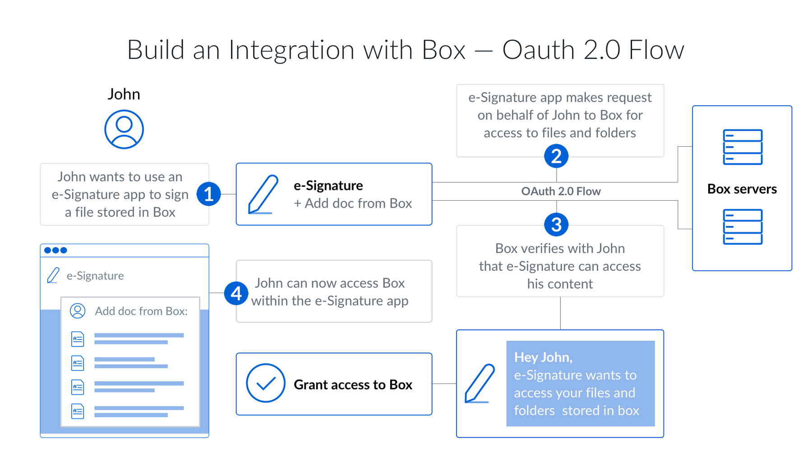

# OAuth 2.0認証

クライアント側OAuth 2.0は、Box APIに対してユーザーを認証する最も簡単な方法の1つです。これは、ユーザーがアプリケーションから他のアプリケーションにある自分のデータにアクセスできるようにすることを目的とした[オープンスタンダード](https://oauth.net/2/)です。

Twitter、Facebook、またはGoogleを使用してウェブサイトにログインしたことがあれば、OAuth 2.0を使用したことがあると考えられます。

<ImageFrame border>

</ImageFrame>

Boxでのクライアント側認証にも同様のフローがあります。このフローでは、ユーザーは、アプリケーションからBoxウェブアプリにリダイレクトされて、ログインするように求められ、アプリケーションに対してユーザーのデータへのアクセス権限を付与します。

## OAuth 2.0を使用する場合

クライアント側認証は、以下に当てはまるアプリに最適な認証方式です。

* 既存のBoxアカウントを持っているユーザーを使用する
* ユーザーにBoxを使用していることを知らせる必要がある
* ユーザーのBoxアカウントにデータを保存し、アプリケーションのBoxアカウントには保存しない
