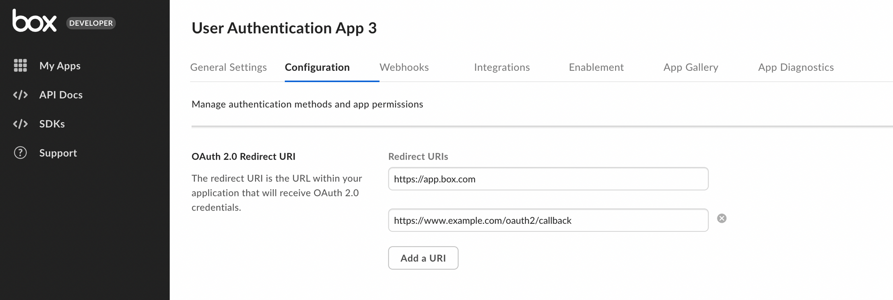

# OAuth 2.0を使用した設定

カスタムアプリは、クライアント側の[OAuth 2.0][oauth2]認証を使用するよう設定できます。

<CTA to="g://authentication/oauth2">

OAuth 2.0認証のしくみを確認する

</CTA>

## 前提条件

OAuth 2.0認証を使用してカスタムアプリを設定するには、Box Enterpriseアカウントから[開発者コンソール][devconsole]にアクセスできることを確認する必要があります。または、[Developerアカウント][devaccount]にサインアップすることもできます。

## アプリの作成手順

### 1. 開発者コンソールに移動する

Boxにログインし、[開発者コンソール][devconsole]に移動して、\[**アプリの新規作成**] を選択します。

### 2. アプリケーションの種類を選択する

アプリケーションの種類のリストから \[**カスタムアプリ**] を選択します。次の手順を促すモーダルが表示されます。

<ImageFrame border>

</ImageFrame>

### 3. 認証の種類とアプリ名を選択する

\[**ユーザー認証 (OAuth 2.0)**] を選択し、アプリケーションに一意の名前を指定します。\[**アプリの作成**] をクリックします。

<ImageFrame border width="400" center>

</ImageFrame>

## 基本的な構成

アプリケーションを使用するには、事前にいくつかの追加構成が必要になります。

### リダイレクトURI

OAuth 2.0フローの間、ユーザーは、認証のためにブラウザにリダイレクトされた後、アプリケーションが自分の代わりにアクションを実行することを承認します。

Boxでは、ユーザーをリダイレクトする前に、[承認URL][url-redirect]に渡された`redirect_uri`パラメータが、アプリケーションに構成されたリダイレクトURIのいずれかと一致することを確認します。完全に一致しているかどうかがチェックされるため、URIはまったく同じである必要があります。localhostおよびループバックアドレスのリダイレクトURIは、どのポートへのリダイレクトも許可されますが、スキーム、ドメイン、パス、およびクエリパラメータは、構成されているURIのいずれかと一致する必要があります。

これらのURIは、開発者コンソールの \[構成] ページにある \[OAuth 2.0リダイレクトURI] セクションで設定できます。有効なHTTPS URIまたは安全性の低いHTTP URI (localhostまたはループバックアドレスの場合) である必要があります。重複するURIの保存は許可されていません。

<Message warning>

日本時間2021年11月30日以降、OAuth 2.0を使用する新規のアプリケーションでは、開発者コンソールの \[構成] タブで設定されたURIとリダイレクト時に使用されるURIが厳密に一致する必要があります。また、そのため新規のアプリケーションと既存のアプリケーションの両方で、複数のリダイレクトURIを追加できるようになります。

既存のアプリケーションでは、サービスの中断を回避するために、日本時間2022年5月14日までにこのURLを変更する必要があります。

</Message>

<ImageFrame border width="600" center>

</ImageFrame>

### アプリケーションスコープ

スコープを使用して、アプリケーションがデータにアクセスするために必要な権限を定義します。各オプションの詳細については、[スコープのガイド][scopes]を参照してください。

<ImageFrame border width="600" center>

</ImageFrame>

### CORSドメイン

アプリケーションがJavaScriptでフロントエンドのブラウザコードからAPI呼び出しを実行する場合は、[クロスオリジンリソース共有][cors] (CORS) のために、これらの呼び出しの実行元となるドメインを許可リストに追加する必要があります。すべてのリクエストがサーバー側のコードから発行される場合は、このセクションをスキップできます。

許可リストにすべてのURIを追加するには、[開発者コンソール][devconsole]の \[**構成**] タブの下部にある \[**CORSドメイン**] セクションに移動します。

<ImageFrame border>

</ImageFrame>

[devconsole]: https://app.box.com/developers/console

[devaccount]: https://account.box.com/signup/n/developer

[devtoken]: g://authentication/tokens/developer-tokens

[scopes]: g://api-calls/permissions-and-errors/scopes

[cors]: https://en.wikipedia.org/wiki/Cross-origin_resource_sharing

[oauth2]: g://authentication/oauth2

[url-redirect]: e://get-authorize/#param-redirect_uri
