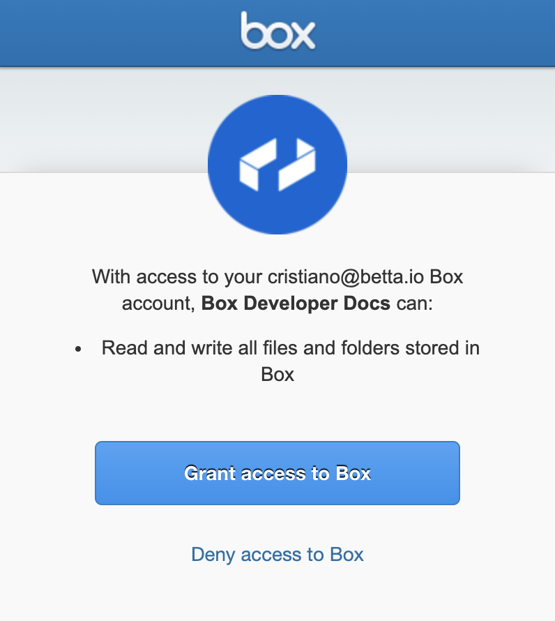
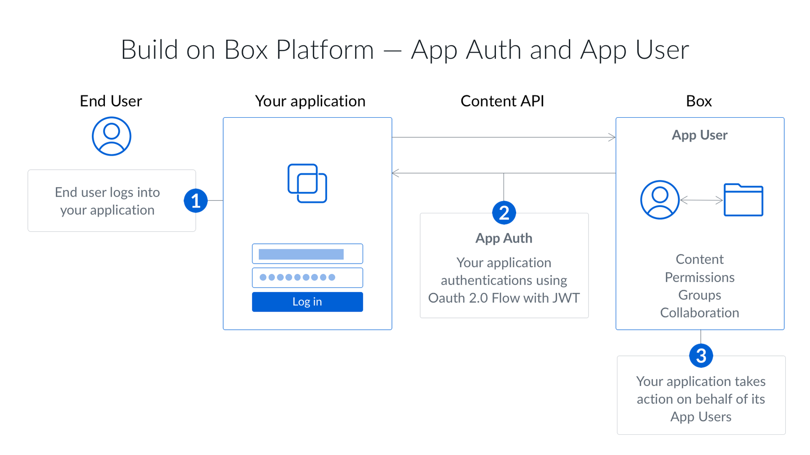

# 認証方式の選択

アプリケーションで使用できる承認の種類は、開発者コンソールで構成したBoxアプリケーションの種類によって異なります。

<CTA to="guide://applications/select">

アプリケーションの種類の選択方法を確認する

</CTA>

## 使用できる方式

Boxアプリケーションの種類それぞれでは、以下の認証方式を使用できます。

<!-- markdownlint-disable line-length -->

| Boxアプリケーションの種類          | OAuth 2.0をサポートしますか? | JWTは? | アプリトークンは? | 開発者トークンは? |
| ----------------------- | ------------------- | ----- | --------- | --------- |
| [カスタムアプリ][custom-app]   | はい                  | はい    | はい        | はい        |
| [カスタムスキル][custom-skill] | いいえ                 | いいえ   | いいえ       | いいえ       |
| 企業統合                    | はい                  | はい    | いいえ       | はい        |
| パートナーの統合                | いいえ                 | いいえ   | はい        | いいえ       |

<!-- markdownlint-enable line-length -->

<Message warning>

企業統合またはパートナーの統合は、従来の目的で存在します。代わりにカスタムアプリを使用し、必要に応じて関連する認証方式を使用してください。

</Message>

<Message>

[カスタムスキル][custom-skill]またはパートナーの統合アプリケーションを作成している場合は、選択肢がないため、認証方式を選択する必要はありません。

カスタムスキルの場合、これ以上の設定は必要ありません。これは、どのスキルイベントのペイロードにも、API呼び出しの実行に使用できるアクセストークンが含まれるためです。

</Message>

### クライアント側OAuth 2.0

クライアント側OAuth 2.0は[カスタムアプリ][custom-app]と企業統合のみで使用できます。この認証方式では、アプリケーションによるユーザーのデータへのアクセスを許可するためにユーザーをBoxウェブサイトにリダイレクトするよう、アプリケーションに要求します。

<ImageFrame center width="400" shadow border>

</ImageFrame>

<Message>

# OAuth 2.0はいつ使用すべきですか?

クライアント側認証は、以下に当てはまるアプリに最適な認証方式です。

* 既存のBoxアカウントを持っているユーザーを使用する
* ユーザーにBoxを使用していることを知らせる必要がある
* ユーザーのBoxアカウントにデータを保存し、アプリケーションのBoxアカウントには保存しない

</Message>

<CTA to="guide://authentication/oauth2">

OAuth 2.0を使用したクライアント側認証を確認する

</CTA>

### サーバー側JWT

JSON Web Token (JWT)を使用するサーバー側の認証は、[カスタムアプリ][custom-app]と企業統合のみで使用できます。ユーザーが承認フローに関与することはないため、社内の任意のユーザーの代わりに処理を実行するために使用できます。JWTでは、公開/秘密キーペアを使用してアプリケーションの権限を確認します。

<ImageFrame center shadow border>

</ImageFrame>

<Message>

# JWTはいつ使用すべきですか?

JWTを使用するサーバー側認証は、以下に当てはまるアプリに最適な認証方式です。

* Boxアカウントを持たないユーザーを使用する
* 独自のIDシステムを使用する
* ユーザーにBoxを使用していることを認識させたくない
* アプリケーションのBoxアカウントにデータを保存し、ユーザーのBoxアカウントには保存しない

</Message>

<CTA to="guide://authentication/jwt">

JWTを使用したサーバー側認証を確認する

</CTA>

### サーバー側アプリトークン

サーバー側アプリトークンは、アプリケーションに、その所有アカウントのデータに対して読み取りと書き込みのアクセス権限だけがある認証方式です。これは、主にBox Viewアプリケーションで使用されます。この認証方式を使用すると、アプリケーションはそのアプリケーションに属しているサービスアカウントとして自動的に認証されるため、ユーザーを承認する必要がありません。

<Message>

# アプリトークンはいつ使用すべきですか?

アプリトークンを使用するサーバー側認証は、以下に当てはまるアプリに最適な認証方式です。

* ユーザーモデルがない環境、またはBoxアカウントを持たないユーザーがいる環境で使用する
* 独自のIDシステムを使用する
* ユーザーにBoxを使用していることを認識させたくない
* ユーザーのアカウントではなく、アプリケーションのサービスアカウントにデータを保存する

</Message>

<CTA to="guide://authentication/app-token">

アプリトークンを使用したサーバー側認証を確認する

</CTA>

### 開発者トークン

サーバー側の開発者トークンは、OAuth 2.0を使用するアプリケーションを作成した開発者が使用できる、有効期間の短い認証です。これは、1時間のみ有効なアクセストークンで、トークンを作成した開発者として認証します。

<Message>

# 開発者トークンはいつ使用すべきですか?

開発者トークンは、開発およびテスト段階に最適な認証方式です。開発者が以下の状況に当てはまる場合に理想的です。

* API呼び出しをすばやくテストする
* 別のユーザーとして認証しない
* トークンが必要なのは1時間以内である
* コードを実稼働環境に提供する予定がない

</Message>

## 比較

以下に、クライアント側とサーバー側の認証の主な違いの概要を示します。

<!-- markdownlint-disable line-length -->

|                 | OAuth 2.0 | JWT | アプリトークン | 開発者トークン |
| --------------- | --------- | --- | ------- | ------- |
| ユーザーの関与が必要?     | はい        | いいえ | いいえ     | はい      |
| 管理者の承認が必要?      | いいえ       | はい  | はい      | いいえ     |
| 他のユーザーの代理で操作可能? | はい        | はい  | いいえ     | はい      |
| ユーザーにBoxを表示?    | はい        | いいえ | いいえ     | はい      |
| App Userを作成可能?  | いいえ       | はい  | いいえ     | はい      |
| 実稼働環境で使用可能?     | はい        | はい  | はい      | いいえ     |

<!-- markdownlint-enable line-length -->

<Message>

アクセストークンは特定のBoxユーザーに関連付けられており、そのユーザーが誰であるかは、トークンがどのように取得されたかによって決まります。

たとえば、クライアント側認証を使用している場合、トークンは、自分のアカウントへのアクセス権限を付与したユーザーを示します。一方、サーバー側認証を使用している場合、トークンは、デフォルトでサービスアカウントになります。

</Message>

[custom-app]: guide://applications/custom-apps

[custom-skill]: guide://applications/custom-skills
