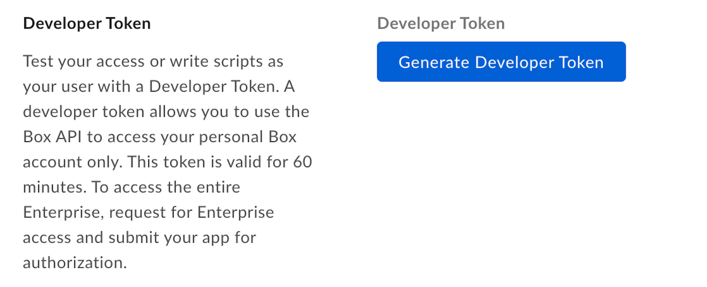

# 開発者トークン

開発者トークンは、開発およびテスト中に開発者が利用できるアクセストークンです。これらのトークンは60分後に期限切れになる有効期間の短いトークンであり、プログラムによって更新することはできません。

## 開発者トークンの作成

アプリケーション用に開発者トークンを作成するには:

* Box[開発者コンソール][devconsole]に移動し、開発者トークンの作成対象となるアプリケーションを選択します。
* \[**構成**] タブを選択します。
* \[開発者トークン] で、\[**開発者トークンを生成**] を選択します。

<ImageFrame border center shadow>



</ImageFrame>

## 開発者トークンの使用

開発者トークンは、さまざまなアクセストークンと同様、API呼び出しの`Authorization`ヘッダーで使用できます。

```curl
curl https://api.box.com/2.0/users/me \
    -H "authorization: Bearer [DEVELOPER_TOKEN]"
```

<Message warning>

開発者トークンは、トークンの生成時に開発者コンソールにログインしているユーザーに関連付けられます。

</Message>

Box SDKは、基本のAPIクライアントを作成する際に、開発者トークンを使用して初期化することができます。

<Samples id="x_auth" variant="init_with_dev_token">

</Samples>

<Message type="danger">

# 開発者トークンは実稼働環境で使用しないでください

開発者トークンは、開発またはテストのためだけに使用してください。

</Message>

[devconsole]: https://app.box.com/developers/console
