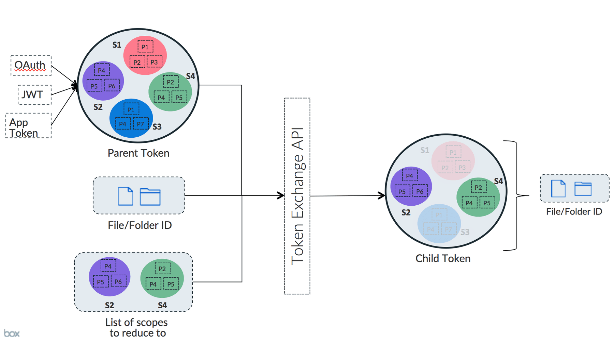

# トークンのダウンスコープ

ダウンスコープは、既存のアクセストークンをより制限の厳しい新しいトークンと交換するための方法です。

## ダウンスコープする理由

アプリケーションは、完全に制御できない環境とアクセストークンを共有しなければならないことがあります。その一般的な例として、ウェブブラウザでBox UI Elementsを使用する場合があります。

アプリケーションがアクセストークンをブラウザに渡す必要がある場合、解決が必要となるセキュリティリスクが生じる可能性があります。このリスクを抑制するために、アクセストークンを、権限がより厳格な新しいトークンと交換できます。

## 概要

ダウンスコープされたトークンは、元のトークンよりも権限 (スコープ) が少ないトークンです。また、オプションで、特定のファイルへのアクセスのみを許可するようさらに制限される場合もあります。

<ImageFrame border>



</ImageFrame>

新しいトークンは、元のトークンの権限を取得し、渡されたトークンのほか、提供されたリソースにその権限を制限します。

## ダウンスコープの実例

トークンをダウンスコープするには、`POST /oauth2/token`エンドポイントに既存のアクセストークン、スコープのリストのほか、トークンを制限するファイルのURL (省略可) を渡します。

<Samples id="post_oauth2_token" variant="downscope_token">

</Samples>

| パラメータ                | 説明                                                                                                                                                           |
| -------------------- | ------------------------------------------------------------------------------------------------------------------------------------------------------------ |
| `subject_token`      | ダウンスコープする元のトークン。これには、OAuth 2.0やJWTトークン交換で取得したトークン、またはアプリトークンとして取得されたトークンを使用できます。                                                                             |
| `scope`              | 新しいトークンを制限するための[スコープ][scopes]のスペース区切りリスト。アプリケーションに有効な任意のスコープを使用できますが、[Box UI Elementsのスコープ][scopes_down]の特殊なセットも使用可能です。                                      |
| `resource`           | トークンが制限されるファイルへの完全なURLパス (省略可)。                                                                                                                              |
| `box_shared_link`    | Box上のファイルまたはフォルダの[共有リンク](g://shared-links)URL (省略可)。パスワード保護されているリンクはサポートされていません。このオプションは、`resource`オプションに追加して使用することができません。また、ウェブリンクに作成された共有リンクを指定することもできません。 |
| `subject_token_type` | 常に`urn:ietf:params:oauth:token-type:access_token`に設定します。                                                                                                     |
| `grant_type`         | 常に`urn:ietf:params:oauth:grant-type:token-exchange`に設定します。                                                                                                   |

## ダウンスコープされたアクセストークンオブジェクト

`POST /oauth2/token`エンドポイントで返されるダウンスコープされたアクセストークンには、特定の制限に関する追加情報が含まれます。

```json
{
  "access_token": "1!DgsZ6V9kMWZu2StrxwQDF5BudQNen-xUmU2cfcVKArE....",
  "expires_in": 4175,
  "token_type": "bearer",
  "restricted_to": [
    {
      "scope": "item_preview",
      "object": {
        "type": "folder",
        "id": "1234567890",
        "sequence_id": "0",
        "etag": "0",
        "name": "Test"
      }
    }
  ],
  "issued_token_type": "urn:ietf:params:oauth:token-type:access_token"
}

```

ここで最も重要なのは、`restricted_to`エントリのリストです。このリストには、新しいトークンが権限を持つ`object`と`scope`の各組み合わせが含まれます。

<Message warning>

ダウンスコープされたトークンに更新トークンは含まれません。新しいダウンスコープされたトークンを取得するには、元の更新トークンを更新し、その新しいトークンを使用してダウンスコープされたトークンを取得します。

</Message>

[scopes]: guide://api-calls/permissions-and-errors/scopes

[scopes_down]: guide://api-calls/permissions-and-errors/scopes/#scopes-for-downscoping
