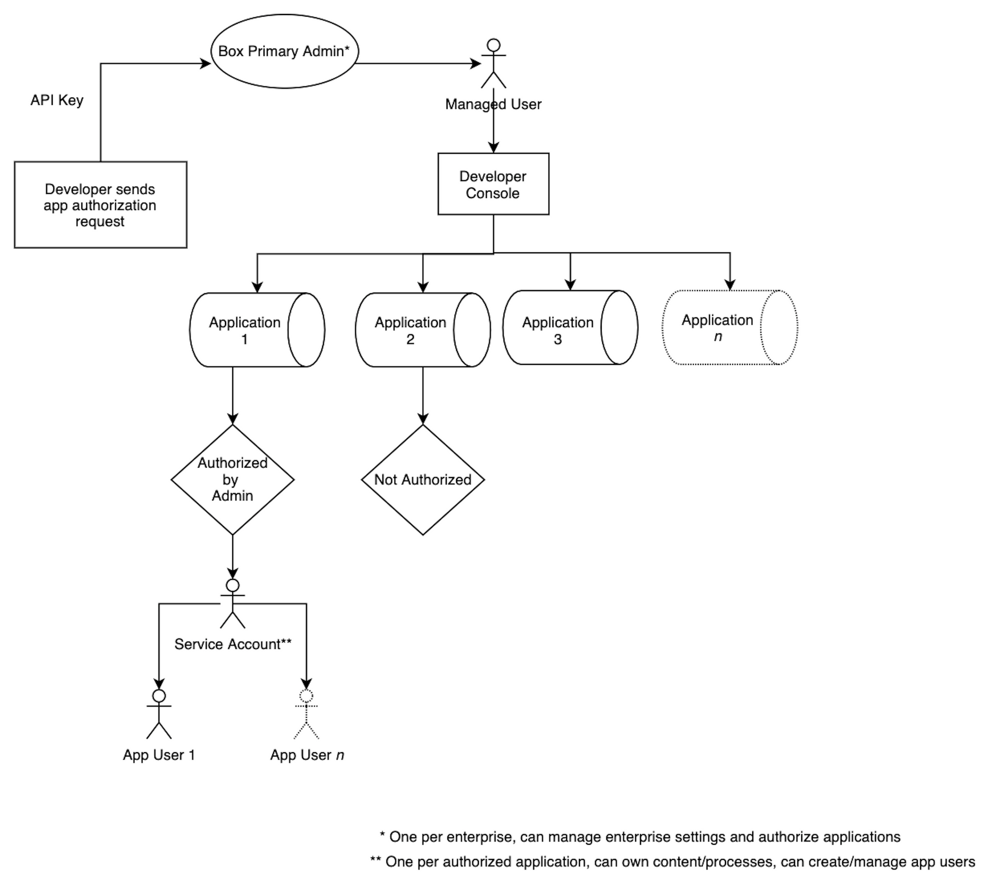

# Service Accounts

A Service Account provides developers with a programmatic authentication
mechanism for server-side integrations with Box. In other words, an application
can authenticate to Box as the service, which is represented by a Service
Account user. A Service Account can then be used to create other application
specific users, called App Users LINK ADDED HERE.

<ImageFrame center shadow border>

</ImageFrame>

## Creation

A unique Box Service Account is automatically generated as soon as an
application, leveraging server to server authentication, is authorized in the
Admin Console. From that point forward, the Service Account represents the
application in the Box enterprise. Since every Box account must have an email
address, Box assigns one. The format will always be
`AutomationUser_AppServiceID_RandomString@boxdevedition.com`. For example:
`AutomationUser_567302_6jCo6Pqwo@boxdevedition.com`. This is why you may
sometimes hear the Service Account referred to as an Automation User.

Once the service account is generated, a section is automatically added to the
general tab of the developer console revealing the email address.
SCREENSHOT ADDED HERE

The numbers surrounded by underscores are also unique to the application and are
called a Service ID. To locate a Service ID  in the Developer Console, click on
the tile for an application and look at the URL. For example,
`https://example.app.box.com/developers/console/app/567302`. As you can see,
this application corresponds to the Service Account provided in the example
above.

If someone attempts to make API calls using a Service Account access token
before the application is authorized in the Admin Console they will receive an
error message: ERROR HERE.

## Use Cases

- Distribution Publishing: upload and share files with any number of users 
  whether or not they are authenticated
- On-Premises Systems and Devices: programmatically ingest content from
  on-premises systems and connected devices 
- Content Migration and Monitoring: move content from on-premises to the cloud
  or between cloud providers  
- Event Monitoring: monitors events in an enterprise to ensure compliance and or
  trigger workflows based on actions
- Content Archive: house minimally accessed content

## Benefits and Concerns

The benefits of storing content in the folder tree of a Service Account:

- content storage for your application
- tight control over data location and sharing
- prevents sharing of credentials between app users and managed users 
- prevents inadvertent access to managed user’s content through requiring the
  Service Account to be added as a collaborator
- Admin-like privileges that can be customized based on scopes
- facilitates data retention and migration through collaboration

<Message type='warning'>

# Admin Approval

With the right scopes enabled a Service Account can perform many of the tasks
that Admin Users are able to perform. For this reason JWT applications need
explicit Admin approval before they can be used in an enterprise.

</Message>

The concerns of storing content in the folder tree of a Service Account:

<!--alex ignore-->

- increases architectural complexity
- single point of failure
- difficult to scale centrally located content

<!--alex enable-->

## Access

Only Primary Admins have the ability to log in as a Service Account through the
Content Manager in the Admin Console. To do this, use the search bar within the
Admin Console to locate the name of the application, right click on it, and
select “Log in to user’s account”. 

A Service Account can be thought of as having the permissions of a Box Co-Admin.
Similar to co-admins being unable to manage each other, co-admins cannot log in
as a Service Account user. Service Accounts are not currently visible in the
users and group tab of the Admin Console. 

## Permissions

The endpoints that a Service Account access token can successfully interact with
are determined by the application scopes configured in the Developer Console.
Depending on the granted scopes, a Service Account may have the ability to
perform Admin actions. 

## Folder Tree and Collaboration

Because a Service Account represents an application as a user within the
enterprise, it has its own folder tree and content ownership capabilities. By
default this folder tree is empty because the Service Account does not initially
own or collaborate on content. This is similar to when you first land on your
All Files page in a newly provisioned Box account. 

Service Account users can collaborate on content. This is done by using the
assigned email address to invite them, as you would any
other managed user. Remember, if you are doing this via the API you will need to
use an access token for a user that already has access to the desired content
and has the appropriate collaboration permissions to invite collaborators.
Instead of the email address, use the Service Account’s user ID. This value is
returned by making a call to the get current user endpoint using an access token
for the Service Account.

<Message type='notice'>

It is possible to assign a Service Account an email alias if that is easier to
remember when adding collaborations.

</Message>

## Box View

A Service Account is also automatically generated when an application when a
Limited Access App is created in the Developer Console. This Service Account
has some additional restrictions that a Service Account associated with a
Custom App does not.

- All content used within the Limited Access App must be uploaded and owned by
this Service Account
- The Service Account can not access any other user's information or content
- The Service Account can not create or otherwise manage any type of new user
- The Service Account can only access a subset of APIs related to previewing
content