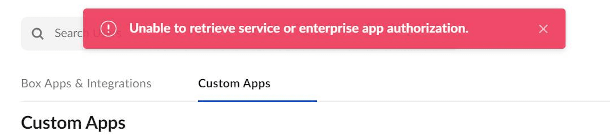
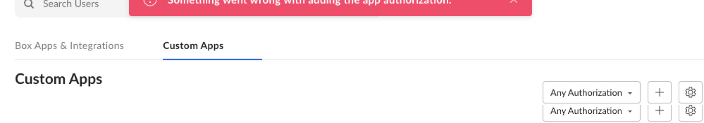
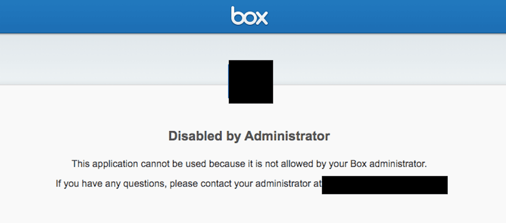

# 一般的なエラー

## サービスまたはEnterpriseのアプリ承認を取得できません

<ImageFrame border>

</ImageFrame>

<!--alex ignore invalid-->

このエラーは、入力したクライアントIDが無効であることを示しています。この問題を解決するには、開発者コンソールからクライアントIDを再度コピーし、末尾に余分な文字を含めていないことを確認してください。

## アプリ承認の追加に問題が発生しました

このエラーは、Enterprise設定を表示する権限は付与されているが、編集する権限が付与されていないBox共同管理者であることを示しています。アプリケーションを正常に承認するには、Box管理者に編集権限を付与してもらう必要があります。

<ImageFrame border>

</ImageFrame>

<!--alex ignore -->

## 管理者により無効化されました

<!--alex enable-->

このエラーは、承認の要件の一部が満たされていないことを示しています。特定のアプリケーションに必要な手順を確認するには、Boxの[承認ガイド][ag]を参照してください。

<ImageFrame border>

</ImageFrame>

[ag]: g://authorization
