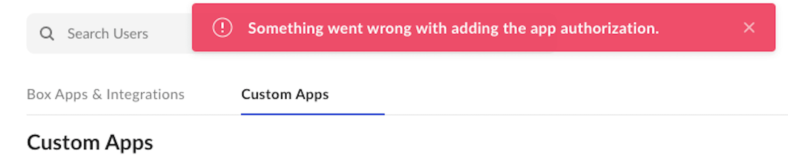

# Common Errors

## Unable to retrieve service of enterprise app authorization

<ImageFrame border>

</ImageFrame>

<!--alex ignore invalid-->

This error indicates that the entered client ID entered is invalid.
To resolve this issue, please re-copy the Client ID from the Developer Console
and ensure you are not including any trailing characters.

## Something went wrong with adding the app authorization

This error indicates you are a Box co-admin granted privileges to view, but not
edit enterprise settings. You will need to have your Box Admin grant edit
privileges in order to successfully authorize an application.

<ImageFrame border>

</ImageFrame>

<!--alex ignore -->

## Disabled by Administrator
<!--alex enable-->

This error indicates that not all authorization requirements are satisfied.
Please review our [authorization guide][ag] to confirm the necessary steps for
a given application.

<ImageFrame border>

</ImageFrame>

[ag]: g://authorization