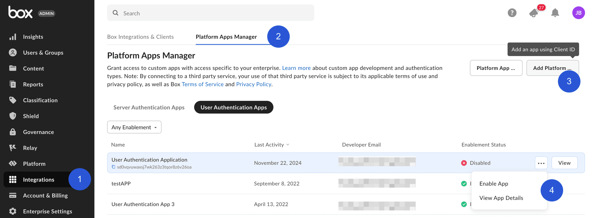

# カスタムアプリの承認

[JWT][jwt]または[クライアント資格情報許可][ccg]を使用するサーバー認証アプリケーションは、使用前にBox管理者が承認する必要があります。

[OAuth 2.0][oauth]認証を使用する未公開アプリケーションは、[デフォルトで非アクティブ][upa]になっている場合、Box管理者による有効化が必要になることがあります。

Box管理者は、管理コンソールでアプリケーションを適切に承認または有効化するために、そのクライアントIDが必要になります。

<Message>

\[[マイアプリ][apps]] ビューを使用すると、アプリケーションの承認ステータスと有効化ステータスをすばやく確認できます。

</Message>

## 承認の通知

アプリの承認を送信するための半自動プロセスは、開発者コンソールですべての種類のカスタムアプリケーションに使用できます。

### サーバー認証アプリ

[開発者コンソール][devconsole]で、目的のアプリケーションの \[**承認**] タブに移動します。

<ImageFrame border center>

![\[承認\] タブ](images/app_authorization.png)

</ImageFrame>

### ユーザー認証アプリ

[開発者コンソール][devconsole]で、目的のアプリケーションの \[**有効化**] タブに移動します。

<ImageFrame border center>

![\[有効化\] タブ](images/app_enablement.png)

</ImageFrame>

承認を得るためにアプリケーションを送信すると、企業のプライマリ管理者宛てにアプリケーションを承認するようメールが送信されます。Box管理者がリクエストを承認または拒否すると、その決定が記載されたメールが届きます。このプロセスの詳細については、[アプリ承認に関するサポート記事][app-auth]を参照してください。

## 手動による承認

以下の手順では、手動でアプリケーションを承認する方法について説明します。

### 開発者の場合

1. [開発者コンソール][devconsole]で、目的のアプリケーションの \[**構成**] タブに移動します。
2. \[OAuth 2.0資格情報] セクションまで下にスクロールし、Box管理者に提出する \[**クライアントID**] の値をコピーします。

また、\[[マイアプリ][apps]] ビューでアプリケーションにカーソルを合わせて**クライアントID**を調べ、`copy`ボタンを使用してそのIDをコピーすることもできます。

<Message>

# Box管理者の確認方法

自分の会社の管理者がわからない場合は、Boxの \[[アカウント設定][settings]] ページに移動し、一番下までスクロールしてください。管理者の連絡先が設定されている場合は、\[管理者の連絡先] の下に連絡先情報が表示されます。

</Message>

### 管理者の場合

1. [管理コンソール][adminconsole]に移動し、左側のナビゲーションパネルで \[**アプリ**] タブ (1) を選択します。
2. 画面上部にある \[**カスタムアプリマネージャ**] タブ (2) をクリックします。
3. \[サーバー認証アプリ] 画面と \[ユーザー認証アプリ] 画面のどちらでも、右上にある \[**アプリの追加**] ボタン (3) をクリックして新しいアプリを追加します。
4. または、\[カスタムアプリマネージャ] の表メニュー (4) を使用してアプリを承認および有効化することもできます。

#### サーバー認証アプリ

<ImageFrame border center>

</ImageFrame>

#### ユーザー認証アプリ

<ImageFrame border center>

</ImageFrame>

表示されたポップアップで、開発者が[開発者コンソール][devconsole]の \[**構成**] タブから収集した、アプリケーションのクライアントIDを入力します。

## 変更の再承認

アプリケーションのスコープまたはアクセスレベルが変更された場合は、アプリケーションを再承認する必要があります。新しい変更を有効にするには、上記のプロセスを繰り返して新しいアクセストークンをリクエストしてください。

管理者は、アプリケーションが最初に承認されたのと同じセクションで、そのアプリケーションを再承認できます。再承認するには、アプリケーション名の右側にある省略記号をクリックし、\[**アプリを再承認**] を選択します。

<ImageFrame border center>

</ImageFrame>

<!-- i18n-enable localize-links -->

[devconsole]: https://app.box.com/developers/console

<!-- i18n-disable localize-links -->

[ccg]: g://authentication/client-credentials

<!-- i18n-enable localize-links -->

[settings]: https://app.box.com/account

[adminconsole]: https://app.box.com/master/settings/custom

<!-- i18n-disable localize-links -->

[jwt]: g://authentication/jwt

[app-token]: g://authentication/app-token

[oauth]: g://authentication/oauth2

[upa]: g://security/#enterprise-settings-and-authorization

<!-- i18n-enable localize-links -->

[app-auth]: https://support.box.com/hc/ja/articles/360043697014-Boxのアプリ承認プロセスでのアプリの承認

<!-- i18n-enable localize-links -->

[apps]: g://applications
