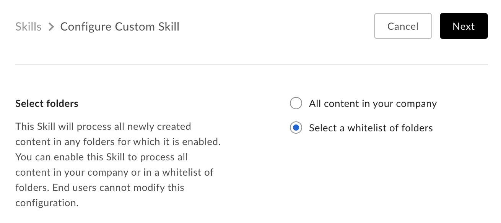

# カスタムスキルの承認

カスタムスキルは、使用前に、企業のBox管理者がフォルダに対して有効にしておく必要があります。

## 開発者の場合

開発者の場合は、[開発者コンソール][devconsole]でアプリケーションに移動し、管理者に提出するそのアプリケーションのクライアントIDをコピーします。

<Message>

# Box管理者の確認方法

自分の企業の管理者がわからない場合は、Boxの[アカウント設定][settings]ページに移動し、一番下までスクロールしてください。管理者の連絡先が設定されている場合は、\[管理者の連絡先] の下に連絡先情報が表示されています。

</Message>

## 管理者の場合

カスタムスキルアプリケーションを有効にするには、[Box管理コンソールの \[Skills\] セクション][adminconsole]に移動し、\[スキルの追加] リンクをクリックして新しいスキルを追加します。

カスタムスキルアプリケーションのクライアントID (APIキー) を入力します。これは開発者から提出されたクライアントIDです。

\[次へ] をクリックし、Box Skillアプリケーションで操作するフォルダを選択します。

<ImageFrame border>

</ImageFrame>

ここには2つのオプションがあります。

* \[**会社のすべてのコンテンツ**] を選択すると、各ユーザーのルートフォルダでスキルが承認されます。その結果、Box Skillアプリケーションによって処理されているフォルダにすべてのファイルがアップロードされます。
* \[**フォルダのリストを選択**] を選択すると、スキルアプリケーションの処理対象となる特定のフォルダまたは一連のフォルダに対してアプリケーションが有効になります。

<ImageFrame border>

</ImageFrame>

\[Skillを有効化] をクリックし、利用規約と契約に同意します。これで、カスタムスキルが有効になります。選択したフォルダに新しいコンテンツが追加されると、Box[開発者コンソール][devconsole]で構成された呼び出しURLにイベントの送信が開始されます。

<Message>

# 会社あたりSkillアプリケーションは10個まで

どのような場合でも、1つの会社につき有効にできるスキルの数は10個という制限があります。会社でさらに多くのスキルを有効にする場合は、Boxの営業担当者にお問い合わせください。

</Message>

[adminconsole]: https://app.box.com/master/skills

[devconsole]: https://app.box.com/developers/console
