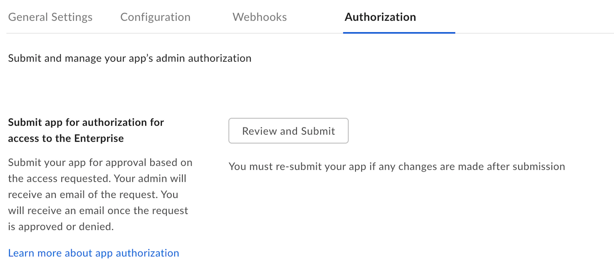
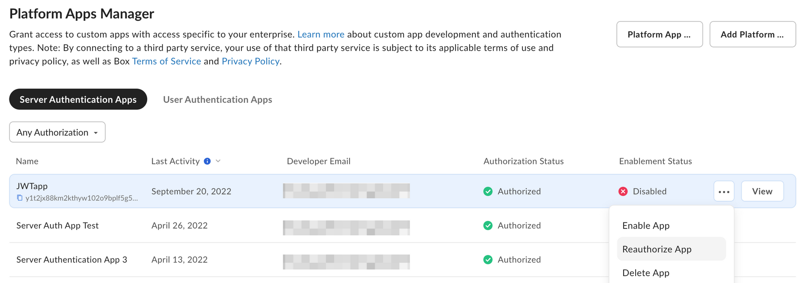

# アクセス制限付きアプリの承認

アクセス制限付きアプリは、作成時に企業での使用について自動的に承認されます。

ただし、Enterprise設定の \[**アプリトークンを使用する場合に管理者の承認を要求する**] が有効になっている場合、管理者は追加の手順を行う必要があります。

## 承認の通知

アプリの承認を送信するための半自動プロセスは、開発者コンソールで利用できます。

[開発者コンソール][devconsole]で、目的のアプリケーションの \[**承認**] タブに移動します。

<ImageFrame border width="400" center>

</ImageFrame>

承認を得るためにアプリケーションを送信すると、企業のプライマリ管理者宛てにアプリケーションを承認するようメールが送信されます。このプロセスの詳細については、[アプリ承認に関するサポート記事][app-auth]を参照してください。

## 手動による承認

以下の手順では、手動でアプリケーションを承認する方法について説明します。

### 開発者の場合

開発者の場合、[開発者コンソール][devconsole]で、目的のアプリケーションの \[**構成**] タブに移動します。\[OAuth 2.0資格情報] セクションまで下にスクロールし、Box管理者に提出するクライアントIDの値をコピーします。

<Message>

# Box管理者の確認方法

自分の会社の管理者がわからない場合は、Boxの \[[アカウント設定][settings]] ページに移動し、一番下までスクロールしてください。管理者の連絡先が設定されている場合は、\[管理者の連絡先] の下に連絡先情報が表示されます。

</Message>

### 管理者の場合

Box管理者の場合、\[[管理コンソール][adminconsole]] に移動し、左側のナビゲーションパネルで \[**アプリ**] タブ (1) を選択して、画面上部にある \[**カスタムアプリ**] タブ (2) をクリックします。この画面では、新しいアプリ承認を追加するための \[**+**] ボタンが右上隅に表示されます。

<ImageFrame border center>

![\[アプリ\] タブ](images/jwt_app_approval_flow.png)

</ImageFrame>

表示されたポップアップで、開発者が開発者コンソールの \[**構成**] タブから収集した、アプリケーションのクライアントIDを入力します。

## 変更の再承認

アプリケーションのスコープまたはアクセスレベルが変更された場合は、アプリケーションを再承認する必要があります。新しい変更を有効にするには、上記のプロセスを繰り返して新しいアクセストークンをリクエストしてください。

管理者は、アプリケーションが最初に承認されたのと同じセクションで、そのアプリケーションを再承認できます。再承認するには、アプリケーション名の右側にある省略記号をクリックし、\[**アプリを再承認**] を選択します。

<ImageFrame border center>

</ImageFrame>

<!-- i18n-enable localize-links -->

[devconsole]: https://app.box.com/developers/console

<!-- i18n-disable localize-links -->

[ccg]: g://authentication/client-credentials

<!-- i18n-enable localize-links -->

[settings]: https://app.box.com/account

[adminconsole]: https://app.box.com/master/settings/custom

<!-- i18n-disable localize-links -->

[jwt]: g://authentication/jwt

[app-token]: g://authentication/app-token

<!-- i18n-enable localize-links -->

[app-auth]: https://support.box.com/hc/ja/articles/360043697014-Boxのアプリ承認プロセスでのアプリの承認

<!-- i18n-disable localize-links -->
