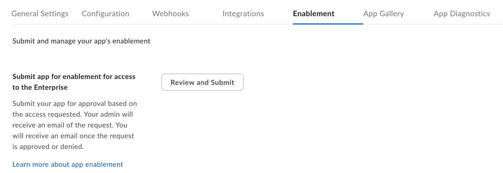

# Platform App Approval

Server authentication applications using [JWT][jwt] or
[Client Credentials Grant][ccg] must be authorized by a Box Admin before use.

Unpublished applications using [OAuth 2.0][oauth] authentication may
require enablement by a Box Admin if they are [inactive by default][upa].

A Box Admin needs an application's Client ID in order to properly
authorize or enable it in the Admin Console.

<Message>

You can use [My Platform Apps][apps] view to quickly look up
the authorization and enablement status of your application.

</Message>

## Approval Notifications

A semi-automated process to submit an app approval is available in the Developer
Console for all platform application types.

### Server authentication apps

Navigate to the **Authorization** tab for your application in the
[Developer Console][devconsole].

<ImageFrame border center>

</ImageFrame>

### User authentication apps

Navigate to the **Enablement** tab for your application in the [Developer Console][devconsole].

<ImageFrame border center>

</ImageFrame>

Submitting the application for approval will send an email to your
enterprise's Primary Admin to approve the application.
When a Box Admin approves or declines your request,
you will get an email with the decision.
More information on this process is available in our [support article on app authorization][app-auth].

## Manual Approval

The following steps provide instructions on how to manually approve the
application.

### As a developer

1. Navigate to the **Configuration** tab for your application in the [Developer Console][devconsole].
2. Scroll down to the OAuth 2.0 Credentials section and copy the **Client ID** value to provide to a Box Admin.

Alternatively, hover over the application in the
[My Platform Apps][apps] view to look up the **ClientID** and then
copy it using the `copy` button.

<Message>

# Finding a Box Admin

If you don't know your enterprise Admin, go to your Box [Account
Settings][settings] page and scroll to the bottom. If an admin contact is set
you should see their contact information under "Admin Contact".

</Message>

### As an Admin

1. Navigate to the [Admin Console][adminconsole] and select the **Apps** tab (1) from the left navigation panel.
2. Click the **Platform Apps Manager** tab (2) at the top of your screen.
3. For both Server and User Authentication Apps screens, click the **Add App** (3) button in the top right corner to add a new app.
4. Alternatively, you can use the Platform Apps Manager table menu (4) to authorize and enable apps.

#### Server Authentication Apps

<ImageFrame border center>

</ImageFrame>

#### User Authentication Apps

<ImageFrame border center>

</ImageFrame>

In the popup that appears, enter the client ID for the application that the
developer collected from the **Configuration** tab of the
[Developer Console][devconsole].

## Re-authorization on changes

When the application's scopes or access level change the application needs to be
re-authorized. Repeat the process above and request a new Access Token for the
new changes to take effect.

In the same section where the application was initially authorized, an Admin
can re-authorize the application by clicking on the ellipses to the right
of the application name to **Reauthorize App**.

<ImageFrame border center>

</ImageFrame>

<!-- i18n-enable localize-links -->

[devconsole]: https://app.box.com/developers/console
<!-- i18n-disable localize-links -->

[ccg]: g://authentication/client-credentials
<!-- i18n-enable localize-links -->

[settings]: https://app.box.com/account
[adminconsole]: https://app.box.com/master/settings/custom
<!-- i18n-disable localize-links -->

[jwt]: g://authentication/jwt
[app-token]: g://authentication/app-token
[oauth]: g://authentication/oauth2
[upa]: g://security/#enterprise-settings-and-authorization
<!-- i18n-enable localize-links -->

[app-auth]: https://support.box.com/hc/en-us/articles/360043697014-Authorizing-Apps-in-the-Box-App-Approval-Process
<!-- i18n-enable localize-links -->

[apps]: g://applications