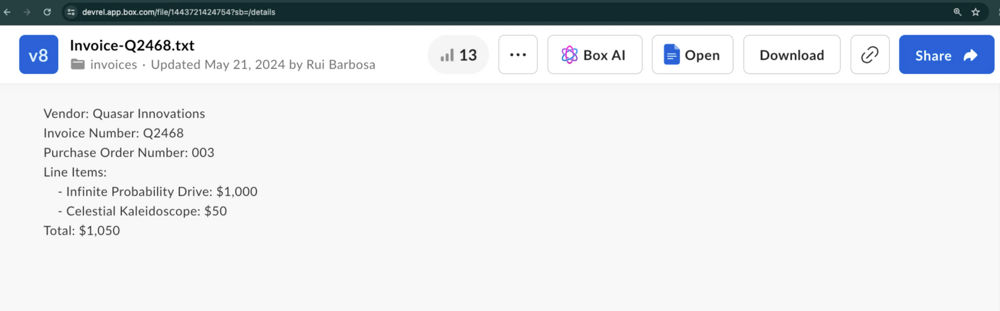

# ファイルからメタデータを抽出する (構造化)

Box AI APIを使用すると、指定したファイルからメタデータを抽出し、結果をキー/値ペアの形式で取得することができます。入力には、`fields`パラメータを使用して構造を作成するか、すでに定義済みのメタデータテンプレートを使用できます。テンプレートの作成の詳細については、[メタデータテンプレートのカスタマイズ][templates-console]を参照するか、[メタデータテンプレートAPI][templates-api]を使用してください。

## 開始する前に

Platformアプリを作成して認証するには、[Box AIの使い方][prereq]に記載されている手順に従っていることを確認してください。

## リクエストの送信

リクエストを送信するには、`POST /2.0/ai/extract_structured`エンドポイントを使用します。

<Samples id="post_ai_extract_structured">

</Samples>

### パラメータ

コールを実行するには、以下のパラメータを渡す必要があります。必須のパラメータは**太字**で示されています。

<Message type="notice">

`items`配列に含めることができる要素は1つだけです。

</Message>

| パラメータ                                | 説明                                                                                                                                                                                                                                                                                                                                                                                        | 例                                                        |
| ------------------------------------ | ----------------------------------------------------------------------------------------------------------------------------------------------------------------------------------------------------------------------------------------------------------------------------------------------------------------------------------------------------------------------------------------- | -------------------------------------------------------- |
| **`metadata_template`**              | 抽出するフィールドを含むメタデータテンプレート。リクエストを機能させるには、`metadata_template`または`fields`を指定する必要がありますが、両方を指定することはできません。                                                                                                                                                                                                                                                                                        |                                                          |
| **`metadata_template.type`**         | メタデータテンプレートのタイプ。                                                                                                                                                                                                                                                                                                                                                                          | `metadata_template`                                      |
| **`metadata_template.scope`**        | メタデータテンプレートのスコープ。`global`または`enterprise`のいずれかになります。globalテンプレートは、任意のBox Enterpriseで利用できますが、`enterprise`テンプレートは特定のEnterpriseに関連付けられます。                                                                                                                                                                                                                                                     | `metadata_template`                                      |
| **`metadata_template.template_key`** | メタデータテンプレートの名前。                                                                                                                                                                                                                                                                                                                                                                           | `invoice`                                                |
| **`items.id`**                       | ドキュメントのBoxファイルID。IDは、拡張子が付いている実際のファイルを参照する必要があります。                                                                                                                                                                                                                                                                                                                                        | `1233039227512`                                          |
| **`items.type`**                     | 指定した入力データのタイプ。                                                                                                                                                                                                                                                                                                                                                                            | `file`                                                   |
| `items.content`                      | 項目のコンテンツ (多くの場合はテキストレプリゼンテーション)。                                                                                                                                                                                                                                                                                                                                                          | `This article is about Box AI`.                          |
| `fields.type`                        | フィールドのタイプ。これには、`string`、`float`、`date`、`enum`、`multiSelect`が含まれますが、これらに限定されるものではありません。                                                                                                                                                                                                                                                                                                    | `string`                                                 |
| `fields.description`                 | フィールドの説明。                                                                                                                                                                                                                                                                                                                                                                                 | `The person's name.`                                     |
| `fields.displayName`                 | フィールドの表示名。                                                                                                                                                                                                                                                                                                                                                                                | `Name`                                                   |
| `fields.key`                         | フィールドの一意の識別子。                                                                                                                                                                                                                                                                                                                                                                             | `name`                                                   |
| `fields.options`                     | このフィールドのオプションのリスト。ほとんどの場合、`enum`および`multiSelect`フィールドタイプと組み合わせて使用します。                                                                                                                                                                                                                                                                                                                     | `[{"key":"First Name"},{"key":"Last Name"}]`             |
| `fields.options.key`                 | フィールドの一意の識別子。                                                                                                                                                                                                                                                                                                                                                                             | `First Name`                                             |
| `fields.prompt`                      | キー (識別子) に関する追加のコンテキスト。キーの確認方法や形式を含めることができます。                                                                                                                                                                                                                                                                                                                                             | `Name is the first and last name from the email address` |
| `ai_agent`                           | デフォルトのエージェント構成を上書きするために使用されるAIエージェント。このパラメータを使用すると、たとえば、[`model`][model-param]パラメータを使用してデフォルトのLLMをカスタムのLLMに置き換えたり、よりカスタマイズされたユーザーエクスペリエンスを実現できるようにベースとなる[`prompt`][prompt-param]を微調整したり、`temperature`などのLLMパラメータを変更して結果の創造性を調整したりすることができます。`ai_agent`パラメータを使用する前に、[`GET 2.0/ai_agent_default`][agent]リクエストを使用してデフォルト構成を取得できます。具体的なユースケースについては、[AIモデルの上書きに関するチュートリアル][overrides]を参照してください。 |                                                          |

## ユースケース

この例では、サンプル請求書から構造化された形でメタデータを抽出する方法を示します。ベンダー名、請求書番号などの詳細情報を抽出する必要があるとします。



### リクエストの作成

Box AIから応答を取得するには、以下のパラメータを使用して、`POST /2.0/ai/extract_structured`エンドポイントを呼び出します。

* `items.type`および`items.id`: データの抽出元となるファイルを指定します。
* `fields`: 指定したファイルから抽出するデータを指定します。
* `metadata_template`: 既存のメタデータテンプレートを指定します。

<Message type="notice">

`fields`と`metadata_template`のどちらかを使用して、構造を指定できます。両方を使用することはできません。

</Message>

### `fields`パラメータの使用

`fields`パラメータを使用すると、抽出するデータを指定できます。各`fields`オブジェクトにはパラメータのサブセットがあり、それを使用して、検索対象のデータに関する情報を追加できます。たとえば、フィールドのタイプや説明、さらには追加のコンテキストを含めたプロンプトを追加することができます。

```bash
curl --location 'https://api.box.com/2.0/ai/extract_structured' \
--header 'Content-Type: application/json' \
--header 'Authorization: Bearer <ACCESS_TOKEN>'' \
--data '{
    "items": [
        {
            "id": "1517628697289",
            "type": "file"
        }
    ],
    "fields": [
        {
            "key": "document_type",
            "type": "enum",
            "prompt": "what type of document is this?",
            "options": [
                {
                    "key": "Invoice"
                },
                {
                    "key": "Purchase Order"
                },
                {
                    "key": "Unknown"
                }
            ]
        },
        {
            "key": "document_date",
            "type": "date"
        },
        {
            "key": "vendor",
            "description": "The name of the entity.",
            "prompt": "Which vendor is sending this document.",
            "type": "string"
        },
        {
            "key": "document_total",
            "type": "float"
        }
    ]
  }'

```

応答には、以下のように、指定したフィールドとその値が示されます。

```bash
{
    "document_date": "2024-02-13",
    "vendor": "Quasar Innovations",
    "document_total": $1050,
    "document_type": "Purchase Order"
}

```

### メタデータテンプレートの使用

メタデータテンプレートを使用する場合は、その`template_key`、`type`、`scope`を指定します。

```bash
curl --location 'https://api.box.com/2.0/ai/extract_structured' \
--header 'Content-Type: application/json' \
--header 'Authorization: Bearer <ACCESS_TOKEN>' \
--data '{
    "items": [
        {
            "id": "1517628697289",
            "type": "file"
        }
    ],
    "metadata_template": {
        "template_key": "rbInvoicePO",
        "type": "metadata_template",
        "scope": "enterprise_1134207681"
    }
}'

```

応答には、以下のように、メタデータテンプレートに含まれているフィールドとその値が示されます。

```bash
{
  "documentDate": "February 13, 2024",
  "total": "$1050",
  "documentType": "Purchase Order",
  "vendor": "Quasar Innovations",
  "purchaseOrderNumber": "003"
}

```

### 抽出エージェント (強化)

抽出エージェント (強化) を使用するには、次のように`ai_agent`オブジェクトを指定します。

```bash
{
  "ai_agent": {
    "type": "ai_agent_id", 
    "id": "enhanced_extract_agent"
  }
}

```

抽出エージェント (強化) を使用してデータを抽出するには、以下のいずれかが必要です。

* [インラインでのフィールド定義][inline-field] (フィールドが頻繁に変わる場合に最適)
* [メタデータテンプレート][metadata-template] (フィールドが一定である場合に最適)

Box Python SDKを使用したサンプルのコードスニペットを確認してください。

```Python
from box_sdk_gen import (
    AiAgentReference,
    AiAgentReferenceTypeField,
    AiItemBase,
    AiItemBaseTypeField,
    BoxClient,
    BoxCCGAuth,
    CCGConfig,
    CreateAiExtractStructuredMetadataTemplate
)

# Create your client credentials grant config from the developer console
ccg_config = CCGConfig(
    client_id="my_box_client_id", # replace with your client id
    client_secret="my_box_client_secret", # replace with your client secret
    user_id="my_box_user_id", # replace with the box user id that has access
                              # to the file you are referencing
)
auth = BoxCCGAuth(config=ccg_config)
client = BoxClient(auth=auth)
# Create the agent config referencing the enhanced extract agent
enhanced_extract_agent_config = AiAgentReference(
    id="enhanced_extract_agent",
    type=AiAgentReferenceTypeField.AI_AGENT_ID
)
# Use the Box SDK to call the extract_structured endpoint
box_ai_response = client.ai.create_ai_extract_structured(
    # Create the items array containing the file information to extract from
    items=[
        AiItemBase(
            id="my_box_file_id", # replace with the file id
            type=AiItemBaseTypeField.FILE
        )
    ],
    # Reference the Box Metadata template 
    metadata_template=CreateAiExtractStructuredMetadataTemplate(
        template_key="InvoicePO",
        scope="enterprise"
    ),
    # Attach the agent config you created earlier
    ai_agent=enhanced_extract_agent_config,
)
print(f"box_ai_response: {box_ai_response.answer}")

```

[prereq]: g://box-ai/ai-tutorials/prerequisites

[agent]: e://get_ai_agent_default

[model-param]: r://ai_agent_text_gen#param_basic_gen_model

[prompt-param]: r://ai_agent_text_gen#param_basic_gen_prompt_template

[templates-console]: https://support.box.com/hc/en-us/articles/360044194033-Customizing-Metadata-Templates

[templates-api]: g://metadata/templates/create

[overrides]: g://box-ai/ai-agents/ai-agent-overrides

[changelog]: page://changelog

[blog]: https://medium.com/box-developer-blog

[inline-field]: #use-fields-parameter

[metadata-template]: #use-metadata-template
