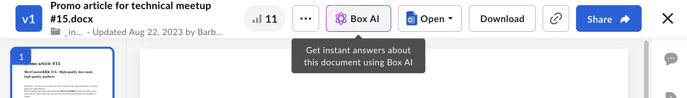

# Box AI

Box AI API allows you to use Box AI
functionality
in your custom applications. For example, you can
implement Box AI question and answer
functionality in your third party application,
or generate content right in
your product’s content editor.

## Box AI Platform API capabilities

Box AI API provides a number of capabilities
designed to help you leverage Large Language Models (LLMs)
in your application workflows.

Currently, you can ask Box AI to answer
user questions, summarize the document content,
or generate text you can use in your documents.
You can also use Box AI to extract metadata from the
provided input, such as a schema or metadata template.

The [Box AI for UI Elements][boxaielement] functionality
allows embedding Box AI in your apps.

### Ask questions to Box AI

You can use Box AI Platform API to ask questions about
the content, for example, while working
on documents you store in Box.

Box AI can answer your questions about the
content or generate a summary based on the
file you supply.

Have a look at [Box AI for Documents][boxaidocs]
to see an example of how users can interact
with Box AI while
working with their documents.

### Generate text with Box AI

You can use Box AI Platform API to generate text
from scratch, from existing text within a Box Note, or
based on a given document in Preview.
For example, you can ask Box AI to create a template
or meeting agenda based on an article you are viewing in
Preview.

Another example is Box Notes that uses Box AI
to generate text
and refine the already existing note content.
For details, see [Box AI for Notes][boxainotes].

### Metadata extraction

The [`POST /2.0/ai/extract`][extract] and [`POST /2.0/ai/extract_structured`][extract-structured] endpoints allow you to extract data from the provided input and return them in a form of key-value pairs.

* Use the `extract_structured` endpoint to extract data according to a pre-defined structure obtained from the metadata template, or a set of fields.
* Use the `extract` endpoint to extract data from a file using a prompt that can include a stringified version of formats such as JSON or XML, or even plain text.

### Configuration overrides

You can use the `ai_agent` parameter available in the Box AI API requests to override the default agent configuration and introduce your own custom settings.

For details, see [AI agent default configuration][agent-default].

### Box AI for UI Elements

Box AI for UI Elements is available in Content Preview
allows asking questions about documents directly
within custom applications.
Check out how to use the [Box AI for UI Elements][boxaielement]
to embed Box AI functionality in your projects.

<!--alex ignore-->

## Supported languages

Box AI works in a number of languages including
English, Japanese, French, Spanish, and many more.
However, the underlying models are primarily
trained on English language documents. This means
that prompts in other languages may return answers
of lower quality than in English. Tests have shown
satisfactory results for summarizing, checking grammar
and spelling, and answering questions, but bear in mind
that the results may be different than in English.

<Message type="tip">

Switch the language to Japanese to get
better results for this language.

</Message>

## Box AI API in User Activity Report (UAR)

[User Activity Reports][uar] provide an overview of the actions the users are taking in Box. Box Admins use this report to view the actions taken by their users within a given time period, and this includes interactions with Box AI. The report contains the following action types that Box admins can select to get details for Box AI:

* **AI query**: The user queried Box AI and received a response.
* **Failed AI query**: The user queried Box AI but did not receive a response.

[boxainotes]: https://support.box.com/hc/en-us/articles/22198577315347-Box-AI-for-Notes
[boxaidocs]: https://support.box.com/hc/en-us/articles/22158484213267-Box-AI-for-Documents
[boxaielement]: g://embed/ui-elements/preview#box-ai-ui-element
[uar]: https://support.box.com/hc/en-us/articles/4415012490387-User-Activity-Report
[agent-default]: g://box-ai/ai-agents/get-agent-default-config
[extract]: e://post_ai_extract
[extract-structured]: e://post_ai_extract_structured
[uar]:https://support.box.com/hc/en-us/articles/4415012490387-User-Activity-Report