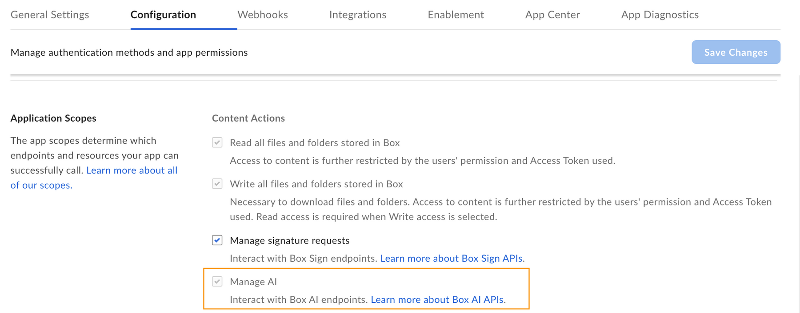
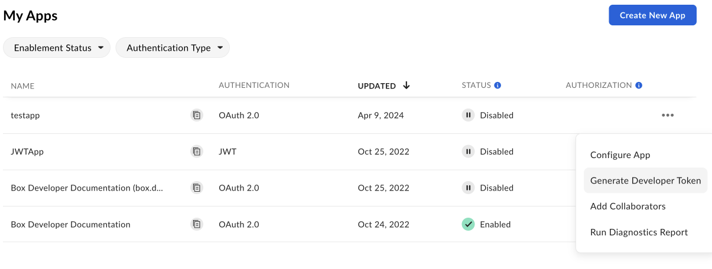

# Box AI入門ガイド

<Message type="notice">

Box AI APIはベータ機能のため、利用可能な機能は変更される可能性があります。Box AI APIは、**Enterprise Plus**をご利用のすべてのお客様が利用できます。

</Message>

ソリューションにBox AI APIを実装するには、その機能にアクセスできることを確認する必要があります。また、Box AIスコープが有効になっているカスタムアプリケーションと、コールを認証するための開発者トークンも必要です。

<Message type="notice">

Box AI APIを使用するには、管理者が管理コンソールでこのAPIを有効にしていることを確認してください。サンドボックスでBox AI APIを使用したい場合は、[こちらのフォーム][form]を使用してBox AIチームにアクセス権限をリクエストしてください。

</Message>

## アプリケーションの作成

まず、コールの実行に使用するカスタムアプリケーションを作成する必要があります。アプリケーションを作成するには、[カスタムアプリの作成][createapps]に関するガイドに従ってください。

## Box AI APIへのアクセスの有効化

Box AI APIを操作するには、アプリケーションに`ai.readwrite`[スコープ][scope]を追加する必要があります。このスコープを追加する前に、Box管理者からBox AI APIへのアクセス権限が付与されていることを確認してください。アプリの構成設定で \[**AIを管理する**] オプションが表示されていない場合は、管理者までお問い合わせください。

スコープを追加するには、以下の手順を実行します。

1. 開発者コンソールで、目的のアプリケーションを開きます。

2. \[**構成**] > \[**アプリケーションスコープ**] > \[**コンテンツ操作**] に移動します。

3. \[**AIを管理する**] スコープを選択します。Box Platformでは、コールを実行すると自動的にこのスコープが含まれます。あるアプリのコラボレータとして追加されているのにBox AI APIにアクセスできない場合は、\[**AIを管理する**] スコープのチェックボックスがオンになった状態で、グレー表示になっています。つまり、アプリの所有者のAIのスコープは有効になっていますが、この設定を変更することはできません。

   

4. [承認または有効化][authorization]のためにアプリを送信します。既存のアプリケーションに対してBox AI APIを有効にする場合は、アプリケーションを[再承認][reauthorization]する必要があります。

## 開発者トークンの生成

リクエストの送信時にアプリを認証するには、開発者トークンが必要です。

トークンを生成するには、以下の手順を実行します。

1. \[**開発者コンソール**] > \[**マイアプリ**] に移動します。
2. 右側の**オプションメニュー**ボタン (\[…]) をクリックします。
3. \[**開発者トークンを生成**] を選択します。トークンが自動的に生成され、クリップボードに保存されます。

アプリを開いて、\[**構成**] > \[**開発者トークン**] に移動してトークンを生成することもできます。

<Message type="notice">

開発者トークンの有効期限は1時間のみです。

</Message>

詳細については、[開発者トークン][token]を参照してください。トークンを生成したら、cURLや他のクライアント ([Postman][postman]など) で使用してコールを実行できます。

[token]: g://authentication/tokens/developer-tokens

[scope]: g://api-calls/permissions-and-errors/scopes

[oauthscopes]: g://api-calls/permissions-and-errors/scopes#scopes-oauth-2-authorization

[createapps]: g://applications/app-types/custom-apps

[postman]: g://tooling/postman

[form]: https://forms.gle/Nsh3TwM3W8qg4U35A

[authorization]: g://authorization

[reauthorization]: g://authorization/custom-app-approval#re-authorization-on-changes
