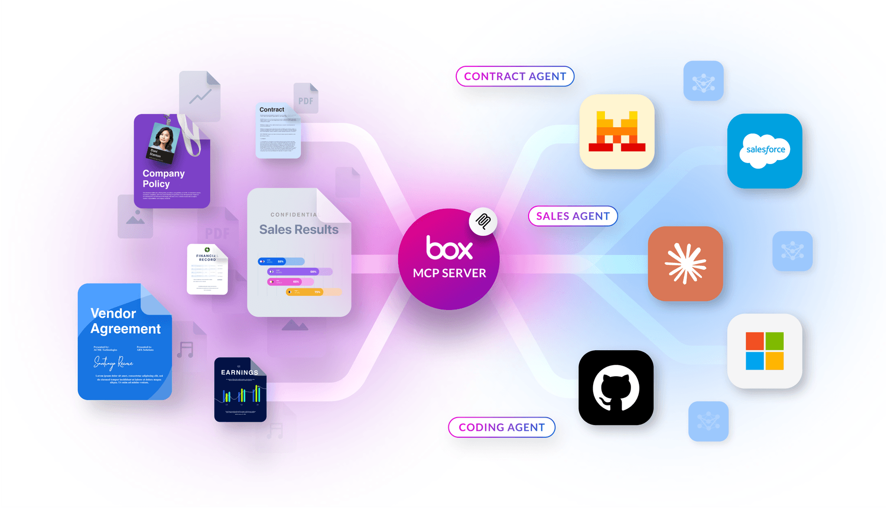

# Box MCP server

Model Context Protocol ([MCP](https://modelcontextprotocol.io/introduction)) is an open protocol that standardizes how applications provide context to LLMs. MCP servers make building advanced integrations simpler and less time consuming.

Box MCP server allows third party AI agents from platforms like Anthropic's Claude, Microsoft Copilot Studio, and Mistral Le Chat to access Box content seamlessly. It extends the agent’s capabilities by allowing it to perform actions related to content stored in Box.

<ImageFrame noborder center>

</ImageFrame>

There are two types of Box MCP servers:

- remote Box MCP server which you can create or enable in the Box Admin Console. It is hosted directly in Box.
<!--alex ignore-->

- self-hosted Box MCP server which you can clone and host on your local machine, as this version in an open source Box Developer community project.
<!--alex enable-->

Check the detailed guides on both types of Box MCP servers, as the level of the implemented tools differs. Learn how to enable Box MCP server:

<TileGrid rows="2">

<Tile type="mcp" title="Remote Box MCP server" href="/guides/box-mcp/remote">

Enable the remote Box MCP server in the Admin Console. It is hosted directly in Box.

<strong style="background-color: #e1ffe7">

New

</strong>

</Tile>

<Tile type="mcp" title="Self-hosted Box MCP server" href="/guides/box-mcp/self-hosted">

An open source Box Developer community project. You can clone this Box MCP Sever and host it on your local machine.

<strong style="background-color: #e8e8e8">

Open source

</strong>

</Tile>

</TileGrid>

Watch an interview with Box CTO, Ben Kus, and learn how MCP empowers AI agents to work dynamically across platforms, reducing the development effort.

<iframe width="100%" height="500" src="https://www.youtube.com/embed/u_y5_y9JGg4?si=PY2__LklwsGWwiAD" title="MCP: The API standard that makes AI actionable for enterprises | Box AI Explainer Series EP4 with Ben Kus, Box CTO" frameborder="0" allow="accelerometer; clipboard-write; encrypted-media; gyroscope; picture-in-picture; web-share" referrerpolicy="strict-origin-when-cross-origin" allowfullscreen>

</iframe>