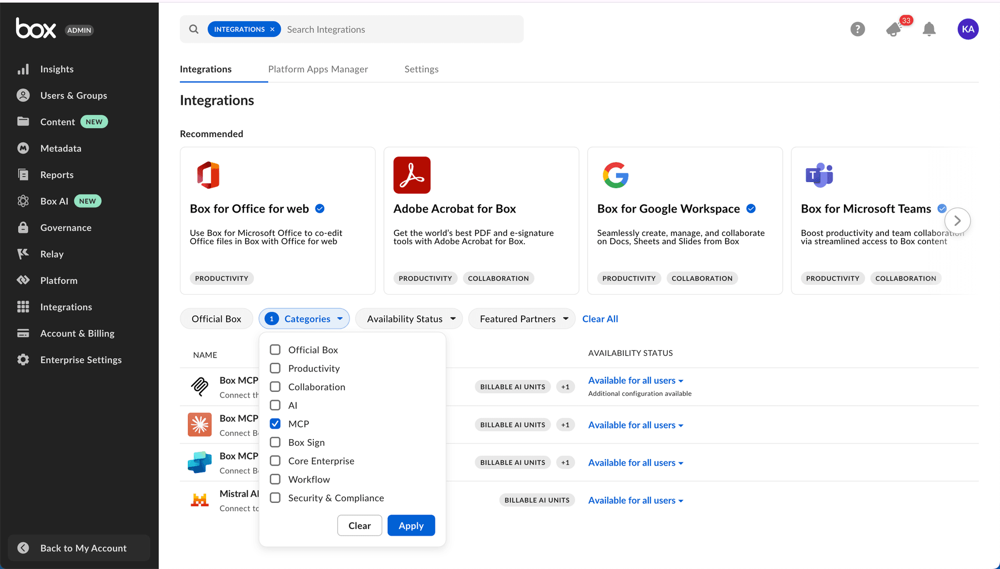

# Remote Box MCP server

[Remote Box MCP server](https://modelcontextprotocol.io/introduction) is a standardized way for AI Agents to connect and interact with third-party applications like Box, enabling seamless access to content and AI capabilities across platforms. The Box MCP server acts as a bridge that allows leading AI Agent platforms — such as Copilot Studio, Claude Enterprise, Mistral Le Chat — to securely query and utilize Box data and AI-powered tools without exposing raw file content. Through OAuth authorization, users can grant AI Agents controlled access to their Box accounts, enabling intelligent document handling, advanced search, and multi-file AI queries directly within these external AI environments.

## Access and manage predefined Box MCP servers

1. Box管理コンソールのサイドバーにある \[**統合**] をクリックします。 
2. Use _Categories_ filter and choose MCP or search for a predefined Box MCP server in the search field search at the top of the window.
3. Beside the selected MCP server, click the state, then select the state you want to enable.

<ImageFrame noborder center>



</ImageFrame>

## Create an unlisted Box MCP server

1. Box管理コンソールのサイドバーにある \[統合] をクリックします。
2. Search for **Box MCP server** in the search field search at the top of the window.
3. Hover on the **Box MCP server** application, then click **Configure**.
4. \[**追加の構成**] セクションで \[**+ 統合資格情報を追加**] をクリックします。
5. 生成されたクライアントIDとクライアントシークレットをコピーします。 
6. 外部MCPクライアントから提供されたリダイレクトURIを入力します。 
7. \[スコープ] で \[_AIリクエストの管理_] が選択されていることを確認します。

## Add Box MCP server on the Client Side

AIエージェントプラットフォームからBoxに接続するには、以下の操作を行う必要があります。

* Endpoint URL: `https://mcp.box.com`
* Client ID and Client Secret: Box generates these in the Integration Credentials section of your Admin Console when configuring the Box MCP server, above.
* MCP名を渡す: `box-remote-mcp`
* `authorization_token`を指定する

正確な手順はAIプラットフォームによって異なる場合があります。クライアント側での設定手順については、お使いのプラットフォームのドキュメントを参照してください。参考までに、次のサンプルコードを確認してください。

```python
response = await client.beta.messages.create(
    model="claude-3-opus-20240229",  # Or your preferred model
    max_tokens=4096,
    messages=conversation_history,
    mcp_servers=[
        {
            "type": "url",
            "url": "https://mcp.box.com",
            "name": "box-remote-mcp",
            "authorization_token": BEARER_TOKEN,
        }
    ],
    betas=["mcp-client-2025-04-04"]
)

```

### Claude Desktop

To start using the remote Box MCP server in [Claude Desktop](https://claude.ai/download), go to Claude app settings and click _Connectors_. Within this view click _Browse connectors_ and choose Box. Ensure to grant Claude access to Box.

See a demo video that showcases how to connect Box MCP with Mistral Claude desktop.

<iframe width="100%" height="500" src="https://www.youtube.com/embed/OJVjXZkPd54?si=PSiV6aKkUnL7CXoG" title="YouTube video player" frameborder="0" allow="accelerometer; autoplay; clipboard-write; encrypted-media; gyroscope; picture-in-picture; web-share" referrerpolicy="strict-origin-when-cross-origin" allowfullscreen>

</iframe>

### Copilot Studio

To add the remote Box MCP server, follow the instructions provided by the Copilot Studio side. Detailed steps and guidance are available in the official Microsoft documentation: [Add an MCP Server in Copilot Studio](https://learn.microsoft.com/en-us/microsoft-copilot-studio/agent-extend-action-mcp#add-tools-from-an-existing-mcp-connector-to-an-agent).

### Azure API Center

To add the remote Box MCP server in Azure API Center's Enterprise Registry, follow the instructions provided by Azure. Detailed steps and guidance are available in the official Microsoft documentation: [Add an MCP Server in Azure API Center's Enterprise Registry](https://learn.microsoft.com/en-us/azure/api-center/register-discover-mcp-server).

### AnthropicのMessages API

Connect the remote Box MCP server with [Anthropic's Messages API](https://docs.anthropic.com/en/api/messages). Clone [this sample chat bot project](https://github.com/box-community/mcp-client-remote-mcp-react) to get started quickly. It allows you to have a conversation with an Anthropic model, which has access to tools provided by the Box remote MCP server.

Watch a video that features a demo project, a React based chat bot that leverages remote Box MCP.

<iframe width="100%" height="500" src="https://www.youtube.com/embed/Rcn8p-nLJtI?si=dWsMnE6reTE-aKQw" title="Box remote MCP" frameborder="0" allow="accelerometer; autoplay; clipboard-write; encrypted-media; gyroscope; picture-in-picture; web-share" referrerpolicy="strict-origin-when-cross-origin" allowfullscreen>

</iframe>

### Mistral AI’s Le Chat

To enable Box MCP for [Mistral AI’s Le Chat](https://chat.mistral.ai/chat), visit [connectors page](https://chat.mistral.ai/connections), click _Connect_ and grant access to Box. Alternatively, directly form the chat view, click _Tools_ and choose Box.

<ImageFrame noborder center>


</ImageFrame>

### MCPサーバーでのBox AIの機能の使用

When you use Box AI in third-party applications, you can achieve the best experience and highest quality results by accessing the applications through the Box MCP server. This ensures full functionality, improved performance, and a seamless user experience.

## 利用可能なツール

Remote Box MCP server includes several tools you can use:

| ツール                                | 説明                                                                               |
| ---------------------------------- | -------------------------------------------------------------------------------- |
| `who_am_i`                         | 現在認証されているBoxユーザーの詳細な情報を返します。                                                     |
| `get_file_content`                 | Returns content of a file stored in Box                                          |
| `search_folders_by_name`           | キーワードの照合を使用して、名前でBox内のフォルダを検索します。                                                |
| `list_folder_content_by_folder_id` | フォルダ内のファイル、フォルダ、ウェブリンクのリストを取得します。                                                |
| `search_files_keyword`             | キーワードを使用してファイルを検索します。メタデータフィルタ、ファイル拡張子によるフィルタ処理、フィールドの選択がサポートされています。             |
| `search_files_metadata`            | SQLに似たメタデータクエリを使用してファイルを検索します。パラメータを使用した複雑なフィルタ処理、フィールドの選択、フォルダの範囲指定がサポートされています。 |
| `ai_qa_single_file`                | Box AIを使用して単一のファイルに質問します。                                                        |
| `ai_qa_multi_file`                 | Box AIを使用して複数のファイルに質問します。                                                        |
| `ai_qa_hub`                        | Box AIを使用してBox Hubに質問します。                                                        |
| `ai_extract_freeform`              | Box AIを使用して、ファイルから自由形式でメタデータを抽出します。あらかじめ定義されたテンプレート構造は必要ありません。                   |
| `ai_extract_structured`            | Box AIを使用して、ファイルから、カスタムフィールドの定義または既存のメタデータテンプレートに基づいて構造化メタデータを抽出します。             |
