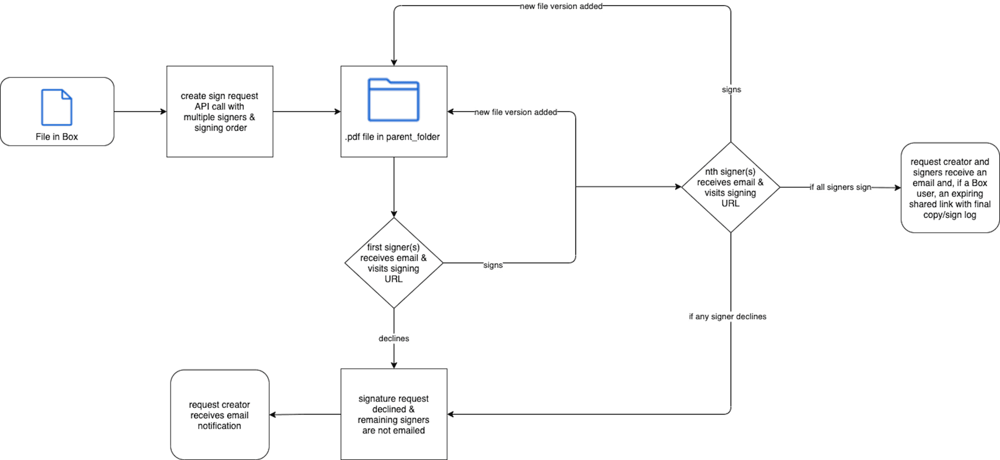
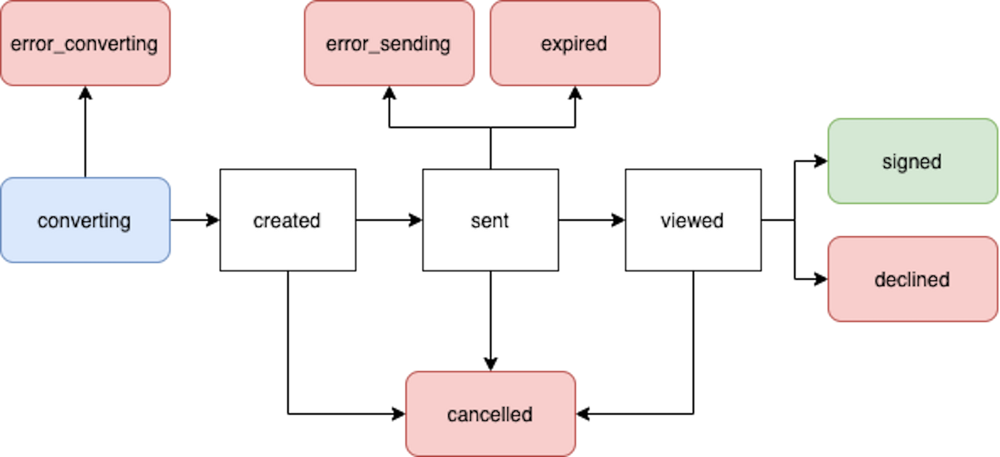

# Box Signのリクエストの作成

[Box Signのリクエストを作成エンドポイント][create]を使用するには、少なくとも、署名用ファイルのほか、署名済みドキュメント/[署名ログ][log]の保存先フォルダを選択し、署名者を指定する必要があります。

<Samples id="post_sign_requests">

</Samples>

## ファイル

Box Signの各リクエストは、署名が必要なファイルから始まります。そのファイルがまだBoxに存在しない場合は、リクエストを作成する前に、別のAPI呼び出しでファイルを[アップロード][upload]する必要があります。現時点では、1つのリクエストにつき署名できるファイルは1つだけです。このファイルIDは、`source_files`本文パラメータで指定されます。

<Message type="warning">

リクエスト送信者は、Box内のファイルに対してダウンロード権限を持っている必要があります。この要件を満たしているかどうかを確認するには、[コラボレーションレベル][collab]を確認してください。

</Message>

サポートされているファイルタイプは以下のとおりです。

* すべての[ドキュメント][documents]
* すべての[プレゼンテーション][presentations]
* 画像: `png`、`jpg`、`jpeg`、`tiff`のみ
* テキストベースのファイル: `.csv`、`.txt`のみ

すべてのファイルタイプは、署名の処理のために`.pdf`に変換されます。この変換後のドキュメントは、リクエストの送信が成功した場合は、`parent_folder`に見つかります。つまり、元のファイルタイプに関係なく、最終的な署名済みドキュメントは`.pdf`になります。各署名者がリクエストを完了すると、Box Signにより新しいファイルバージョンが自動的に追加されます。

ファイルサイズの上限は、アカウントの種類によって決まります。詳細については、[アップロードガイド][uploads]を参照してください。 

## 親フォルダ

`parent_folder`本文パラメータで指定されたフォルダIDによって、最終的な署名済みドキュメントと[署名ログ][log]の保存先が決まります。このフォルダには、フォルダID `0`で表される \[すべてのファイル] やルートレベルを指定することができません。 

## 署名者

各署名者には、[役割][role]として、署名者、承認者、または最終的なコピー受信者を割り当てる必要があります。

リクエスト送信者に役割が指定されていない場合は、`final_copy_reader`という役割の署名者が自動的に作成されます。つまり、最終的な署名済みドキュメントと[署名ログ][log]のコピーを受信するだけです。

署名者は、ドキュメントに署名するために、既存のBoxアカウントを持っている必要も、アカウントを作成する必要もありません。他のAPIエンドポイントとは異なり、署名者はBox `user_id`ではなくメールアドレスを使用して招待されます。 

<Message type="warning">

Box Signは、リクエストで指定された署名者のメールアドレスに署名用メールを送信しようとするだけです。Boxユーザーの場合、指定しない限り、メールエイリアスは含まれません。指定された署名者のメールアドレスすべてが有効であることを再確認してください。

</Message>

## 複数の署名者と署名の順序

署名の順序は、指定された`order`の数値を小さいものから大きいものへ順序付けすることで決まります。2つの数値が同じ場合、署名者には同時にリクエストが届きます。

最初は、割り当てられた`order`の数値が最も小さい署名者だけに、Box Signのリクエストメールが送信されます。その署名者が署名すると、次のユーザーにメールが送信される、というように進んでいきます。Box Signでは、ユーザーが署名するたびに、ドキュメントの新しいバージョンが`parent_folder`に自動的に追加されます。  

いずれかの署名者が拒否した場合、残りの署名者にBox Signのリクエストメールが送信されません。リクエスト全体が拒否されます。

<ImageFrame border center shadow>

</ImageFrame>

## ドキュメントの準備

Box Signのリクエストを送信する前にドキュメントを準備することで、開発者は署名者のために日付、テキスト、チェックボックス、署名のプレースホルダを追加できます。これを実行するには、UIを使用するか、ドキュメント内で直接[タグ][tags]を使用します。これを実行しなかった場合、署名者には準備が完了していないドキュメントが送信されるため、署名者の判断で署名やフィールドを配置できます。ただし、開発者は、準備が完了していないドキュメントの機能をオンまたはオフにするためのコントロールをリクエスト内で利用できます。

`is_document_preparation_needed`を`true`に設定すると、レスポンスで`prepare_url`が返されます。ブラウザでこのリンクにアクセスすると、ドキュメントの準備を完了し、UIを使用してリクエストを送信できます。

ドキュメントのタグの詳細については、[サポート記事][tags]を参照してください。

<Message type="warning">

Boxウェブアプリを使用してテンプレートに作成された事前入力タグには、APIからアクセスできません。

</Message>

<ImageFrame border center shadow>

</ImageFrame>

## リクエストのステータス

* `converting`: 署名リクエストが送信された後、ファイルが署名プロセスのために`.pdf`に変換されている
* `error_converting`: ファイルを`.pdf`に変換している間に問題が発生した
* `created`: `document_preparation_is_needed`が`true`に設定されているが、`prepare_url`がまだアクセスされていない場合
* `sent`: リクエストが正常に送信されたが、どの署名者も対応していない
* `error_sending`: リクエストを送信中に問題が発生した
* `viewed`: 最初 (または唯一) の署名者が署名用メールの \[**ドキュメントをレビュー**] をクリックするか、署名用URLにアクセスした場合
* `downloaded`: 署名者が署名用ドキュメントをダウンロードした
* `signed`: すべての署名者がリクエストの処理を完了した
* `signed and downloaded`: 署名者が署名用ドキュメントに署名してダウンロードした
* `declined`: いずれかの署名者がリクエストを拒否した場合
* `cancelled`: リクエストがUIまたはAPIを介してキャンセルされた場合
* `expired`: 署名が未完了、不十分のまま、有効期限が過ぎた 

エラーステータスになった場合、再試行するには、新しい署名リクエストを作成する必要があります。

<ImageFrame border center shadow>

</ImageFrame>

[upload]: e://post-files-content/

[documents]: g://representations/supported-file-types/#documents

[presentations]: g://representations/supported-file-types/#presentations

[uploads]: g://uploads/direct

[create]: e://post-sign-requests

<!-- i18n-enable localize-links -->

[tags]: https://support.box.com/hc/ja/articles/4404085855251-タグを使用したテンプレートの作成

[log]: https://support.box.com/hc/ja/articles/4404095202579-署名ログの確認

[role]: https://support.box.com/hc/ja/articles/4404105660947-署名者の役割

[collab]: https://support.box.com/hc/ja/articles/360044196413-コラボレータの権限レベルについて

<!-- i18n-disable localize-links -->
