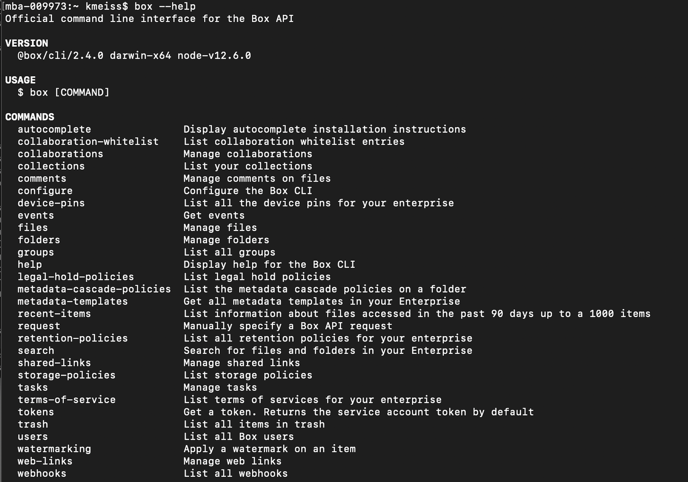
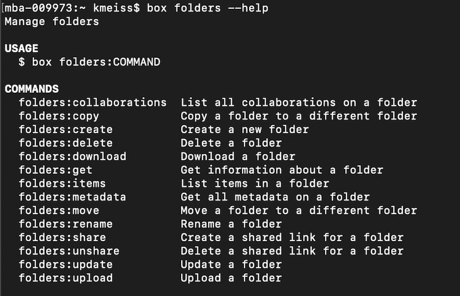
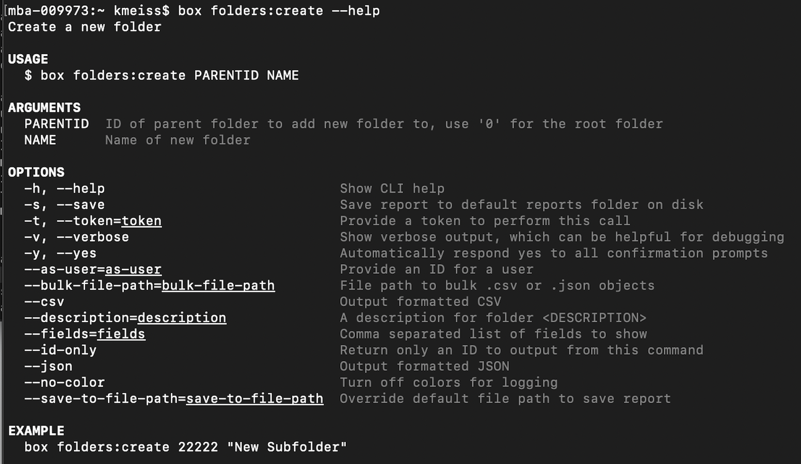

# コマンドの作成とヘルプ機能

CLIコマンドの全一覧と使用方法に関する情報については、[GitHubリポジトリ][github]を参照してください。

<Message type="warning">

一部のコマンドは、サービスアカウントと管理者しか使用できません。必要なスコープでユーザーが承認されていない場合、または別のユーザーのデフォルトのトークンを取得するようCLIを構成した場合は、呼び出しが失敗する可能性があります。詳細なエラーログを確認するには、コマンドに`-v`または`--verbose`を追加してください。

</Message>

必要なエンドポイント用のコマンドが表示されない場合は、[カスタムリクエスト][custom]を作成できます。

<Message type="tip">

helpコマンドで提供されない情報を確認するには、リファレンスドキュメントと併せてリポジトリのドキュメントを使用してください。このような情報には、制限事項、トークンの権限の要件、フィールドなどがあります。

</Message>

<YouTube id="66wlIyS07Aw">

</YouTube>

## はじめに: ブラウザのストレージをリセットする

Box API資格情報をCLIにインポートしたので、これらの資格情報をブラウザのストレージから削除することをお勧めします。

<ResetButton id="cli,credentials,observable_events">

資格情報をクリア

</ResetButton>

<Message warning>

API資格情報をブラウザのストレージから削除すると、**クライアントID**または**クライアントシークレット**を他のスクリプトで読み取ることができなくなります。

</Message>

## helpを使用したフォルダの作成

<!--alex ignore executing-->

どのCLIコマンドも`box`で始まります。任意のコマンドにオプション`--help`を追加すると、そのコマンドを作成するためのヘルプが表示されます。たとえば、`box --help`を実行すると、使用可能なすべてのオブジェクトコマンドのリストが表示されます。オプションの詳細については、[手順4][four]で説明します。

<ImageFrame center>

</ImageFrame>

<!--alex ignore execute-->

次に、例として、フォルダオブジェクトを使用してコマンド`box folders --help`を実行します。その結果、このオブジェクトに実行できるすべての操作のリストが表示されます。

<ImageFrame center>

</ImageFrame>

フォルダの作成に必要な引数を調べるためのコマンド: `box folders:create --help`

<ImageFrame center>

</ImageFrame>

<!--alex ignore execute-->

コマンド`box folders:create 0 "My CLI Folder"`を実行し、レスポンスで返されたフォルダIDを書き留めておきます。

<Message type="tip">

フォルダツリーのルートレベルである \[すべてのファイル] ページは、常にフォルダID 0で表されます。

</Message>

**自分の**Boxアカウントにログインします。このフォルダが自分のフォルダツリーに表示されているでしょうか?

<Message type="warning">

JWT認証を使用したBox CLIを設定すると、Boxアカウントにこのフォルダが表示されなくなります。このフォルダは、アプリケーションの承認後に作成されたアプリケーションのサービスアカウントに存在します。

</Message>

## まとめ

* **ヘルプ**機能を使用してフォルダを作成しました

<Next>

最初のフォルダを作成しました

</Next>

[github]: https://github.com/box/boxcli#command-topics-1

[custom]: https://github.com/box/boxcli/blob/master/docs/request.md

[sa]: page://platform/user-types/#service-account

[four]: g://cli/quick-start/options-and-bulk-commands/#options
