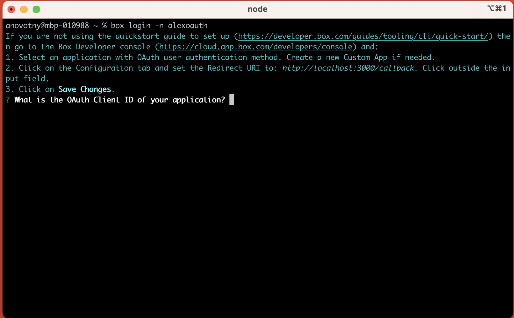
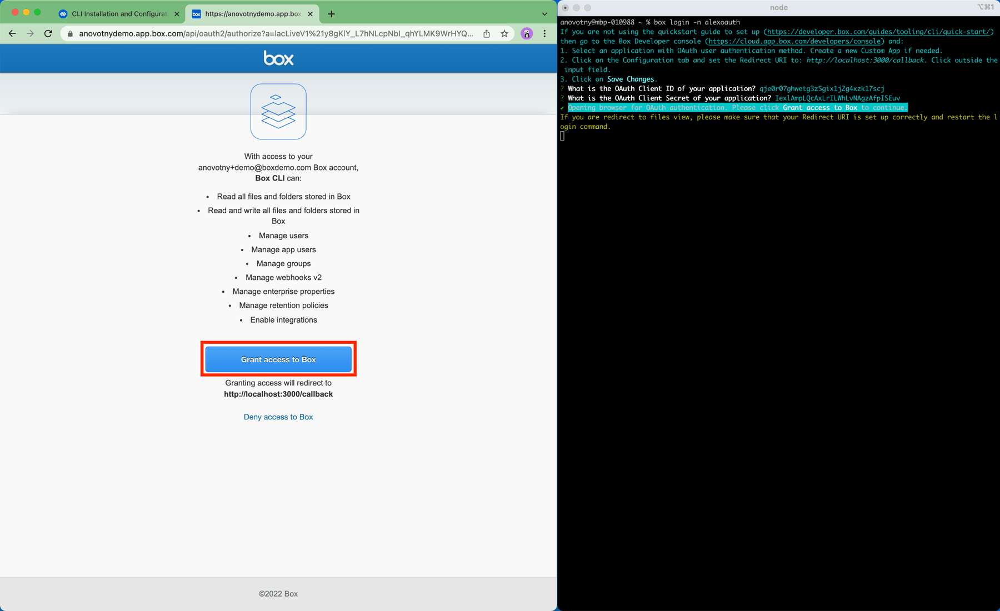
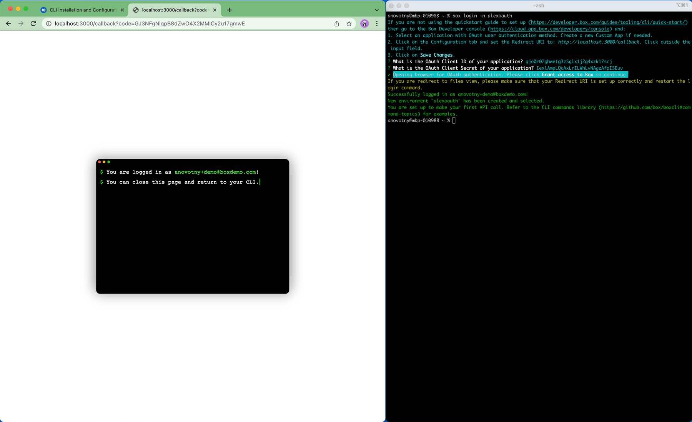
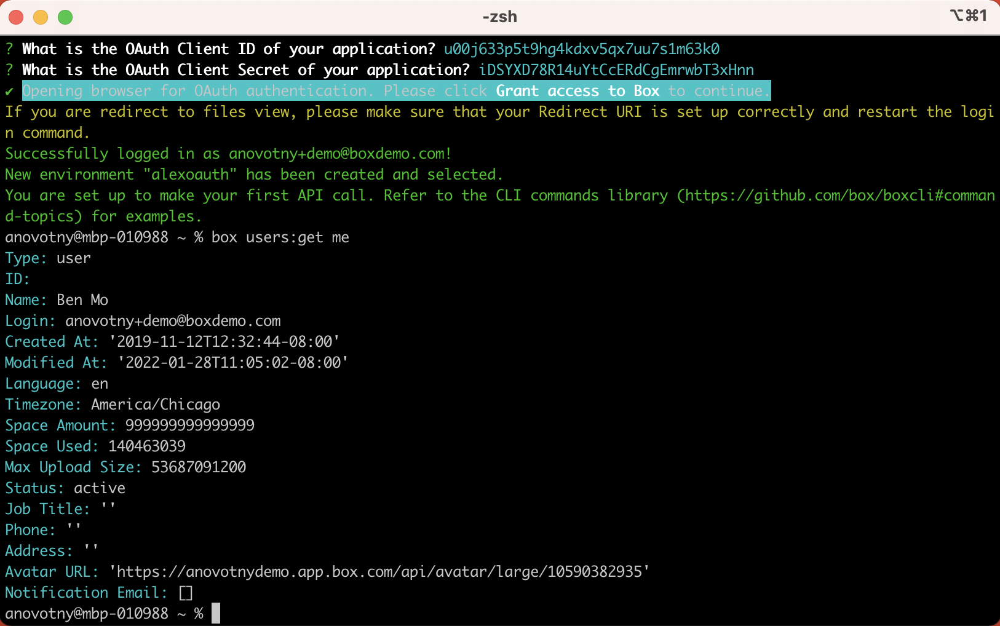

# CLIのインストールと構成

<Choice option="cli.app_type" value="create_new,use_existing,clicked" color="none">

Windows用およびmacOS用のインストーラが提供されていますが、その他の環境でCLIを構築する場合はRawソースコードを利用できます。

## Windows用およびmacOS用インストーラ

お使いのマシンに最新のCLIをインストールするには、最新リリースに対応する最新の`.exe` (Windowsの場合) または`.pkg` (macOSの場合) をダウンロードします。

<CTA to="https://github.com/box/boxcli/releases">

最新のCLIインストーラをダウンロード

</CTA>

## LinuxとNodeのインストール

さらに、CLIは、任意のプラットフォーム (Linuxなど) にNodeパッケージとしてインストールすることができます。このためには、[Node JS](https://nodejs.org/)をマシンにインストールしておく必要があります。

```bash
npm install --global @box/cli

```

## ソースコード

CLIのソースコードは、[GitHub][cli]で提供されています。

## 構成コマンドの実行

ここで、BoxアプリにログインしてCLIを構成する必要があります。

この手順では、前の手順の**クライアントID**と**クライアントシークレット**を使用してログインし、ユーザー用に**アクセストークン**を作成します。

## ログインする理由

現時点では、以下の情報が提示されています。

<Store disabled inline id="cli_credentials.client_id">

クライアントID

</Store>

<Store disabled inline obscured id="cli_credentials.client_secret">

クライアントシークレット

</Store>

<!--alex ignore execute-->

ターミナルまたはコマンドラインを開き、`box login -n example_name`コマンドを実行します。

求められたら、ターミナルウィンドウにクライアントIDとクライアントシークレットをコピーします。

<ImageFrame center>



</ImageFrame>

ブラウザウィンドウに表示された \[**Boxへのアクセスを許可**] ボタンをクリックします。

<ImageFrame center>



</ImageFrame>

成功すると、成功を示す次のメッセージが表示されます。

<ImageFrame center>



</ImageFrame>

## 構成の確認

うまく構成されているか確認するには、`box users:get me`コマンドを入力して、Box CLIで最初のBox APIコールを実行します。

<ImageFrame center>



</ImageFrame>

成功を示すレスポンスには、ユーザーアカウントの詳細が示されます。

```json
Type: user
ID: ''0123456789''
Name: Aaron Levie
Login: example@box.com
Created At: '2020-01-01T09:45:01-07:00'
Modified At: '2021-03-01T09:30:05-07:00'
Language: en
Timezone: America/Los_Angeles
Space Amount: 999999999999999
Space Used: 6291500
Max Upload Size: 16106127360
Status: active
Job Title: ''
Phone: ''
Address: example+user@box.com
Avatar URL: ''
Notification Email: []

```

## まとめ

* CLIをインストールしました。
* 前に作成したOAuth 2.0アプリケーションを使用するようCLIを構成しました。
* **Box CLIの最初のBox APIコールを実行**し、アクセストークンに関連付けられたユーザーを確認しました。

<Next>

CLIをインストールして構成しました

</Next>

</Choice>

<Choice option="cli.app_type" unset color="none">

<Message danger>

# 前の手順が完了していません

前の手順を完了し、使用する**Boxアプリ**をセットアップしてください。

</Message>

</Choice>

[cli]: https://github.com/box/boxcli

[auth]: g://authentication/jwt/without-sdk/

[sa]: page://platform/user-types/#service-account/

[at]: g://authentication/tokens/

[dc]: https://app.box.com/developers/console
