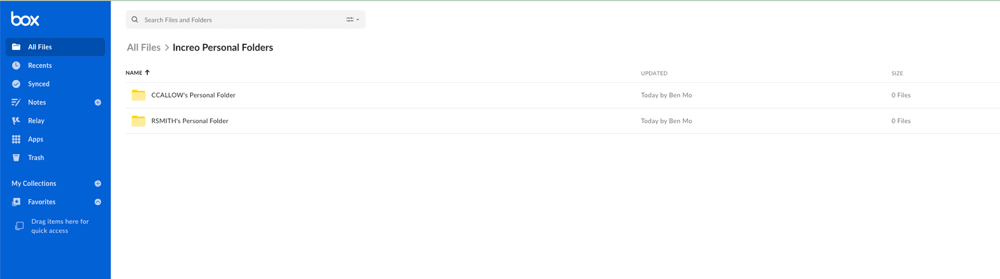

# Box CLIでのPowerShellスクリプトの使用

CLIはそれ自体がすでに強力ですが、PowerShellスクリプトと併用すると、反復タスクをさらに短時間で完了することができます。Boxでは、開発をすぐに開始できるように、BoxのCLI GitHubリポジトリ内にサンプル[スクリプト][scripts]フォルダを作成しました。

CLIスクリプトのしくみを説明するため、ユーザーのプロビジョニングと作成を行う[スクリプト][script-1]テンプレートを使用します。

このスクリプトでは、Box CLIを使用して、個人用フォルダ構造の作成と管理対象ユーザーの一括作成を実行し、新しく作成したフォルダ構造に新しいユーザーをビューアー/アップローダーのロールを持つコラボレータとして追加することでそのユーザーのプロビジョニングを行います。

<Message type="warning">

クイックスタートのこの手順は、管理者権限を持つサービスアカウントとユーザーのみを対象としています。Box管理者以外のユーザーの場合、またはサービスアカウントを使用していない場合は、この手順をスキップしてください。

</Message>

<YouTube id="i43YfP-dT_s">

</YouTube>

## ユースケース

ユーザーとフォルダ構造を自動的に作成するために、スクリプトによって以下の手順が実行されます。

1. `.csv`ファイルを使用して従業員データを一括で読み込みます。
2. JSONファイルを使用してフォルダ構造を定義するか、ユーザーのローカルディレクトリから構造をアップロードします。
3. 新しい管理対象ユーザーごとに、あらかじめ決められた個人用フォルダ構造を作成します。

## 前提条件

### Windows

[.NET Core](https://dotnet.microsoft.com/download)の最新バージョンのインストール

### macOSおよびLinux

[PowerShell][pwsh]のインストール

<message>

問題が発生する場合は、[.NET Core](https://dotnet.microsoft.com/download)と[PowerShell][pwsh]の両方をインストールしたかどうか確認してください

</message>

### Box CLI

スクリプトを使用するには、Box CLIをインストールし、構成する必要があります。まだの場合は、このクイックスタートガイドの[手順1][step 1]を参照してください。または、[開発者コンソール][console]に移動し、[OAuth 2.0を使用した設定][auth]ガイドに従ってください。

### 個人用フォルダの親フォルダの作成

このスクリプトは、作成される各ユーザーにフォルダ構造を作成することで動作します。そのためには、すべての個人用フォルダが格納される親フォルダを作成する必要があります。そうしないと、すべてのフォルダは、CLIの設定に使用したユーザーのルートに格納されます。このフォルダは、好きな場所に名前を付けて配置できますが、CLIの設定に使用したユーザーにそのフォルダへのアクセス権限を付与する必要があります。

スクリプト実行後の構造の例を次に示します。

<ImageFrame border center>



</ImageFrame>

## スクリプトのダウンロード

任意のディレクトリにスクリプトを複製し、そのディレクトリに移動します。

```bash
git clone https://github.com/box/boxcli.git box-cli
cd box-cli/examples/User\ Creation\ \&\ Provisioning/

```

## スクリプト設定の構成

自分の環境で実行できるようにスクリプトを調整します。この例では、スクリプトに用意されているサンプルデータを使用します。

### パラメータの指定

スクリプトを実行する前に指定する必要があるパラメータがいくつかあります。

* `EmployeeList`: `Employee List` CSVのパス。
* `PersonalFolderParentID`: 入力にJSONファイルを使用してフォルダ構造を作成するかローカルの構造をアップロードするときに、すべての個人用フォルダが作成される宛先フォルダID。このフォルダは、初めてスクリプトを実行する前に作成する必要があります。この値を`0`にすることはお勧めしません。この値に設定した場合、CLIの設定に使用したアカウントのルートに個々の個人用フォルダが作成されるためです。
* `FolderStructureJSONPath`: 所有するフォルダ構造のJSONパス。
* `PersonalFolderSlug`: 個人用フォルダの親として作成されるフォルダ名の末尾に使用される文字列。デフォルトでは`Personal Folder`に設定されていますが、必要に応じて自由に設定できます。ユーザー名にこの値を連結して、各ユーザーの個人用フォルダの名前が作成されます (例: `rsmith2's Personal Folder`)。
* `LocalUploadPath`: フォルダ構造を直接アップロードするためのローカルディレクトリ。

<Message>

ローカルのアップロードパスまたはフォルダ構造のJSONファイルを指定してください。両方は指定できません。

</Message>

### ユーザーリストの更新

ユーザーを読み込むには、サンプルファイル`Employees_1.csv`、`Employees_5.csv`、`Employees_10.csv`を使用できます。それぞれのファイルでは、新しいユーザーが1人、5人、10人読み込まれます。

これらのファイルをテスト実行用にカスタマイズします。たとえば、`Employees_1.csv`を次のデータで更新します。

```bash
firstName,lastName,email,username
Isaac,Newton,abc@abc.local,INewton23

```

`EmployeeList`パラメータを使用して、データを読み込む`.csv`ファイルを指定します。

<Message warning>

メールアドレスは、Box全体で一意である必要があります。また、ユーザー名は特定のBoxインスタンスで一意である必要があります。そうでない場合は、スクリプトを実行したときにエラーがスローされます。

</Message>

### フォルダ構造の作成

フォルダ構造は、JSONファイルから作成するか、ローカルドライブからアップロードすることができます。

#### JSONファイルを使用する

`Folder_Structure.json`ファイルは、作成するフォルダ構造を含んでいます。たとえば、`Market Research`フォルダと`Sales Plays`フォルダを作成し、それぞれにサブフォルダ`Statistics`と`Big Pharma`を作成するとします。このスクリプトは、このフォルダ構造を、指定した親フォルダ内にある当該ユーザーの`Personal Folder`フォルダの下に配置します。

`FolderStructureJSONPath`パラメータを使用して、`Folder_Structure.json`ファイルの場所を指定します。

#### ローカルドライブからアップロードする

フォルダ構造をローカルファイルシステムから直接アップロードすることもできます。`LocalUploadPath`パラメータを使用して、アップロードするローカルフォルダのパスを指定します。このフォルダは、名前はそのままで、JSONファイルを使用した方法と同様にアップロードされます。

### パラメータの更新

スクリプトを実行する前にパラメータを渡す方法は3つあります。

* スクリプトで静的な値を使用する

  <Message>

    実行する前に、スクリプト内のすべての必須パラメータを忘れずに更新してください。

    </Message>

```bash
    # Set Employee List CSV Path
    # firstname, lastname, email, username
    $EmployeeList = ""

    # Personal Folder Structure: Set either path build off JSON or directly upload
    # a local folder
    $FolderStructureJSONPath = ""
    $LocalUploadPath = ""

    # Ending slug of folder that will be used in creating personal folders for new
    # users. Value will get concatenated with username
    # If username is RSMITH, the personal folder name would be
    # RSMITH's Personal Folder
    $PersonalFolderSlug = ""

    # ID of parent folder for created personal folders to be created in
    # This folder should be created before running the script the first time.
    # It is not advised to make this value 0, as this will create individual
    # Personal folders in root of the account you set up the cli with
    $PersonalFolderParentID = ""

```

* パラメータを指定してスクリプトを実行する

    スクリプトの実行中にパラメータを指定できます。以下に例を示します。

```bash
    PS > ./Users_Create_Provision.ps1 -EmployeeList ./Employees_1.csv `
        -LocalUploadPath ./PersonalLocalUpload `
        -PersonalFolderSlug "Personal Folder" `
        -PersonalFolderParentID 123456789

    Starting User Creation & Provisioning script...

```

* 求められたときにパラメータを指定する

    実行時に指定されていないパラメータがある場合は、スクリプトにより、指定するよう求められます。

```bash
    PS > ./Users_Create_Provision.ps1
    Please enter the path to the employee list CSV file:
    ./Employees_1.csv
    Please enter the path to the folder structure JSON file or the local upload path:
    Folder_Structure.json
    Folder structure JSON path set to: Folder_Structure.json
    Please enter the ID of the folder where you would like to create the personal folders:
    0
    Starting User Creation & Provisioning script...

```

## スクリプトの実行

1. ディレクトリを、スクリプトが格納されているフォルダに変更します。この例では、`User Creation & Provisioning`フォルダになります。

```bash
    pwsh

```

2. スクリプトを実行します:

```bash
    PS /home/rvb/box-cli/examples/User Creation & Provisioning> ./Users_Create_Provision.ps1

```

    The response will be similar to the following:

```bash
    Starting User Creation & Provisioning script...

    firstName lastName email
    --------- -------- -----
    Isaac     Newton   abc@abc.local
    Extracting folder structure
    Found current User ID: 18622116055

    Created a user owned Onboarding folder with id: 164734146745

    Created subfolder Market Research under Onboarding folder with id: 164735375585

    Created subfolder under Statistics folder with id: 164734956242

    Created subfolder Sales Plays under Onboarding folder with id: 164735683001

    Created subfolder under Big Pharma folder with id: 164736160637
    Creating employee Managed User account with first name:
    Isaac, last name: Newton, email: abc@abc.local, and

    Created Managed user with id: 19605663027

    Type: collaboration
        ID: '37250833128'
    Created By:
        Type: user
        ID: '18622116055'
    Name: Rui Barbosa
    Login: barduinor@gmail.com
    Created At: '2022-06-07T13:58:05-07:00'
    Modified At: '2022-06-07T13:58:05-07:00'
    Expires At: null
    Status: accepted
    Accessible By:
        Type: user
        ID: '19605663027'
        Name: Isaac Newton
        Login: abc@abc.local
    Invite Email: null
    Role: viewer uploader
    Acknowledged At: '2022-06-07T13:58:05-07:00'
    Item:
        Type: folder
        ID: '164734146745'
        Sequence ID: '0'
        ETag: '0'
    Name: Onboarding
    Collaborated Managed User Isaac Newton to current users
    Onboarding folder for provisioning

```

## 新規ユーザーに対するスクリプトの再実行

<!--alex ignore -->

会社で新しい従業員を雇用するたび、このスクリプトを定期的に実行することは一般的です。単に`.csv`ファイルを編集し、前の行のユーザーを削除して新規ユーザーの情報を追加するだけです。その後、スクリプトを再度実行できます。

## まとめ

Box CLIと共にPowerShellスクリプトを使用した、ユーザーのプロビジョニングと最初のフォルダ構造の作成の自動化について確認しました。

その他のユースケースについては、他の[サンプルスクリプト][samples]を確認してください。

<Next>サンプルスクリプトを使用して繰り返し発生するタスクを自動化する方法を理解しました</Next>

[scripts]: https://github.com/box/boxcli/tree/main/examples

[script-1]: https://github.com/box/boxcli/tree/main/examples/User%20Creation%20&%20Provisioning

[jwt-cli]: g://cli/cli-docs/jwt-cli

[pwsh]: https://docs.microsoft.com/en-us/powershell/scripting/install/installing-powershell?view=powershell-7.2

[step 1]: g://cli/quick-start/create-oauth-app/

[console]: https://app.box.com/developers/console

[auth]: g://authentication/oauth2/oauth2-setup

[samples]: g://cli/scripts
