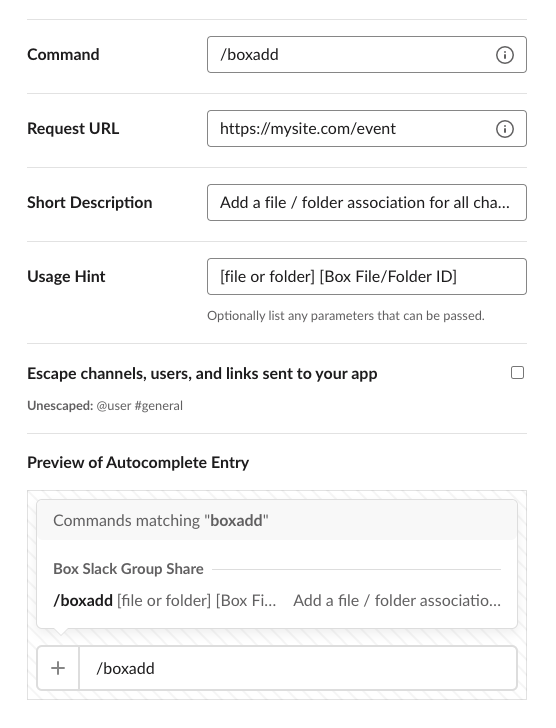

# Slackの構成

このガイドの最初の手順では、Slackアプリケーションを作成して構成します。このSlackアプリケーションは、SlackチャンネルでUser Eventをリッスンするボットとして機能し、そのチャンネルでユーザーが入力した**スラッシュコマンド**に応答します。これにより、ユーザーはBox上のファイルやフォルダをグループと共有できます。

このセクションでは、以下の手順を説明します。

* Slack APIダッシュボード内で最小限のSlackアプリケーションを作成します。
* ユーザーがチャンネルに参加したりチャンネルから退出したりするたびにBoxのアプリケーションに通知が送信されるようSlackアプリケーションを構成し、BoxのコードでBoxグループを更新できるようにします。
* Boxのファイルやフォルダをチャンネル内のすべてのユーザーと共有できるようにする`/boxadd`**スラッシュコマンド**を構成します。

## 最小限のSlackアプリの作成

**[Slackアプリのページ][slack-apps]**に移動し、\[**Create New App (アプリの新規作成)**] をクリックします。\[**App Name (アプリ名)**] を追加し、ボットの展開先となる \[**Development Slack Workspace (開発Slackワークスペース)**] をドロップダウンリストから選択し、\[**Create App (アプリの作成)**] をクリックします。

<ImageFrame noborder center shadow>


</ImageFrame>

作成後、アプリケーションの基本情報セクションにリダイレクトされます。下部の \[**Display Information (情報の表示)**] セクションで、作成したアプリのアイコンと説明を調整して、ワークスペースでアプリケーションをカスタマイズできます。

## Slackアプリのイベントリスナーの構成

Slackアプリ用のイベントリスナーを設定すると、チャンネル内のイベントを監視できます。このボットでは、Box内で操作を実行するために、3つの[Slackイベント][slack-events]を監視します。

* [`bot_added`][slack-event-bot-added]: ボットは、最初にチャンネルに追加されたときに、チャンネル内の全ユーザーのリストを取得し、取得したユーザーのBoxグループを作成します。このグループは、**スラッシュコマンド**で共有される任意のコンテンツにそのグループを追加するために後で使用できます。
* [`member_joined_channel`][slack-event-member-joined]: 新しいユーザーは、Slackチャンネルに参加したときにBoxグループに追加されます。
* [`member_left_channel`][slack-event-member-left]: ユーザーはSlackチャンネルから退出したときや削除されたときに、Boxグループから削除されます。

このようなSlackのイベントペイロードの送信先となる通知URLを設定するために、Slackでは確認手順が必要になります。ボットアプリケーションコードのイベントリスナーURLを設定すると、Slackは即座にそのURLにチャレンジを送信し、そのURLが有効かどうかを確認します。これは、次のようなペイロードを含むHTTP POSTです。

```json
{
  "token": "Jhj5dZrVaK7ZwHHjRyZWjbDl",
  "challenge": "3eZbrw1aBm2rZgRNFdxV2595E9CY3gmdALWMmHkvFXO7tYXAYM8P",
  "type": "url_verification"
}

```

イベントリスナーのURLを設定するには、この手順の間に、設定するURLが、チャレンジ値を含む確認用ペイロードを使用してSlackに応答する必要があります。ペイロードは次のようになります。

```js
HTTP 200 OK Content-type: application/json {"challenge":"3eZbrw1aBm2rZgRNFdxV2595E9CY3gmdALWMmHkvFXO7tYXAYM8P"}

```

このためには、チャレンジイベントに応答する少量のコードを展開します。最初に、以下の中からお好みの言語/フレームワークを選択してください。

<Grid columns="1" compact>

<Choose option="programming.platform" value="node" color="blue">

# Node (Expressフレームワーク)

</Choose>

<Choose option="programming.platform" value="java" color="blue">

# Java (Spring Bootフレームワーク)

</Choose>

</Grid>

<Choice option="programming.platform" value="node" color="none">

プロジェクトディレクトリ内で`npm install express --save`を実行してExpressの依存関係をインストールし、次のコードを適切なNodeモジュールとともに公開エンドポイントに展開します。

```js
const express = require('express');
const app = express();
const port = process.env.PORT || 3000;

app.use(express.urlencoded({ extended: true }));
app.use(express.json());

app.post('/event', (req, res) => {
    if (
        req.body &&
        req.body.challenge &&
        req.body.type === 'url_verification'
    ) {
        res.send({
            challenge: req.body.challenge
        });
    } else {
        res.status(400).send({
            error: "Unrecognized request"
        });
    }
});

app.listen(port, function(err) {
    console.log("Server listening on PORT", port);
});

```

</Choice>

<Choice option="programming.platform" value="java" color="none">

<Message type="tip">

[`Spring Initializr`][spring-initializr]は、すべての依存関係が定義された状態の新しいSpring Bootアプリケーションを自動生成するのに便利なサービスです。これは、空のJavaアプリケーションを作成する代わりに使用できます。

</Message>

* Eclipseで新しいプロジェクトを作成します。求められたら、Gradleプロジェクトを選択します。
* プロジェクトの一意の名前を入力します。このガイドでは`slack.box`という名前を使用しています。
* `build.gradle`ファイルを開いて以下を追加します。アプリケーションに使用したグループとこのグループが一致することを確認します。保存したら、Gradleプロジェクトを更新します。

```java
plugins {
    id 'org.springframework.boot' version '2.3.1.RELEASE'
    id 'io.spring.dependency-management' version '1.0.9.RELEASE'
    id 'java'
}

group = 'com.box'
version = '0.0.1-SNAPSHOT'
sourceCompatibility = '1.8'

repositories {
    mavenCentral()
}

dependencies {
    implementation 'org.springframework.boot:spring-boot-starter-web'
    testImplementation('org.springframework.boot:spring-boot-starter-test') {
        exclude group: 'org.junit.vintage', module: 'junit-vintage-engine'
    }
    compile 'com.box:box-java-sdk:2.44.1'
}

test {
    useJUnitPlatform()
}

```

* `src/main/java`パスに、`Application.java`という名前の新しいJavaクラスファイルを作成します。
* このファイルを開き、次のコードを追加して保存します。

```java
package com.box.slack.box;

import org.jose4j.json.internal.json_simple.JSONObject;
import org.jose4j.json.internal.json_simple.parser.JSONParser;
import org.springframework.boot.SpringApplication;
import org.springframework.boot.autoconfigure.EnableAutoConfiguration;
import org.springframework.web.bind.annotation.PostMapping;
import org.springframework.web.bind.annotation.RequestBody;
import org.springframework.web.bind.annotation.RestController;

@RestController
@EnableAutoConfiguration
public class Application {
    @PostMapping("/event")
    public JSONObject challenge(@RequestBody String data) throws Exception {
        JSONObject returnJSON = new JSONObject();

        Object dataObj = new JSONParser().parse(data);
        JSONObject inputJSON = (JSONObject) dataObj;
        String challenge = (String) inputJSON.get("challenge");
        String type = (String) inputJSON.get("type");

        if (type.equals("url_verification")) {
            returnJSON.put("challenge", challenge);
        } else {
            System.err.println("Invalid input");
        }

        return returnJSON;
    }

    public static void main(String[] args) {
        SpringApplication.run(Application.class, args);
    }
}

```

</Choice>

<Choice option="programming.platform" unset color="none">

<Message danger>

# 前の手順が完了していません

最初に、上記の中からお好みの言語/フレームワークを選択してください。

</Message>

</Choice>

これで、イベントURLの追加時にSlackチャレンジに応答するコードを準備できたので、これをSlackアプリケーション内で構成できます。

Slackアプリケーションの \[**Basic Information (基本情報)**] タブの \[**Add features and functionality (機能の追加)**] で、\[**Event Subscriptions (イベントサブスクリプション)**] というタイトルのボタンをクリックし、以下の操作を行います。

* \[**Enable Events (イベントの有効化)**] を \[**On (オン)**] に切り替えます。
* \[**Request URL (リクエストURL)**] で、上記のコードを展開した公開URLを追加し、`{YOUR_APP_DOMAIN}/event` (`https://myapp.com/event`など) でリッスンしていることに注意します。URLを追加し、フィールドの外をクリックすると、Slackはすぐに、上記でコードをホストしていたURLにチャレンジを送信します。コードが正しく応答した場合は、\[**Request URL (リクエストURL)**] ヘッダーの横に緑色で確認済みであることが表示されます。

<ImageFrame noborder center shadow>

![Slackの \[Event Subscriptions (イベントサブスクリプション)\] の有効化](./img/slack_1_create_event_sub.png)

</ImageFrame>

* \[**Subscribe to bot events (Bot Eventの購読)**] セクションを展開し、\[**Add Bot User Event (Bot User Eventの追加)**] ボタンをクリックします。
* ボットが登録されているイベントに`member_joined_channel`と`member_left_channel`を追加します。これらは、新しいユーザーがチャンネルに追加されたときにイベントを送信します。
* ページの下部にある \[**Save Changes (変更を保存)**] ボタンをクリックします。

## Slackアプリのスラッシュコマンドの構成

Slackチャンネルの各ユーザーにBox内のファイルやフォルダへのアクセス権限を付与するために、Slackの**「スラッシュコマンド」**を使用できます。スラッシュコマンドにより、チャンネル内のどのユーザーも、Box内に所有しているコンテンツをチャンネルの他のユーザーと共有できます。

このコマンドを使用すると、チャンネルのメンバーはチャネルに`/boxadd [file / folder] [id]` (`boxadd file 1459732312`など) を入力してファイル/フォルダをそのチャンネルのすべてのユーザーと共有できます。そのために、ファイルはそのチャンネル内に存在するBoxグループのユーザーと自動的にコラボレーションされます。

作成したアプリケーションの \[**Basic Information (基本情報)**] タブの \[**Add features and functionality (機能の追加)**] で \[**Slash Commands (スラッシュコマンド)**] というタイトルのボタンをクリックします。

表示されるページで、\[**Create New Command (新しいコマンドの作成)**] をクリックして、以下の項目を入力します。

* **Command (コマンド)**: チャンネルユーザーがBoxのファイル/フォルダIDをチャンネルと共有するために使用するコマンドです。このクイックスタートでは、`/boxadd`を使用します。
* **Request URL (リクエストURL)**: Slackボットでスラッシュコマンドをリッスンし、そのコマンドに応答するURL。このクイックスタートでは、前述のアプリのイベントリスナーのセクションで使用したのと同じイベントURLを使用します。
* **Short Description (簡単な説明)**: スラッシュコマンドで実行する処理の説明。
* **Usage Hint (使用方法のヒント)**: このコマンドに渡すことができる追加のパラメータ。この例では、Boxのファイル/フォルダIDとコンテンツのタイプを使用します。

<ImageFrame noborder center shadow>



</ImageFrame>

\[**Save (保存)**] をクリックして、このコマンドをSlackアプリに追加します。

## その他のスコープの追加

Slackからアプリケーションに送信されるスラッシュコマンドまたは通知には、操作を行ったユーザーまたは操作の影響を受けたユーザーに関連するSlackユーザーIDが含まれます。そのIDをBoxユーザーに変換するには、Slackユーザーのメールアドレスを取得する必要があります。取得したメールアドレスを使用して、そのSlackユーザーを対応するBoxユーザーに関連付けることができます。この操作を行うには、Slackアプリケーションの構成で2つのスコープを追加する必要があります。

Slackアプリケーションの構成で、左側のメニューにある \[**OAuth & Permissions (OAuthと権限)**] をクリックし、以下の操作を行います。

* \[**Scopes (スコープ)**] セクションまで下にスクロールします。
* \[**Bot Token Scopes (ボットトークンのスコープ)**] で \[**Add an OAuth Scope (OAuthスコープの追加)**] ボタンをクリックします。
* `users:read`と`users:read.email`を検索して追加します。

## Slackワークスペースへのボットの展開

最後に、Slackワークスペースにこのアプリケーションをインストールします。アプリの \[**Basic Information (基本情報)**] ページで、\[**Install your app to your workspace (ワークスペースに自分のアプリをインストール)**] セクションを展開します。

<ImageFrame noborder center shadow>

![Slackの \[Event Subscriptions (イベントサブスクリプション)\] の有効化](./img/slack_5_install_workspace.png)

</ImageFrame>

\[**Install App to Workspace (ワークスペースにアプリをインストール)**] ボタンをクリックします。

<ImageFrame noborder center shadow>

![Slackの \[Event Subscriptions (イベントサブスクリプション)\] の有効化](./img/slack_5_install_workspace_allow.png)

</ImageFrame>

\[**Allow (許可)**] ボタンをクリックすると、成功を示すメッセージが表示されます。これでワークスペース内にボットがインストールされました。

## まとめ

* Slackアプリケーションを作成しました。
* User Event通知、スラッシュコマンド、追加のスコープを構成しました。
* Slackボットをワークスペースに展開しました。

<Observe option="programming.platform" value="node,java">

<Next>

ローカルアプリケーションの設定が完了しました

</Next>

</Observe>

[slack-apps]: https://api.slack.com/apps

[slack-events]: https://api.slack.com/events

[slack-event-bot-added]: https://api.slack.com/events/bot_added

[slack-event-member-joined]: https://api.slack.com/events/member_joined_channel

[slack-event-member-left]: https://api.slack.com/events/member_left_channel

[step3]: g://collaborations/connect-slack-to-group-collabs/scaffold-application-code

[spring-initializr]: https://start.spring.io/
