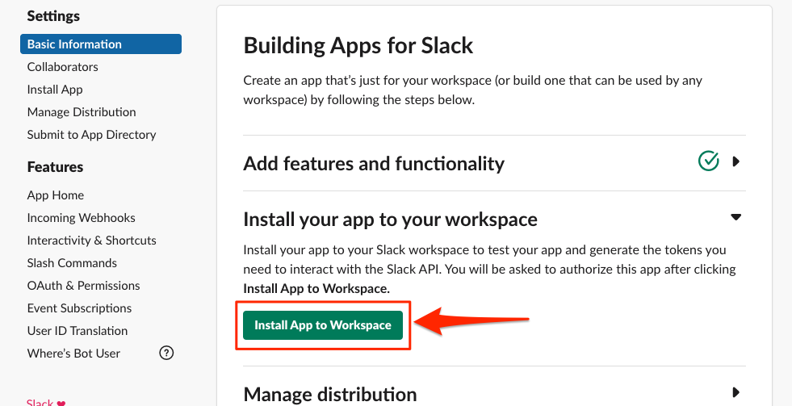

# Configure Slack

The first step in this guide is to create and configure a Slack application.
This Slack application will act as a bot that listens for user events in Slack
channels, and responds to **slash commands** by users in those channels -
allowing them to share Box files and folders with the group.

This section will take you through the following steps.

* Create a minimal Slack application within the Slack API dashboard
* Configure the Slack application to send notifications to our application whenever a user joins or leaves the channel - allowing our code to update the Box Box group.
* Configure a `/boxadd` **slash command** that will allow users to share a Box file or folder with all the users in the channel.

## Create a minimal Slack app

Go to the **[Slack apps page][slack-apps]** and click **Create Platform App**. Add
an **App Name**, select your **Development Slack Workspace** from the dropdown
list where the bot will be deployed to, then click **Create App**.

<ImageFrame noborder center shadow>


</ImageFrame>

Once created, you will be redirected to the basic information section of the
application. You may adjust the icon and description of your app within the
**Display Information** section at the bottom to customize the application
in your workspace.

## Configure the Slack app's event listener

Setting up an event listener for our Slack app will allow us to monitor for
events within the channel. For this bot, we want to monitor three
[Slack events][slack-events] in order to perform actions within Box.

* [`bot_added`][slack-event-bot-added]: When the bot is first added to a channel, it will get a list of all users in the channel, then create a Box group for those users. We can then use this group later on to add that group to any content that is shared with the **slash command**.
* [`member_joined_channel`][slack-event-member-joined]: When a new user joins a Slack channel they will be added to the Box group.
* [`member_left_channel`][slack-event-member-left]: When a user leaves a Slack channel, or the user is removed, they will be removed from the Box group.

To set up a notification URL to which these Slack event payloads will
be sent, Slack requires a verification step. When you set an event listener URL
for your bot application code, Slack will immediately send a challenge to that
URL to verify that it's valid. This will be an HTTP POST with a payload that
looks something like the following:

```json
{
  "token": "Jhj5dZrVaK7ZwHHjRyZWjbDl",
  "challenge": "3eZbrw1aBm2rZgRNFdxV2595E9CY3gmdALWMmHkvFXO7tYXAYM8P",
  "type": "url_verification"
}
```

To set up the URL for the event listener, that URL that is set needs
to respond with a verification payload containing the challenge value back to
Slack during this step. The payload will look similar to the following.

```js
HTTP 200 OK Content-type: application/json {"challenge":"3eZbrw1aBm2rZgRNFdxV2595E9CY3gmdALWMmHkvFXO7tYXAYM8P"}
```

To do this we will deploy a small bit of code to respond to the challenge
event. Choose your preferred language / framework below to get started.

<Grid columns='1' compact>

<Choose option='programming.platform' value='node' color='blue'>

# Node (Express Framework)

</Choose>

<Choose option='programming.platform' value='java' color='blue'>

# Java (Spring Boot Framework)

</Choose>

</Grid>

<Choice option='programming.platform' value='node' color='none'>

Within the project directory, run `npm install express --save` to install the
Express dependency, then deploy the following code to your public endpoint
along with the appropriate Node modules.

```js
const express = require('express');
const app = express();
const port = process.env.PORT || 3000;

app.use(express.urlencoded({ extended: true }));
app.use(express.json());

app.post('/event', (req, res) => {
    if (
        req.body &&
        req.body.challenge &&
        req.body.type === 'url_verification'
    ) {
        res.send({
            challenge: req.body.challenge
        });
    } else {
        res.status(400).send({
            error: "Unrecognized request"
        });
    }
});

app.listen(port, function(err) {
    console.log("Server listening on PORT", port);
});
```

</Choice>

<Choice option='programming.platform' value='java' color='none'>

<Message type='tip'>

[`Spring Initializr`][spring-initializr] is a useful service for
auto-generating a new Spring boot application with all dependencies defined.
This may be used instead of creating a blank Java application.

</Message>

* From Eclipse, create a new project. When prompted, select a Gradle project.
* Enter a unique name for the project, we used `slack.box` for this guide.
* Open your `build.gradle` file and add the following. Ensure that the group matches the group that you used for the application. Once saved, refresh the Gradle project.

```java
plugins {
    id 'org.springframework.boot' version '2.3.1.RELEASE'
    id 'io.spring.dependency-management' version '1.0.9.RELEASE'
    id 'java'
}

group = 'com.box'
version = '0.0.1-SNAPSHOT'
sourceCompatibility = '1.8'

repositories {
    mavenCentral()
}

dependencies {
    implementation 'org.springframework.boot:spring-boot-starter-web'
    testImplementation('org.springframework.boot:spring-boot-starter-test') {
        exclude group: 'org.junit.vintage', module: 'junit-vintage-engine'
    }
    compile 'com.box:box-java-sdk:2.44.1'
}

test {
    useJUnitPlatform()
}
```

* Within your `src/main/java` path, create a new Java class file named `Application.java`.
* Open the file, add the following code, and save.

```java
package com.box.slack.box;

import org.jose4j.json.internal.json_simple.JSONObject;
import org.jose4j.json.internal.json_simple.parser.JSONParser;
import org.springframework.boot.SpringApplication;
import org.springframework.boot.autoconfigure.EnableAutoConfiguration;
import org.springframework.web.bind.annotation.PostMapping;
import org.springframework.web.bind.annotation.RequestBody;
import org.springframework.web.bind.annotation.RestController;

@RestController
@EnableAutoConfiguration
public class Application {
    @PostMapping("/event")
    public JSONObject challenge(@RequestBody String data) throws Exception {
        JSONObject returnJSON = new JSONObject();

        Object dataObj = new JSONParser().parse(data);
        JSONObject inputJSON = (JSONObject) dataObj;
        String challenge = (String) inputJSON.get("challenge");
        String type = (String) inputJSON.get("type");

        if (type.equals("url_verification")) {
            returnJSON.put("challenge", challenge);
        } else {
            System.err.println("Invalid input");
        }

        return returnJSON;
    }

    public static void main(String[] args) {
        SpringApplication.run(Application.class, args);
    }
}
```

</Choice>

<Choice option='programming.platform' unset color='none'>

<Message danger>

# Incomplete previous step
Please select a preferred language / framework above to get started.

</Message>

</Choice>

Now that we have the code to respond to the Slack challenge when adding an
event URL, we can configure that within the Slack application.

From your Slack application **Basic Information** tab, under
**Add features and functionality**, click on the button titled
**Event Subscriptions** and do the following.

* Toggle **Enable Events** to **On**.
* Under **Request URL** add in the public URL that you deployed the above code to, and be aware that we are listening at `{YOUR_APP_DOMAIN}/event` (such as `https://myapp.com/event`). Once you add the URL and click outside the field, Slack will immediately send the challenge to the URL that you were hosting the code at above. If the code responds correctly, you will see a green verified note beside the **Request URL** header.

<ImageFrame noborder center shadow>


</ImageFrame>

* Expand the **Subscribe to bot events** section and click on the **Add Bot User Event** button.
* Add `member_joined_channel` and `member_left_channel` to the events the bot is subscribed to. These will send events when anyone new is added to the channel.
* Click the **Save Changes** button at the bottom of the page.

## Configure the Slack app slash command

To provide every user in a Slack channel access to a file or folder in Box, we
can use a Slack **"slash commands"**. A slash command will allow any person in
the channel to share content they own in Box with the rest of the channel.

Through this command, a channel member will be able to type
`/boxadd [file / folder] [id]`, for example `boxadd file 1459732312`, into the
channel to share the file / folder with every user in the channel. To do this,
the file is automatically collaborated with the Box group of users that are in
that channel.

From the **Basic Information** tab of your application, under **Add features and
functionality**, click on the button titled **Slash Commands**.

In the page that comes up, click **Create New Command** and input the following:

* **Command**: This is the command that a channel user will use to share a Box file / folder ID with the channel. Use `/boxadd` for this quick start.
* **Request URL**: The URL that is listening for and responding to slash commands in our Slack bot. In this quick start we use the same event URL that was used for the app event listener section above.
* **Short Description**: A description of what the Slash command will do.
* **Usage Hint**: Additional parameters that may be passed to the command. In our case, that's the Box file / folder ID and type of content.

<ImageFrame noborder center shadow>


</ImageFrame>

Click **Save** to add the command to our Slack app.

## Add Additional Scopes

When slash commands or notifications are sent to our application from
Slack they will contain a Slack user ID, which relates to the person that took
or was affected by the action. To translate that ID to a Box user we need to
get the Slack user's email, which we can then use to associate that Slack user
to a corresponding Box user. This action requires two extra scopes in the Slack
application configuration.

From your Slack application configuration, click on **OAuth & Permissions** in
the left menu, then do the following.

* Scroll down to the **Scopes** section.
* Click on the **Add an OAuth Scope** button under **Bot Token Scopes**..
* Search for and add `users:read` and `users:read.email`.

## Deploy Bot to Slack Workspace

The last step is to install the application into your Slack workspace. From the
**Basic Information** page of the app, expand the
**Install your app to your workspace** section.

<ImageFrame noborder center shadow>



</ImageFrame>

Click the button to **Install App to Workspace**.

<ImageFrame noborder center shadow>


</ImageFrame>

Once the **Allow** button is clicked you should see a success message. Your bot
is now installed within the workplace.

## Summary

* You've created your Slack application.
* You've configured user event notifications, slash commands, and additional scoping.
* You've deployed your Slack bot to your workspace.

<Observe option='programming.platform' value='node,java'>

<Next>

I have my local application set up

</Next>

</Observe>

[slack-apps]: https://api.slack.com/apps
[slack-events]: https://api.slack.com/events
[slack-event-bot-added]: https://api.slack.com/events/bot_added
[slack-event-member-joined]: https://api.slack.com/events/member_joined_channel
[slack-event-member-left]: https://api.slack.com/events/member_left_channel
[step3]: g://collaborations/connect-slack-to-group-collabs/scaffold-application-code
[spring-initializr]: https://start.spring.io/