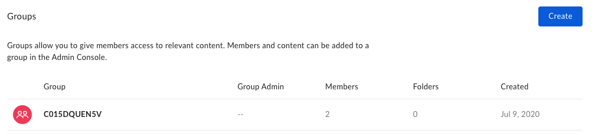
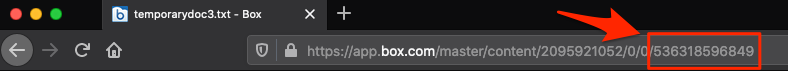

# ボットのテスト

この最後のセクションでは、Slackボットのさまざまな機能をテストします。

* **グループの作成**: ボットがチャンネルに追加されると、現在のチャンネル参加者全員を含む新しいBoxグループが作成されます。このチャンネル内で (メールアドレスの照合を基に) 一致するBoxアカウントを持つユーザーのみが追加される必要があります。
* **User Event関数**: ユーザーは、チャンネルに参加した場合またはチャンネルから退出した場合に、チャンネルグループから追加または削除される必要があります。
* **コンテンツ追加関数**: ユーザーが有効な`/boxadd`スラッシュコマンドを入力すると、新しいコラボレーションによってそのコンテンツがグループと共有される必要があります。

<Message type="notice">

上記の内容がまだできていない場合は、これまでに作成したすべてのコードが、一般公開されているアプリケーションとして展開されていることを確認します。

</Message>

## グループの作成のテスト

ボットが初めてチャンネルに追加されるときに、予想されることがいくつかあります。

* SlackチャンネルIDと一致する名前で新しいグループが作成されます。
* 現在チャンネルに存在するすべてのユーザーがグループに追加されます (Slackメールアドレスが同じメールアドレスでEnterpriseアカウントと一致する限り)

Slackボットを[手順1][step1]で構成した際に、SlackボットをSlackワークスペースにインストールしました。グループの作成をテストするには、Slackボットをチャンネルに追加する必要があります。

Slack UIまたは`/invite @bot_app_name`コマンドを使用して、任意のSlackチャンネルからSlackボットを招待します。

追加後、Boxにグループが作成され、メンバーが追加されていることを確認します。Box Enterprise管理者アカウントで、管理コンソールの \[**[ユーザーとグループ][box-users-groups]**] セクションに移動します。成功した場合、表示されるグループには、グループ名としてランダムな英数字の文字列が使用されます。これはSlackのチャンネルIDで、グループ名に反映されています。

<ImageFrame noborder center shadow>

</ImageFrame>

\[**メンバー**] 列には、グループ作成時に社内で検出されてグループに追加された、一致するメールアドレスを持つBoxユーザーの数も表示されます。

グループとメンバーが表示されていれば、この手順は成功です。

<Message type="notice">

グループに追加したメンバーが表示されず、ボットアプリケーションからエラーが返されない場合、最も可能性が高い原因として、メールアドレスの不一致が考えられます。Slackのアカウントで使用されているメールアドレスが、Box Enterpriseのユーザーで使用されているメールアドレスと一致することを確認してください。

</Message>

## User Event関数のテスト

Box管理コンソールの \[**[ユーザーとグループ][box-users-groups]**] セクションを開いたまま、Slackグループの横にある \[**メンバー**] 列の数値を書き留めます。

ボットを招待したSlackチャンネルから、ボット以外のユーザーを追加または削除します。

Box管理コンソールの \[ユーザーとグループ] セクションを更新すると、ユーザーの追加または削除に応じたメンバー数の増減がわかります。

メンバーの数が変化していれば、この手順は成功です。

## コンテンツ追加関数のテスト

グループとコンテンツを共有する機能をテストするには、チャンネル内の2人のユーザーに対するアクセス権限が必要です。1人はBoxアカウントからコンテンツを共有するユーザー、もう1人は、コンテンツが共有されたことを確認するためにファイルのリストを表示する、グループ内の別のユーザーです。

ボットを招待したSlackチャンネルで、ファイルやフォルダをグループと共有するためのスラッシュコマンドを`/boxadd [file/folder] [ID of file/folder]`形式 (`/boxadd folder 324554221`など) で入力します。

<Message type="notice">

指定されるファイルまたはフォルダIDは、ファイルまたはフォルダを共有するユーザーのBoxアカウント内のコンテンツである必要があります。

</Message>

Boxアカウント内のファイルまたはフォルダのIDを調べるには、[Boxサイト][box]内でファイルまたはフォルダを読み込み、URLを確認します。IDはURLの最後の文字列で、多くの場合、`/file/`または`/folder/`を含むセクションの直後に表示されます。

<ImageFrame noborder center shadow>

</ImageFrame>

コマンドを入力したら、SlackチャンネルとBoxグループ内で別のユーザーの[Boxサイト][box]アカウントに移動します。共有したコンテンツがそのアカウントで使用できるようになっているはずです。

共有したコンテンツをグループ内の他のユーザーが使用できれば、この手順は成功です。

## 次の手順

最小限のボットが展開されたので、ここまでに作成した機能に加えて、操作性を向上させる方法を検討できるようになりました。この工程における次の手順として、さまざまな領域を拡張することもできます。

* グループと共有されたファイルやフォルダの[共有リンクを作成][next-steps-shared-link]するための新しいスラッシュコマンドを追加することで、そのグループに属していない他のユーザーや社外のユーザーとコンテンツを共有できるようにします。
* [リテンションポリシーを作成][next-steps-retention-policy]し、グループと共有されたコンテンツに[割り当てる][next-steps-policy-assign]ことで、共有コンテンツの寿命とガバナンスを制御できるようにします。
* チャンネル内のユーザーが、グループと共有されている[ファイルにコメント][next-steps-comment]できるように新しいスラッシュコマンドを追加します。

[step1]: g://collaborations/connect-slack-to-group-collabs/configure-slack

[box-users-groups]: https://app.box.com/master/groups

[next-steps-shared-link]: g://shared-links/create-or-update

[next-steps-retention-policy]: e://post-retention-policies

[next-steps-policy-assign]: e://post-retention-policy-assignments

[next-steps-comment]: e://post-comments

<!-- i18n-enable localize-links -->

[box]: https://box.com

<!-- i18n-disable localize-links -->
