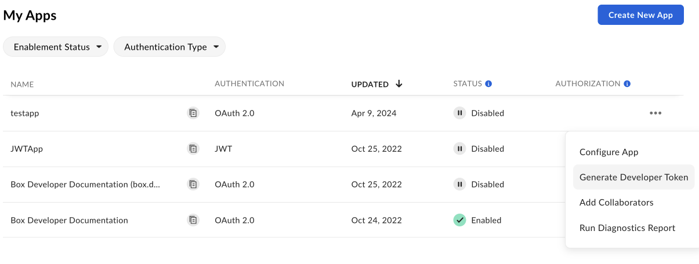

# Box Doc Genの使い方

Box Doc Gen APIを使用したドキュメントの生成を開始するには、Platformアプリケーションと、コールを認証するための開発者トークンが必要です。また、ドキュメントの入力ソースとして機能するDoc Genテンプレートも必要です。

## Box Doc Genの有効化

Box Doc Genを使用するには、管理者が管理コンソールで有効にしていることを確認してください。Box管理者の場合、[Enterprise設定: \[コンテンツと共有\] タブ][settings]のドキュメントで必要な情報を確認できます。

## Box Doc Genテンプレートの作成とアップロード

Box Doc Gen APIを使用してドキュメントを生成するには、Box Doc GenテンプレートがすでにBox内に存在する必要があります。テンプレートを作成するには、以下のオプションがあります。

* [Microsoft Word用Box Doc Gen Template Creatorアドイン][template-addin]をインストールする。
* [JSONファイルを使用][json-template]してBox Doc Genテンプレートを作成するか、手動で[テンプレートタグ][template-tags]を作成する。

## Platformアプリケーションの作成

まず、コールの実行に使用するPlatformアプリケーションを作成する必要があります。アプリケーションを作成するには、[Platformアプリの作成][createapps]に関するガイドに従ってください。

## 開発者トークンの生成

リクエストの送信時にアプリを認証するには、開発者トークンが必要です。

トークンを生成するには、以下の手順を実行します。

1. \[**開発者コンソール**] > \[**Platformアプリ**] に移動します。
2. 右側の**オプションメニュー**ボタン (\[…]) をクリックします。
3. \[**開発者トークンを生成**] を選択します。トークンが自動的に生成され、クリップボードに保存されます。

アプリを開いて、\[**構成**] > \[**開発者トークン**] に移動してトークンを生成することもできます。

<Message type="notice">

開発者トークンの有効期限は1時間のみです。

</Message>

詳細については、[開発者トークン][token]を参照してください。トークンを生成したら、cURLや他のクライアント ([Postman][postman]など) で使用してコールを実行できます。

[token]: g://authentication/tokens/developer-tokens

[createapps]: g://applications/app-types/platform-apps

[postman]: g://tooling/postman

[settings]: https://support.box.com/hc/en-us/articles/4404822772755-Enterprise-Settings-Content-Sharing-Tab#h_01FYQGK5RW42T07GV985MQ9E9A

[template-addin]: https://support.box.com/hc/en-us/articles/36587535449747-Installing-Box-Doc-Gen-Add-in

[template-tags]: https://support.box.com/hc/en-us/articles/36151895655059-Creating-A-Box-Doc-Gen-Template-Manually

[json-template]: https://support.box.com/hc/en-us/articles/36148012877843-Creating-a-Box-Doc-Gen-Template-using-JSON-data
