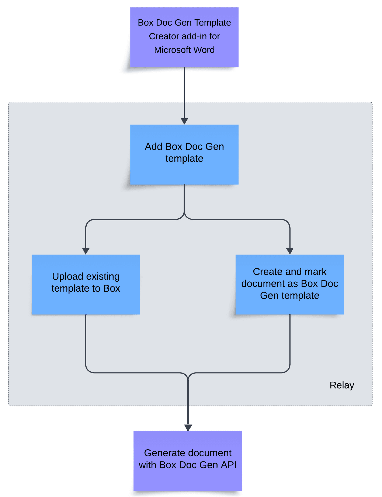

# Box Doc Gen

Box Doc Gen allows you to generate business documents such as offer letters, sales contracts, invoices or agreements.
You can generate documents based on Box Doc Gen templates uploaded to Box, with data fields that can be dynamically filled using Box Doc Gen API.

<Message type='notice'>

Box has limited support for non-English content merged into Box Doc Gen templates. It is  the  responsibility of the customers to test and review that Box Doc Gen supports their language requirements.

</Message>

## Box Doc Gen API capabilities

Box Doc Gen API allows you to:

* mark documents as Box Doc Gen templates,
* generate documents based on Box Doc Gen templates you store in Box,
* examine the details of Box Doc Gen templates and document generation jobs.

## Box Doc Gen workflow

1. Install the [Box Doc Gen Template Creator add-in for Microsoft Word][template-addin]. Once the installation is complete, proceed to create a template, either using a [JSON schema][json-template] or [manually creating the tags][template-tags].
2. [Add the template to Box][upload-template] using the Box Doc Gen UI. At this point, you can:
    * Create and upload the template directly in Box.
    * Upload an existing document and mark it as a Box Doc Gen template.
3. [Generate the document][generate-document] using Box Doc Gen API.

[template-addin]: https://support.box.com/hc/en-us/articles/36587535449747-Installing-Box-Doc-Gen-Add-in
[template-tags]: https://support.box.com/hc/en-us/articles/36151895655059-Creating-A-Box-Doc-Gen-Template-Manually
[json-template]: https://support.box.com/hc/en-us/articles/36148012877843-Creating-a-Box-Doc-Gen-Template-using-JSON-data
[upload-template]: https://support.box.com/hc/en-us/articles/36587432368275-Managing-Box-Doc-Gen-Templates-in-Relay
[generate-document]: g://docgen/generate-document