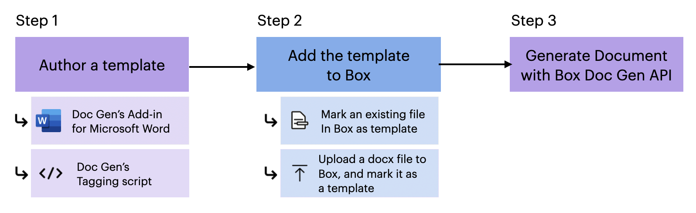

# Box Doc Gen

Box Doc Genを使用すると、採用通知書、売買契約書、請求書、契約書などのビジネスドキュメントを生成できます。BoxにアップロードされたBox Doc Genテンプレートに基づいた、Box Doc Gen APIを使用して動的に入力できるデータフィールドを含むドキュメントを生成できます。

<Message type="notice">

Box Doc Genでは、Box Doc Genテンプレートの使用時に英語のテンプレートタグを利用する機能のみがサポートされています。お客様には、Box Doc Genがご希望の言語の要件をサポートしているかどうかをテストおよび確認することをお勧めします。

</Message>

## 前提条件

* Microsoft Wordへのアクセス権限

Box Doc Genを使用するには、ドキュメントテンプレートの作成に必要になるため、Microsoft Wordへのアクセス権限が必要です。Box Doc Genアドインを利用してコード不要のエクスペリエンスを実現するか、Word内でタグ付きスクリプトを適用してドキュメントを準備することができます。

<Message type="notice">

Box Doc Genは、ビジネスドキュメントの動的な生成を容易にすることを目的としていますが、Boxでは、ユーザーのMicrosoft Wordに対するアクセス権限を制御していないことに注意してください。ユーザーは、ドキュメントテンプレートを効果的に作成するために必要なMicrosoft Wordに対する権限やアクセス権限があることを確認する必要があります。

</Message>

## Box Doc Gen APIの機能

Box Doc Gen APIを使用すると、以下のことが可能です。

* ドキュメントをBox Doc Genテンプレートとして設定する。
* Boxに保存したBox Doc Genテンプレートに基づいてドキュメントを生成する。
* Box Doc Genテンプレートやドキュメント生成ジョブの詳細を調査する。

## Box Doc Gen APIバージョン

Box Doc Gen APIはBox APIバージョン`2025.0`でリリースされました。Box Doc Gen APIのエンドポイントに対するすべてのAPIリクエストでは、`box-version`ヘッダーを`2025.0`に設定して、有効なAPIバージョンを指定する必要があります。

詳細については、[APIのバージョン戦略][api-versioning]を参照してください。

## Box Doc Genのワークフロー

1. Box Doc Genテンプレートを作成します。

* [Microsoft Word用Doc Genアドイン][template-addin]を使用して、コードを使用せずにテンプレートを作成する。
* [Doc Genのタグ付きスクリプト][tagging-script]を利用してテンプレートを作成することも可能。

2. Box Doc Gen UIを使用して[Boxにテンプレートを追加][upload-template]します。この時点では、以下のことが可能です。

* Box内の既存のファイルをDoc Genテンプレートとして設定する。
* ドキュメントを作成またはアップロードして、Box Doc Genテンプレートとして設定する。

3. Box Doc Gen APIを使用して[ドキュメントを生成][generate-document]する。

[template-addin]: https://support.box.com/hc/en-us/articles/36587535449747-Installing-Box-Doc-Gen-Add-in

[template-tags]: https://support.box.com/hc/en-us/articles/36151895655059-Creating-A-Box-Doc-Gen-Template-Manually

[json-template]: https://support.box.com/hc/en-us/articles/36148012877843-Creating-a-Box-Doc-Gen-Template-using-JSON-data

[tagging-script]: https://support.box.com/hc/en-us/articles/36149723736723-Template-tags-reference

[upload-template]: https://support.box.com/hc/en-us/articles/36587432368275-Managing-Box-Doc-Gen-Templates-in-Relay

[generate-document]: g://docgen/generate-document

[api-versioning]: g://api-calls/api-versioning-strategy
