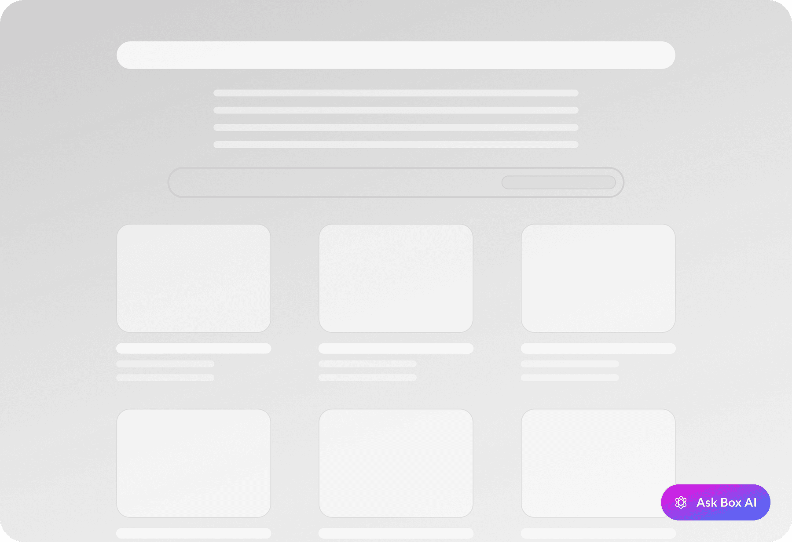

# Box Embed

Box Embed is a HTML-based framework that allows embedding the entire Box Web App experience in a custom-made application. Box Embed provides the ability to upload, search, comment, share, tag, and edit files using Box Edit. You can also embed Box Hubs AI Chat for a focused chatbot experience.

## 開始する前に

ウィジェットを作成するには、以下のことが必要です。

* Set an embeddable element, such as a folder, file, hub, note, or app for sharing. 
* **ビューアー**以上の[権限][5]がある。

## ウェブアプリの使用

BoxウェブアプリからBox埋め込みウィジェットのコードを取得するには、以下の手順を実行します。

### ファイルとフォルダ

1. 選択したファイルまたはフォルダに移動します。 
2. そのフォルダの横にある省略記号をクリックします。 
3. \[**その他の操作**] > \[**埋め込みウィジェット**] に移動します。

### Hub

1. Navigate to the chosen hub. 
2. Click on the ellipsis menu in the upper-right corner. 
3. \[**Hubを埋め込む**] をクリックします。

<Message type="notice">

You can also embed only the AI chat interface from a hub. Users can ask questions and get AI-powered answers based on the hub's files, without accessing navigation or file browsing features. For more information, see the [Box Hubs AI Chat embedding][6] section.

</Message>

### メモ

1. Navigate to the chosen note.
2. 省略記号メニューをクリックします。
3. \[**埋め込みウィジェット**] をクリックします。

### アプリ

1. Navigate to the chosen app or Box App View.
2. 省略記号メニューをクリックします。
3. \[**埋め込む**] をクリックします。

<ImageFrame border>


</ImageFrame>

次の手順では、埋め込み可能な要素のパラメータを構成します。

| Element Type | Configuration Options                                                 |
| ------------ | --------------------------------------------------------------------- |
| ファイル         | ウィジェットのサイズ                                                            |
| フォルダ         | ウィジェットのサイズ、フォルダ内のファイルの並べ替え、ナビゲーションパスとサイドバーの非表示。                       |
| Hub          | ウィジェットのサイズ、親のナビゲーションパスとサイドバーの非表示                                      |
| Hubs AI Chat | Chat mode: button or widget.                                          |
| メモ           | ウィジェットのサイズ、クラウド (雲) ゲームのスキップ (その結果、メモは読み取り専用モードになります)、メモのナビゲーションの非表示。 |
| アプリ          | ウィジェットのサイズ                                                            |

<ImageFrame border>


</ImageFrame>

埋め込みウィジェットのカスタマイズが完了したら、埋め込みコードをコピーして自分のサイトまたはウェブアプリに貼り付けます。

## プログラムを使用して構成

Box Embedをさらにカスタマイズする場合は、プログラムを使用して実行できます。埋め込みのスニペットの形式は次のとおりです。

```html
<iframe
  src="https://{custom_domain}.app.box.com/embed/s/{shared link value}?view={list or icon}&sortColumn={name, date, or size}&sortDirection=ASC"
  width="{pixels}"
  height="{pixels}"
  frameborder="0"
  <!-- Optionally replace * with your enterprise-specific domain (for example, mycompanydomain.app.box.com) -->
  allow="local-network-access *; clipboard-read *; clipboard-write *" 
  allowfullscreen
  webkitallowfullscreen
  msallowfullscreen>
</iframe>

```

### ブラウザの権限

Google Chrome 142以上およびMicrosoft Edge 143以上では、`allow`属性を使用して、クリップボードの操作やローカルネットワークへのアクセスを有効にします。この属性は、これらのブラウザバージョン用に設計されていますが、すべてのブラウザに対して安全に含めることができます。他のブラウザでは無視されます。

この属性がないと、埋め込まれたBoxコンテンツは、Box Tools、デバイストラスト、またはクリップボードのコピーボタンで機能しない可能性があります。

<Message type="notice">

埋め込みウィジェットのリンク生成ウィンドウでは、生成されたコードに自動的にこのパラメータが含まれます。

</Message>

### 共有リンクの値の検索

プログラムを使用して埋め込み`iframe`を構築するには、まず、共有リンクの値を生成または検索します。この値を検索する1つの方法として、Boxウェブアプリを使用します。

<ImageFrame border>


</ImageFrame>

また、[`PUT /files/:file_id`][3]または[`PUT /files/:file_id`][4]を使用して、APIで共有リンクを作成する方法もあります。

その後、[`GET /files/:id`][1]または[`GET /folders/:id`][2]エンドポイントを使用してクエリパラメータ`fields=shared_link`を渡すことにより、この共有リンクの値を検索できます。

```curl
curl https://api.box.com/2.0/folders/12345?fields=shared_link \
    -H "authorization: Bearer ACCESS_TOKEN"

```

```json
"shared_link": {
  "url": "https://app.box.com/s/dsbJFzdO7qZxdfOHFzdO7qZxdfOH",
  "download_url": null,
  "vanity_url": null,
  ...
}

```

ページをルートフォルダ/\[すべてのファイル] ページに設定することもできます。URLを共有リンク`<iframe src=“https://app.box.com/embed/folder/0”….></iframe>`ではなく`/folder/0`に設定してください。

### パラメータ

次に、表示のカスタマイズオプションを選択します。構成可能なパラメータ (省略可) のリストを以下に示します。

|                          |                                                                                      |
| ------------------------ | ------------------------------------------------------------------------------------ |
| `hideHubsGallery`        | Hubsギャラリーに戻るためのナビゲーションの山括弧ボタンを非表示または表示します。`true`または`false` (デフォルト) を指定できます。          |
| `hideNavigationControls` | Box Notesのナビゲーションコントロールを非表示または表示します。                                                 |
| `showItemFeedActions`    | ファイルのコメントまたはタスクを非表示または表示します。`true` (デフォルト) または`false`を指定できます。                        |
| `showParentPath`         | フレームのヘッダーにフォルダパスを非表示または表示します。`true`または`false` (デフォルト) を指定できます。                       |
| `sortColumn`             | ファイルまたはフォルダを並べ替える順番。`name`、`date` (デフォルト)、または、`size`を指定できます。                         |
| `sortDirection`          | ファイルまたはフォルダの並べ替えの方向。`ASC` (デフォルト) または`DESC`を指定できます。                                  |
| `view`                   | ファイルまたはフォルダの表示方法の種類。`list` (デフォルト) または`icon`を指定できます。ログインユーザーの場合は、ユーザー設定の表示方法が優先されます。 |
| `uxLite`                 | クラウド (雲) ゲームを使用せず、制限付きコンテンツプレビュー (Preview Light) を表示します。共有ファイルおよびBox Notesのみに有効です。   |

<Message type="notice">

Box Notesで`uxLite`を使用すると、`hideNavigationControls`の設定に関わらず、ナビゲーションコントロールは表示されません。

</Message>

Boxが提供するアプリのURLにあるカスタム検索パラメータはすべて、埋め込みウィジェットウィンドウとコンテンツプレビューに渡されます。

### 全画面表示機能

Box Embedスニペットの全画面表示機能を有効にするために、オブジェクトを全画面に表示可能にする場合は、以下のパラメータの1つ以上を`<iframe>`に含めてください。

* `allowfullscreen`
* `webkitallowfullscreen`
* `mozallowfullscreen`
* `oallowfullscreen`
* `msallowfullscreen`

## Box Hubs AI Chat embedding

In addition to embedding the complete Box Hub experience, you can embed only the AI-powered chat interface. This mode provides a focused chatbot experience powered by the files within a specific hub, without navigation or content browsing options.

### 前提条件

To access a hub embedded in AI Chat mode:

* The enterprise that owns the hub must have Box AI for Hubs enabled.
* The user must be authenticated and have Box AI for Hubs enabled at their enterprise.
* The user needs at least Viewer [permissions][5] on the hub.

### Creating an AI Chat embed

1. Navigate to the hub that will serve as the knowledge source for the AI Chat.

2. Click the ellipsis menu in the upper-right corner.

3. \[**Hubを埋め込む**] をクリックします。

4. Select the **Hub AI Chat** tab.

5. Select chat mode:

   * [Chat button][7]
   * [Chat widget][8]

6. Copy the embed code.

<Message type="notice">

If you experience issues with the Box Hubs AI Chat embedding, regenerate the embed code to get the latest version of the script by repeating steps 1-6 above.

</Message>

### Chat button

In **Chat button** mode, the AI chat widget opens after the user clicks the button. It is generated as a Box-hosted `script` and displays a floating chat button on your page.



#### Chat button parameters

The **Chat button** mode supports the following parameters:

| パラメータ                    | 必須  | 説明                                                                                                                                   |
| ------------------------ | --- | ------------------------------------------------------------------------------------------------------------------------------------ |
| `data-hub-id`            | はい  | The ID of the hub that powers the chatbot.                                                                                           |
| `data-custom-box-domain` | いいえ | For Box instances with custom domains. Default: `app.box.com`. Example: `mycompanydomain.app.box.com`.                               |
| `data-button-text`       | いいえ | Custom text to display on the chat button. Default: `Box AI`. This value is also used for the button's area label for accessibility. |
| `data-shared-link`       | いいえ | Optional shared link for hub access. If not provided, the chat loads only for users who are collaborators on the hub.                |

The following example shows a fully configured chat button with all available parameters:

```html
<script 
  src="https://cdn01.boxcdn.net/embeddable-ai-chat-script/2.8.0/box_integrations_ai_chat_button.js" 
  data-hub-id="123456789" 
  data-custom-box-domain="mycompanydomain.app.box.com" 
  data-shared-link="abcdefghijklmnopqrst123" 
  data-button-text="Ask our HR chatbot">
</script>

```

### Chat widget

In **Chat widget** mode, the AI chat widget is embedded directly on page load. It is generated as an `iframe` and displays the full chat interface immediately.

<ImageFrame shadow>


</ImageFrame>

#### Chat widget parameters

In **Chat widget** mode, the AI chat widget is embedded directly on the page using an `iframe`. You can customize the behavior by adding URL parameters to the iframe's `src` attribute:

| パラメータ             | 説明                                                                                                                                                                                                                                                                                                   |
| ----------------- | ---------------------------------------------------------------------------------------------------------------------------------------------------------------------------------------------------------------------------------------------------------------------------------------------------- |
| `hubId`           | The ID of the hub that powers the chatbot.                                                                                                                                                                                                                                                           |
| `sharedLink`      | The shared link hash for hub access. If not provided, the chat loads only for users who are collaborators on the hub.                                                                                                                                                                                |
| `showCloseButton` | Whether to show the [X (close) button][9] in the chat interface. When set to `true`, the close button is displayed. When a user clicks this button, Box generates an event that is sent to the parent web application, enabling you to implement custom closing logic based on the user interaction. |

The following example shows a fully configured chat widget with all available parameters:

```html
<iframe 
  src="https://yourcompanydomain.app.box.com/ai-chat?hubId=123456789&sharedLink=abcdefghijklmnop123&showCloseButton=false" 
  width="800" 
  height="550" 
  frameBorder="0" 
  <!-- Optionally replace * with your enterprise-specific domain (for example, mycompanydomain.app.box.com) -->  
  allow="local-network-access *; clipboard-read *; clipboard-write *"  
  allowfullscreen 
  webkitallowfullscreen 
  msallowfullscreen>
</iframe>

```

#### Using the close button

When embedding the Box AI chat directly with `iframe` (without using the provided script), you can enable a close button within the chat interface that communicates with your parent application through `postMessage`.

##### Enabling the close button

To display a close button (✕) in the corner of the iframe, add the `showCloseButton=true` query parameter to your `iframe` URL as follows: `https://app.box.com/ai-chat?hubId=YOUR_HUB_ID&showCloseButton=true`

##### How it works

1. When `showCloseButton=true` is set, an X button appears in the corner of the chat iframe.
2. When a user clicks this button, the iframe sends a `postMessage` event to the parent window.
3. The event contains `event.data.type` set to `"BOX_AI_CHAT_CLOSE"`.
4. Your hosting application listens for this event and handles the closing logic.

##### Implementation example

```javascript
window.addEventListener('message', (event) => {
    // Optional: validate origin is from Box for additional security
    // if (event.origin !== 'https://app.box.com') return;

    if (event.data && event.data.type === 'BOX_AI_CHAT_CLOSE') {
        closeChat();
    }
});

```

##### Event reference

| プロパティ             | 値                     | 説明                                                              |
| ----------------- | --------------------- | --------------------------------------------------------------- |
| `event.data.type` | `"BOX_AI_CHAT_CLOSE"` | Indicates the user clicked the close button in the chat iframe. |

## 有効期限付き埋め込みリンク

ファイルの場合、[`GET /files/:id`][1]を呼び出し、`fields`クエリパラメータを使用して`expiring_embed_link`をリクエストすることもできます。

```curl
curl https://api.box.com/2.0/files/12345?fields=expiring_embed_link \
    -H "authorization: Bearer ACCESS_TOKEN"

```

```json
{
  "etag": "1",
  "expiring_embed_link": {
    "token": {
      "access_token": "1!rFppcinUwwwDmB4G60nah7z...",
      "expires_in": 3646,
      "restricted_to": [
        {
          "object": {
            "etag": "1",
            "file_version": {
              "id": "34567",
              "sha1": "1b8cda4e52cb7b58b354d8da0068908ecfa4bd00",
              "type": "file_version"
            },
            "id": "12345",
            "name": "Image.png",
            "sequence_id": "1",
            "sha1": "1b8cda4e52cb7b58b354d8da0068908ecfa4bd00",
            "type": "file"
          },
          "scope": "base_preview"
        },
        ...
      ],
      "token_type": "bearer"
    },
    "url": "https://cloud.app.box.com/preview/expiring_embed/...."
  },
  "id": "12345",
  "type": "file"
}

```

`url`属性を`<iframe>`内で使用すると、自動で期限切れになるBox Embedインターフェースを埋め込むことができます。

```html
<iframe
  src="YOUR-GENERATED-BOX-EMBED-LINK"
  width="{pixels}"
  height="{pixels}"
  frameborder="0"
  allowfullscreen
  webkitallowfullscreen
  msallowfullscreen
/>

```

### パラメータ

UIをカスタマイズするために、このURLにさらにパラメータを追加することもできます。そのためには、以下のパラメータをクエリパラメータとして`url`に追加します。最終的なURLは、次のようになります。

```sh
https://app.box.com/preview/expiring_embed/[HASH]?[parameterName]=true

```

|                   |                                                                                                                                                                                                     |
| ----------------- | --------------------------------------------------------------------------------------------------------------------------------------------------------------------------------------------------- |
| `showDownload`    | ファイルをダウンロードするための権限がビューアーにある場合は、埋め込まれたヘッダーバーにダウンロードボタンが表示されます。また、印刷とダウンロードが同じ権限で管理されているため、ドキュメントのファイルタイプには印刷ボタンも表示されます。デフォルトでは`false`になります。                                                          |
| `showAnnotations` | プレビュー以上の権限を持つユーザーは、ドキュメントと画像のプレビューに注釈を付けることができます。また、すでにドキュメントに付けられている注釈も表示されます。注釈が利用可能なファイルタイプおよび注釈の種類の詳細については、注釈ページを参照してください。現在、注釈はウェブブラウザでのみ使用できます。モバイルブラウザでは、ユーザーは注釈を表示できますが、新しい注釈を作成することはできません。 |

## クラウド (雲) ゲーム

クラウド (雲) ゲームとは、[クリックジャッキング][cloud-game]を防ぐために作成されたウィジェットです。これは、パートナー統合ではない埋め込みサイトに表示されます。クラウド (雲) ゲームでは、ユーザーは、操作の許可を得るためにクラウド (雲) を適切な場所にドラッグする必要があります。このゲームでは、クラウド (雲) の位置とそのドラッグ先がランダムに生成されるため、クリックジャッキングが難しくなります。

<ImageFrame border>


</ImageFrame>

`postMessage()`は、埋め込みと`showCloudGame`両方のステータスを取得するためにiframeで使用されます。埋め込まれている場合、`document.hasStorageAccess()`は、BoxからCookieにアクセスできるかどうかを示します。アクセスでき、ユーザーがログイン済みの場合、クラウド (雲) ゲームが表示されます。`showCloudGame`のステータスが`false`の場合、ユーザーはログインページに誘導されます。

## カスタムロゴ

有料のBoxをお使いの場合は、ファイルのプレビューに表示されるBoxのロゴを削除できます。削除するには、**管理コンソール**の \[**Enterprise設定**]、\[**カスタム設定**] に移動し、\[**埋め込みウィジェットのカスタマイズ**] をオフに切り替えてBoxのロゴを非表示にします。

## 制限

Box Embedは、モバイルブラウザ向けには最適化されていないため、モバイルデバイス用に設計されたウェブエクスペリエンスでは使用しないでください。多くのUI Element (**ダウンロード**オプションや**印刷**オプションなど) はモバイルブラウザに表示されない可能性があります。

<!-- i18n-enable localize-links -->

[logo]: https://support.box.com/hc/ja/articles/360044193633-会社ブランドに合わせたアカウントのカスタマイズ

<!-- i18n-enable localize-links -->

[1]: e://get-files-id

[2]: e://get-folders-id

[3]: e://put-files-id--add-shared-link

[4]: e://put-folders-id--add-shared-link

[5]: https://support.box.com/hc/ja/articles/360044196413-コラボレータの権限レベルについて

[cloud-game]: https://support.box.com/hc/ja/articles/360043691034-Boxはどのようにしてクリックジャッキングを防止していますか

[6]: g://embed/box-embed/#box-hubs-ai-chat-embedding

[7]: g://embed/box-embed/#chat-button

[8]: g://embed/box-embed/#chat-widget

[9]: g://embed/box-embed/#using-the-close-button
