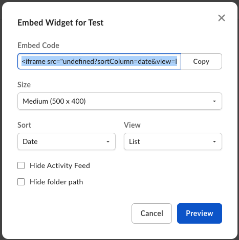

# Box Embed

Box EmbedはHTMLベースのフレームワークで、Boxウェブアプリの機能全体を埋め込み、場所を問わずに使えるようにします。Box Embedを使用すると、ファイルのアップロード、検索、コメント付け、共有、タグ付けに加え、Box Editを使用したファイルの編集も可能になります。

## 構成

ウィジェットを作成するには、共有用のフォルダを設定する必要があるほか、**ビューアー**以上の[権限][5]が必要です。

### ウェブから構成

BoxウェブアプリからBox Embedのコードを取得するには:

* 任意のフォルダに移動します。
* そのフォルダの横にある省略記号をクリックします。
* \[**その他の操作**] に移動します。
* \[**埋め込みウィジェット**] をクリックします。

<ImageFrame border>


</ImageFrame>

次の画面で、ウィジェットのサイズ、並べ替え、表示を設定できます。また、\[フォルダパスを非表示] や \[ナビゲーションとサイドバーを展開する] をデフォルトでオンにするよう選択することもできます。

<ImageFrame border>



</ImageFrame>

埋め込みウィジェットのカスタマイズが完了したら、埋め込みコードをコピーしてサイトまたはウェブアプリケーションに貼り付ける必要があります。

## プログラムを使用して構成

Box Embedをさらにカスタマイズする場合は、プログラムを使用してカスタマイズできます。埋め込みのスニペットの形式は次のとおりです。

```html
<iframe
  src="https://{custom_domain}.app.box.com/embed/s/{shared link value}?view={list or icon}&sortColumn={name, date, or size}&sortDirection=ASC"
  width="{pixels}"
  height="{pixels}"
  frameborder="0"
  allowfullscreen
  webkitallowfullscreen
  msallowfullscreen
></iframe>

```

### 共有リンクの値の検索

プログラムを使用して埋め込み`iframe`を構築するには、まず、共有リンクの値を生成または検索します。この値を検索する1つの方法として、Boxウェブアプリを使用します。

<ImageFrame border>


</ImageFrame>

また、[`PUT /files/:file_id`][3]または[`PUT /files/:file_id`][4]を使用して、APIで共有リンクを作成する方法もあります。

その後、[`GET /files/:id`][1]または[`GET /folders/:id`][2]エンドポイントを使用してクエリパラメータ`fields=shared_link`を渡すことにより、この共有リンクの値を検索できます。

```curl
curl https://api.box.com/2.0/folders/12345?fields=shared_link \
    -H "authorization: Bearer ACCESS_TOKEN"

```

```json
"shared_link": {
  "url": "https://app.box.com/s/dsbJFzdO7qZxdfOHFzdO7qZxdfOH",
  "download_url": null,
  "vanity_url": null,
  ...
}

```

ページをルートフォルダ/\[すべてのファイル] ページに設定することもできます。URLを共有リンク`<iframe src=“https://app.box.com/embed/folder/0”….></iframe>`ではなく`/folder/0`に設定してください。

### パラメータ

次に、表示のカスタマイズオプションを選択します。構成可能なパラメータ (省略可) のリストを以下に示します。

|                       |                                                                |
| --------------------- | -------------------------------------------------------------- |
| `view`                | ファイルまたはフォルダの表示方法の種類。`list` (デフォルト) または`icon`を指定できます。           |
| `sortColumn`          | ファイルまたはフォルダを並べ替える順番。`name`、`date` (デフォルト)、または、`size`を指定できます。   |
| `sortDirection`       | ファイルまたはフォルダの並べ替えの方向。`ASC` (デフォルト) または`DESC`を指定できます。            |
| `showParentPath`      | フレームのヘッダーにフォルダパスを非表示または表示します。`true`または`false` (デフォルト) を指定できます。 |
| `showItemFeedActions` | ファイルのコメントまたはタスクを非表示または表示します。true (デフォルト) またはfalseを指定できます。      |

### 全画面表示機能

Box Embedスニペットの全画面表示機能を有効にするために、オブジェクトを全画面に表示可能にする場合は、以下のパラメータの1つ以上を`<iframe>`に含めてください。

* `allowfullscreen`
* `webkitallowfullscreen`
* `mozallowfullscreen`
* `oallowfullscreen`
* `msallowfullscreen`

## 有効期限付き埋め込みリンク

ファイルの場合、[`GET /files/:id`][1]を呼び出し、`fields`クエリパラメータを使用して`expiring_embed_link`をリクエストすることもできます。

```curl
curl https://api.box.com/2.0/files/12345?fields=expiring_embed_link \
    -H "authorization: Bearer ACCESS_TOKEN"

```

```json
{
  "etag": "1",
  "expiring_embed_link": {
    "token": {
      "access_token": "1!rFppcinUwwwDmB4G60nah7z...",
      "expires_in": 3646,
      "restricted_to": [
        {
          "object": {
            "etag": "1",
            "file_version": {
              "id": "34567",
              "sha1": "1b8cda4e52cb7b58b354d8da0068908ecfa4bd00",
              "type": "file_version"
            },
            "id": "12345",
            "name": "Image.png",
            "sequence_id": "1",
            "sha1": "1b8cda4e52cb7b58b354d8da0068908ecfa4bd00",
            "type": "file"
          },
          "scope": "base_preview"
        },
        ...
      ],
      "token_type": "bearer"
    },
    "url": "https://cloud.app.box.com/preview/expiring_embed/...."
  },
  "id": "12345",
  "type": "file"
}

```

`url`属性を`<iframe>`内で使用すると、自動で期限切れになるBox Embedインターフェースを埋め込むことができます。

```html
<iframe
  src="YOUR-GENERATED-BOX-EMBED-LINK"
  width="{pixels}"
  height="{pixels}"
  frameborder="0"
  allowfullscreen
  webkitallowfullscreen
  msallowfullscreen
/>

```

### パラメータ

UIをカスタマイズするために、このURLにさらにパラメータを追加することもできます。そのためには、以下のパラメータをクエリパラメータとして`url`に追加します。最終的なURLは、次のようになります。

```sh
https://app.box.com/preview/expiring_embed/[HASH]?[parameterName]=true

```

|                   |                                                                                                                                                                                                     |
| ----------------- | --------------------------------------------------------------------------------------------------------------------------------------------------------------------------------------------------- |
| `showDownload`    | ファイルをダウンロードするための権限がビューアーにある場合は、埋め込まれたヘッダーバーにダウンロードボタンが表示されます。また、印刷とダウンロードが同じ権限で管理されているため、ドキュメントのファイルタイプには印刷ボタンも表示されます。デフォルトでは`false`になります。                                                          |
| `showAnnotations` | プレビュー以上の権限を持つユーザーは、ドキュメントと画像のプレビューに注釈を付けることができます。また、すでにドキュメントに付けられている注釈も表示されます。注釈が利用可能なファイルタイプおよび注釈の種類の詳細については、注釈ページを参照してください。現在、注釈はウェブブラウザでのみ使用できます。モバイルブラウザでは、ユーザーは注釈を表示できますが、新しい注釈を作成することはできません。 |

## クラウド (雲) ゲーム

クラウド (雲) ゲームとは、クリックジャッキングを防ぐために作成されたウィジェットです。これは、パートナー統合ではない埋め込みサイトに表示されます。クラウド (雲) ゲームでは、ユーザーは、操作の許可を得るためにクラウド (雲) を適切な場所にドラッグする必要があります。このゲームでは、クラウド (雲) の位置とそのドラッグ先がランダムに生成されるため、クリックジャッキングが難しくなります。

<ImageFrame border>


</ImageFrame>

`postMessage()`は、埋め込みと`showCloudGame`両方のステータスを取得するためにiframeで使用されます。埋め込まれている場合、`document.hasStorageAccess()`は、BoxからCookieにアクセスできるかどうかを示します。アクセスでき、ユーザーがログイン済みの場合、クラウド (雲) ゲームが表示されます。`showCloudGame`のステータスが`false`の場合、ユーザーはログインページに誘導されます。

## カスタムロゴ

有料のBoxをお使いの場合は、ファイルのプレビューに表示されるBoxのロゴを削除できます。削除するには、**管理コンソール**の \[**Enterprise設定**]、\[**カスタム設定**] に移動し、\[**埋め込みウィジェットのカスタマイズ**] をオフに切り替えてBoxのロゴを非表示にします。

## 制限

Box Embedは、モバイルブラウザ向けには最適化されていないため、モバイルデバイス用に設計されたウェブエクスペリエンスでは使用しないでください。多くのUI Element (**ダウンロード**オプションや**印刷**オプションなど) はモバイルブラウザに表示されない可能性があります。

<!-- i18n-enable localize-links -->

[logo]: https://support.box.com/hc/ja/articles/360044193633-会社ブランドに合わせたアカウントのカスタマイズ

<!-- i18n-enable localize-links -->

[1]: e://get-files-id

[2]: e://get-folders-id

[3]: e://put-files-id--add-shared-link

[4]: e://put-folders-id--add-shared-link

[5]: https://support.box.com/hc/ja/articles/360044196413-コラボレータの権限レベルについて
