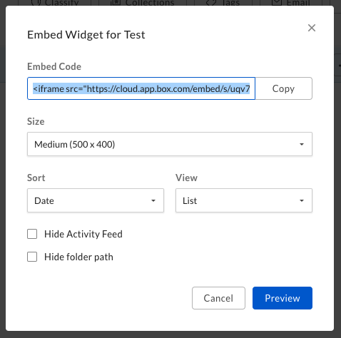

# Box Embed

Box Embed is a HTML-based framework that makes it easy to embed the entire Box
experience anywhere people work. Box Embed provides the ability to upload,
search, comment, share, tag, and most importantly edit files using Box Edit.

## Configure

### From the web

To grab your Box Embed code from the Box web app, navigate to the folder of
choice, click on the ellipsis beside the folder, go to More Actions, and click
Embed Widget.

<ImageFrame border>


</ImageFrame>

You are presented with options to adjust the size, view, and sorting.

<ImageFrame border>

  

</ImageFrame>

Once you are done customizing the embed widget, all you will need to do is copy
and paste the embed code into your site or web application.

## Programmatically

If you want to add more customization to Box Embed, you have the ability to
build it programmatically. The format for an embed snippet is as follows.

<!-- markdownlint-disable line-length -->

```html
<iframe
  src="https://{custom_domain}.app.box.com/embed/s/{shared link value}?view={list or icon}&sortColumn={name, date, or size}&sortDirection=ASC"
  width="{pixels}"
  height="{pixels}"
  frameborder="0"
  allowfullscreen
  webkitallowfullscreen
  msallowfullscreen
></iframe>
```

<!-- markdownlint-enable line-length -->

### Finding your shared link value

The first step to building an embed `iframe` programmatically is to generate or
find the value for the shared link. One way to find this value is by using the Box
web app.

<ImageFrame border>

  

</ImageFrame>

Additionally, you can also find this shared link value through the API using the
[`GET /files/:id`](e://get-files-id) endpoint.

```json
"shared_link": {
  "url": "https://cloud.box.com/s/bxtkjxgiq6v50zfap4h1xez5qthn186u",
  "download_url": null,
  "vanity_url": null,
  ...
}
```

### Parameters

Next, you will want to choose your view customization options. The following is
a list of optional parameters you can configure.

<!-- markdownlint-disable line-length -->

|                       |                                                                                              |
| --------------------- | -------------------------------------------------------------------------------------------- |
| `view`                | The view type for your files or folders. Can be `list` (default) or `icon`.                  |
| `sortColumn`          | The order the files or folders are sorted in. Can be `name`, `date` (default), or `size`.    |
| `sortDirection`       | The sort direction of files or folders. Can be `ASC` (default) or `DESC`.                    |
| `showParentPath`      | Hide or show the folder path in the header of the frame. Can be `true` or `false` (default). |
| `showItemFeedActions` | Hide or show file comments or tasks. Can be true (default) or false.                         |

<!-- markdownlint-enable line-length -->

### Full Screen Capabilities

To enable full screen capabilities for the Box Embed snippet, include one or more
of the following parameters if you want the object to be viewable in full screen
within an `<iframe>`:

- `allowfullscreen`
- `webkitallowfullscreen`
- `mozallowfullscreen`
- `oallowfullscreen`
- `msallowfullscreen`

## Limitations

Box Embed is not optimized for mobile browsers and should not be used in web
experiences designed for mobile devices.
