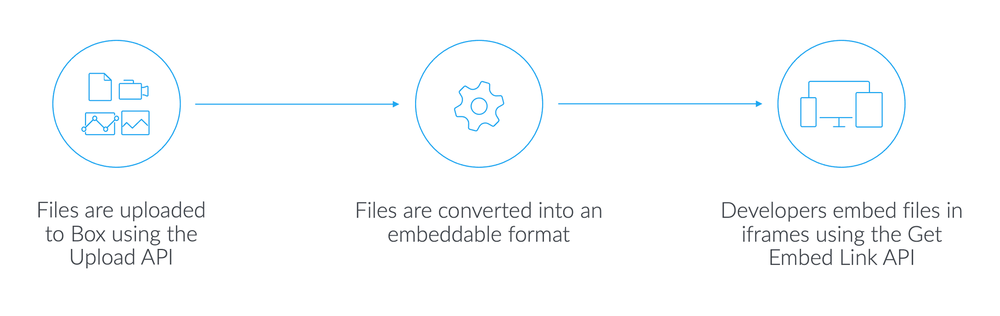

# Box View

Box Viewは、開発者が自分のウェブアプリやモバイルアプリで、忠実度の高いインタラクティブなファイルビューアーを使用してファイルをアップロード、変換、および表示できるようにする、埋め込み可能なサービスです。

## 機能

### 任意のファイルの表示

標準の`<iframe>`を使用して、ドキュメント、画像、動画、360度動画および画像、3Dモデル、その他の多くのファイルを任意のウェブアプリまたはモバイルアプリに埋め込みます。

### 使いやすさ

セキュアなAPIを介してBoxにファイルをアップロードすると、アプリケーションのUIに埋め込み可能なHTML5スニペットが配置されます。

### 状況に応じたコラボレーション

エンドユーザーが注釈を使用して、ドキュメント、プレゼンテーション、および画像のコラボレーションやマークアップを実行できるようにします。ユーザーは、テキストをハイライトしたり、ファイルレンダリングの特定の領域にコメントを付けたりできます。

## Box Viewのしくみ

1. [セキュアなアップロードAPI][upload]を使用してBoxにファイルをアップロードします。コンテンツはすべて、ウイルススキャンと256ビット暗号化を備えたBoxのセキュアなクラウドストレージインフラストラクチャに保存されます。
2. アップロード時に、ファイルはHTML5互換のアセットに変換されます。これらのアセットは、明瞭にすばやくレンダリングするよう作られています。
3. ファイルレンダリングにアクセスするために埋め込み可能なURLがリクエストされます。プレビューは、`<iframe>` URLを使用してアプリケーションに直接埋め込むことができます。

<ImageFrame border center shadow>

</ImageFrame>

## Box Content Previewによる操作のカスタマイズ

[Box Content Preview](g://embed/ui-elements/preview)を使用すると、変換されたファイルに対するクライアント側の操作をカスタマイズできます。

## ユースケース

* 求人アプリケーションで履歴書PDFを変換して表示する
* 学生用ポータルで、ドキュメント、動画、PDFなどの教材を変換して表示する
* メディアルームでHD動画を変換して表示する
* 現場の営業支援アプリケーションで、ドキュメント、動画、PDF、3Dモデルなどの営業資料を変換して表示する

[upload]: e://post-files-content
