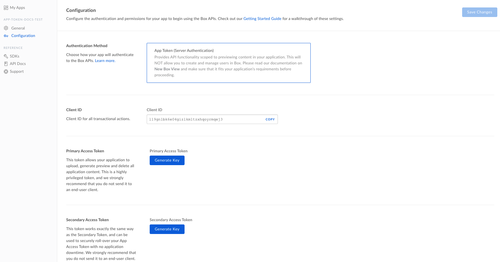
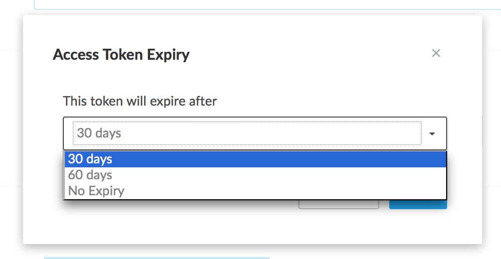

# 設定

Boxにファイルをアップロードし、Box Viewを使用してプレビューする前に、Boxアプリケーションを作成し、そのアプリケーション用にアクセストークンを生成する必要があります。

## アプリトークンアプリの作成

Box Viewでは、**アプリトークン認証**と呼ばれる認証メカニズムを使用して、特定のBoxユーザーとは対照的に、アプリケーションのアカウント内に直接ファイルを保存します。これにより、ユーザーとコンテンツを関連付ける必要なく、ファイルのプレビューが可能になります。

最初の手順として、アプリケーションを作成し、管理者からアプリケーションの承認を受けて、BoxにAPIリクエストの発行を開始します。

<CTA to="guide://applications/custom-apps/app-token-setup/">

アプリトークンアプリのセットアップと承認

</CTA>

<Message type="warning">

アプリトークンアプリは、Box管理者による承認が必要です。承認されない場合は、APIリクエストの送信時に権限エラーが発生します。アプリの承認を受けるには、[このガイド](guide://applications/custom-apps/app-approval/)に従ってください。

</Message>

## アクセストークンの生成

アプリケーションが読み込まれた状態で、左側のナビゲーションメニューで\[**構成**]オプションをクリックします。アプリケーションの\[構成]ページは次のようになります。

<ImageFrame border>

</ImageFrame>

\[**プライマリアクセストークン**]セクション内の\[**キーを生成**]ボタンをクリックします。

<ImageFrame border>

</ImageFrame>

<Message type="notice">

開発アカウント用の2FA設定がない場合は、アプリトークンを正常に生成できるよう事前に2FAの設定が求められます。プロンプトの指示に従って2FAを設定してください。

</Message>

トークンの有効期限に30日、60日、または有効期限なしを選択します。

<ImageFrame border width="600" shadow center>

</ImageFrame>

アプリトークンが生成されたら、コピーして安全に保存します。アプリトークンは、ページが再読み込みされると表示されなくなります。これは、Boxでは実際のトークンではなくトークンの一方向のハッシュが保存されているため、元のトークンを再取得できないからです。
