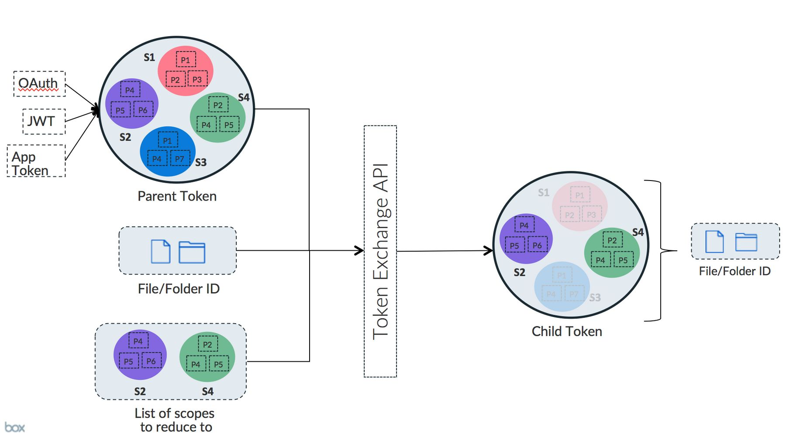
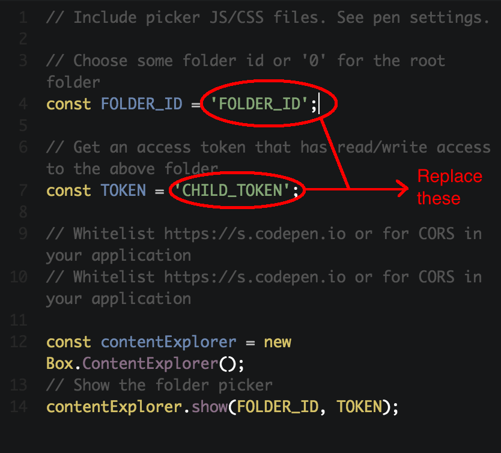
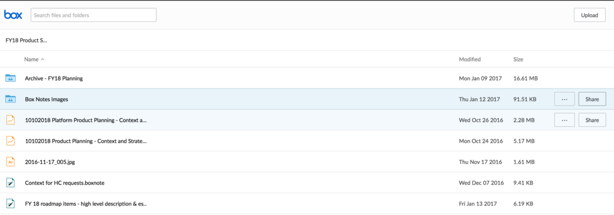

# アクセスのカスタマイズ

## 動機

Box UI Elementsは、クライアントで初期化され、Boxに対して直接API呼び出しを実行します。したがって、すべてのBox APIリクエストが認証されなければならないため、有効なアクセストークンがクライアントにある必要があります。

[トークン交換](g://authentication/access-tokens/downscope)とは、「親トークン」(管理対象ユーザー、App User、サービスアカウント、またはアプリケーションのトークン)を「子トークン」に交換するためのメカニズムです。「子トークン」は、クライアントの権限を引き上げることなく安全にクライアントに送信できるように、必要最小限の権限のセットにダウンスコープしたものです。

Box UI Elementsは、トークンの権限に対応するよう設計されています。そのため、Box UI Elementsとともにトークン交換を使用すると、クライアントトークンに対する適切な権限セットがあれば、フロントエンドの開発者が手動でUIコントロールのオン/オフを切り替える必要はないという別のメリットがもたらされます。この動作は、Boxアプリケーションでの動作にも似ています。たとえば、フォルダに対して「プレビューのみ」の権限を持つユーザーの場合、UIに\[ダウンロード]ボタンは表示されません。

次の設計図では、アプリケーションでUI Elementとともにトークン交換を使用する方法と、ユースケースの例を示しています。

<ImageFrame border>


</ImageFrame>

* **クライアントからのAPI呼び出しのセキュリティ強化:** 一般的なセキュリティ対策として、ユーザーによってアクションが実行されるたびにダウンスコープされたトークンを生成して送信し、クライアントができるだけ危険にさらされないようにすることをお勧めします。たとえば、ユーザーがファイルに対するプレビューおよび共有アクセス権限を必要とする場合でも、クライアントにユーザートークンを送信してユーザーに完全なユーザーレベルのアクセス権限を付与するのではなく、トークン交換を使用してトークンをダウンスコープし、ユーザーがファイルをプレビューしたい場合は「プレビューのみ」のトークンを、ファイルを共有したい場合は「共有」トークンを送信することをお勧めします。
* **カスタム権限モデルの作成:** UI Elementを使用してアプリケーションを構築していて、デフォルトのBoxアクセスレベルが実際の権限モデルに合わない場合は、すべてのユーザーに対する完全なスコープのトークンから始め、適宜トークン交換を使用して、独自の権限モデルに対応するようダウンスコープしていくことができます。
* **Boxサービスをトランザクションで使用(Boxユーザーアカウントがない場合):** Boxにユーザーを作成しないでBoxサービスをトランザクションで使用している場合、ユーザーレベルのトークンにはアクセスできません。このような場合は、トークン交換を使用してサービスアカウントトークンを適切なスコープのトークンにダウンスコープできます。
* **別のユーザーのコンテンツへのアクセス権限を付与することのみを目的としたユーザーの作成:** エンドユーザーに別のアプリ/管理対象ユーザーのコンテンツへの「1回限り」のアクセス権限を与える必要がある場合は、トークン交換を使用すると、アプリ/管理対象ユーザーのトークンを、エンドユーザーにアクセスを許可したい特定の権限とファイル/フォルダにダウンスコープし、そのトークンをUI Elementに渡してエンドユーザーがそのコンテンツにアクセスできるようにすることができます。たとえば、トークン交換を使用した場合、ユーザートークンを、コンテンツに対するアクセス権限が読み取り専用になるようダウンスコープし、そのトークンを別のユーザーに渡すことができます。

## 実装

上記のすべてに対する解決策として、トークン交換を使用して親トークンをダウンスコープされたトークンに交換し、そのトークンを使用してUI Elementを初期化します。

トークン交換では、「親トークン」、「スコープのリスト」、およびファイル/フォルダID (省略可)を入力引数として受け取り、これらの厳密なスコープのセットとそれぞれのファイル/フォルダID (入力引数に指定されている場合)にダウンスコープされたトークンが返されます。

<Messsage>

# UI Element向けに設計された専用スコープ

Boxでは、UI Elementとシームレスに連動する一連のスコープを設計しました。トークン交換はすべてのBoxスコープで動作しますが、設計したスコープには、基本機能に必要な権限セットに加えて、追加機能のための増分の権限も含まれているため、UI Elementと一緒にこれらのスコープを使用することをお勧めします。

</Message>

<ImageFrame border>



</ImageFrame>

## 開発者のフロー

さまざまなスコープについて説明したので、ここからはUI Elementでトークン交換を使用するシナリオを見ていきましょう。

**シナリオ:** Box Content Explorer UI Elementを使用してユーザーがフォルダツリーを閲覧できるようにして、ユーザーによるファイルのプレビューとダウンロードを許可します。共有は無効にする必要があります。

**手順:**

* ユースケースに応じて、管理対象ユーザー、App User、またはサービスアカウントを作成します。このユーザーまたはアプリケーションのトークンをトークン交換の親トークンとして使用します。ユーザートークンを生成するには、以下に従います。
  * 管理対象ユーザーを作成する場合は、OAuthを使用した認証のガイド
  * App Userまたはサービスアカウントを作成する場合は、JWTを使用した認証のガイド
* 以下に示すようにコラボレータの作成APIを使用して、上で作成したユーザーをコラボレータとしてコンテンツに追加します。この手順では、ユーザーアカウントでユーザーにコンテンツに対するアクセス権限が与えられていない場合は、アクセス権限が与えられます。このユーザーのアカウントでファイル/フォルダが作成されている場合は、ユーザーはデフォルトでフォルダに対する「所有者」アクセス権限を持っているため、このコラボレーションの手順をスキップしてかまいません。

<!-- markdownlint-disable line-length -->

```curl
curl https://api.box.com/2.0/collaborations \
  -H "authorization: Bearer [ACCESS_TOKEN]" \
  -d '{"item": { "id": "123456", "type": "folder"}, "accessible_by": { "id": "USER_ID", "type": "user" }, "role": "editor"}' \
  -X POST
```

<!-- markdownlint-enable line-length -->

<Message>

# Boxでのアクセスレベル

BoxユーザーがBox内のファイル/フォルダでコラボレーションする場合に[7種類のアクセスレベル][accesslevels]を使用できます。このユーザーのアカウントでファイル/フォルダが作成されている場合は、ユーザーはデフォルトでフォルダに対する「所有者」アクセス権限を持っているため、このコラボレーションの手順をスキップしてかまいません。

</Message>

* トークン交換APIを使用して親トークンを、Content Explorerの基本スコープ(`base_explorer`)と特定の`folder_id` `123456`に有効な`item_download`および`item_preview`スコープを含む子トークンに交換します。この手順はアプリケーションサーバー上で実行することを強くお勧めします。

### リクエスト

```curl
curl https://api.box.com/oauth2/token \
  -d 'subject_token=ACCESS_TOKEN' \
  -d 'subject_token_type=urn:ietf:params:oauth:token-type:access_token' \
  -d 'scope=item_upload item_preview base_explorer' \
  -d 'resource=https://api.box.com/2.0/folders/123456' \
  -d 'grant_type=urn:ietf:params:oauth:grant-type:token-exchange' \
  -X POST
```

### レスポンス

```json
{
    "access_token": "CHILD_TOKEN",
    "expires_in": 4247,
    "token_type": "bearer",
    "restricted_to": [
        {
            "scope": "base_explorer",
            "object": {
                "type": "folder",
                "id": "123456",
                "sequence_id": "0",
                "etag": "0",
                "name": "FOLDER_NAME"
            }
        },
        {
            "scope": "item_download",
            "object": {
                "type": "folder",
                "id": "123456",
                "sequence_id": "0",
                "etag": "0",
                "name": "FOLDER_NAME"
            }
       },
       {
            "scope": "item_preview",
            "object": {
                "type": "folder",
                "id": "123456",
                "sequence_id": "0",
                "etag": "0",
                "name": "FOLDER_NAME"
            }
        }
    ],
    "issued_token_type": "urn:ietf:params:oauth:token-type:access_token"
}
```

上で取得した`CHILD_TOKEN`はダウンスコープされ、フォルダID`123456`とその子に対するダウンロードおよびプレビューの権限のみが含まれています。

この`CHILD_TOKEN`をコンテンツエクスプローラUI Elementで使用します。簡単なデモを確認するには、[コンテンツエクスプローラUI Element CodePenのサンプル](https://codepen.io/box-platform/pen/wdWWdN)を使用して、\[JS]タブでアクセストークンの値とフォルダIDの値を置き換えてください。

<ImageFrame border>



</ImageFrame>

\[Run]をクリックします。指定したフォルダでContent Explorerが初期化されることがわかります。また、Content Explorerには、親(ユーザー)トークンの使用時に表示される\[共有]ボタンが表示されなくなることに注意してください。

<ImageFrame border>


</ImageFrame>

<ImageFrame border>



</ImageFrame>

## トークン交換を使用すべきでない場合

* **Box内のユーザーまたはグループを置き換えない:** Boxにユーザーを作成する代わりにトークン交換を使用することはお勧めしません。Boxユーザーを作成する必要があるかどうかを判断するには、アプリケーションのすべてのエンドユーザーが自身のコンテンツのコピーを保持することが妥当かどうかを評価します。以下に、Boxにユーザーレベルのアカウントを維持することで得られるメリットを示します。トークン交換だけでは、これらのメリットを得ることはできません。
  * **コンテンツの分離とセキュリティ:** ユーザーレベルのアカウントの使用がより適しているのは、親トークンが誤って漏えいした場合でも、会社の全ユーザーではなく、1人のユーザーのコンテンツのセキュリティが侵害されるだけで済むからです。
  * **パフォーマンス:** Boxにユーザーやグループを作成すると、アプリケーションでコンテンツにアクセスするときに適切な権限を決定する必要がなくなるので便利です。適切な権限を決定する処理は、アプリケーションのパフォーマンスに影響を及ぼす可能性が高くなります。
  * **ユーザーレベルの追跡と監査:** 監査、アクセス統計情報、リテンションなど、いくつかのBox機能では、Boxのユーザーモデルが利用されます。これらの機能の使用が必須の場合は、ユーザーレベルのアカウントを作成する必要があります。
* **Boxでのコラボレーションを置き換えない:** コラボレーションは、コンテンツに対するアクセス権限をBoxユーザーに提供するためのより標準的で拡張しやすい方法です。また、Boxでコラボレーションを使用してコンテンツへのアクセス権限を管理する場合、アプリケーションでは、どのユーザーにどのコンテンツへのアクセス権限が必要かについて、管理が必要なコードやデータの量が少なくなります。コラボレーションの代わりにトークン交換を使用すると、各ユーザーから、各ユーザーがアクセスできるすべてのファイルやフォルダへのマッピングを維持する必要があり、すべてのファイルやフォルダはすぐに制御できなくなる可能性があります。
* **ダウンスコープされたトークンのキャッシュ:** アプリケーションにとってパフォーマンスが重要な場合は、ダウンスコープされたトークンをサーバー側で事前にキャッシュする必要があります。トークンを事前にキャッシュする場合は、トークンが1時間以内に期限切れになるため、再試行を実装することをお勧めします。

<Message>

# トークンの寿命

親トークンおよび子トークンの寿命は互いに依存していません。たとえば、子トークンを生成しても親トークンが非アクティブになることはありません。同様に、子トークンをさらに生成しても、以前の子トークンにはまったく影響しません。

</Message>

## シナリオの例

### シナリオ1: クライアントのAPI呼び出しのセキュリティ強化

ある株式投資会社は、従業員が公開する情報を投資家に配信する目的(表示のみのアクセス権限を使用)で、パートナーおよび投資家向けポータルを構築しています。

この会社は外部の顧客それぞれにApp Userを作成し、従業員はコンテンツの公開に使用したBoxアカウントをプロビジョニングしました。すべてのApp Userは、公開されたコンテンツでビューアー/アップローダーとしてコラボレーションしているため、必要に応じて自分のアカウントでコンテンツのプレビューとアップロードの両方を実行することができます。投資家やパートナーはサインインすると、情報を表示およびアップロードできるポータルが表示されます。

プレビューとアップロードの両方では、「ビューアー/アップローダー」トークンを渡す代わりに、クライアントを介してAPI呼び出しを実行する必要があるため、アプリケーションではトークン交換を使用して、ユーザーが実行しようとしている処理に応じて適宜トークンをダウンスコープします。これにより、トークンのセキュリティが侵害された場合に、データ漏えいは最小限に抑えられ、アプリケーションの全体的なセキュリティ対策が強化されます。

### シナリオ2: カスタム権限モデル

ある大規模なフィンテック企業では、クライアントへの投資を管理するために、クライアントのセキュアな格納庫を構築しています。また、Box UI Elementsを使用してアプリケーションのコンテンツ管理フロントエンドも構築しています。

この会社では、通常どおりクライアントとアプリアドバイザーごとにApp Userを作成します。App User間でコンテンツを共有する場合は、App Userを「編集者」ロール(Boxのロール)としてコラボレーションさせます。こうすることで、各App Userは自分以外のすべてのユーザーのコンテンツすべてにアクセスできるようになります。

ユーザーがUI Elementを介してコンテンツにアクセスできるように、アプリケーションがクライアントに直接App Userトークンを提供することはありません。これは、App Userが他のユーザーのコンテンツで「編集者」としてコラボレーションしている(強い権限を持っている)可能性があるためです。代わりに、App Userトークンを使用したトークン交換により、ダウンスコープされたトークンが生成され、以下が制限されます。

* トークンの使用目的を示すスコープ(表示、アップロード、ダウンロード、閲覧、共有など)
* ユーザーがアクセスできる特定のファイル

### シナリオ3: プロセスフロー

ある非営利の信用組合では、ローン処理アプリケーションを開発しています。このアプリケーションでは、Boxのセキュアなコンテンツレイヤを使用して、ローン申請者と社内ユーザー(ローン事務担当者とローン引受人)の間のドキュメントの共有を容易にします。基本的なプロセスは以下のとおりです。

* 顧客はローンを申請する際、申請手続きの一環として、独自に構築されたウェブポータルからドキュメント(収入証明や身分証明など)を提出します。
* Boxは、ドキュメントの送受信を仲介する機能として使用されます。
* 社内の従業員は、顧客に代わってファイルをアップロードする必要があります。
* 社内の従業員は、カスタムのウェブポータルとBoxウェブアプリからドキュメントにアクセスできます。

アプリケーション開発者は、UI Elementとともにトークン交換を使用して、ローン処理管理ソリューションを構築しました。このソリューションで、アプリケーションサーバーは、ローン申請のApp Userトークンを、クライアントが実行する必要のある処理に基づいてダウンスコープし、そのダウンスコープされたトークンをクライアント (顧客とローン担当者) に渡します。このようにダウンスコープされたトークンを使用すると、UI Elementは適切なコントロールやボタンを表示し、ユーザーに対して実行可能な操作を示すことができます (例: ダウンスコープされて渡されたトークンにアップロード権限が含まれていない場合、コンテンツエクスプローラUI Elementではアップロードボタンがグレー表示になります)。

### シナリオ4: トランザクションフロー

ある学習管理システムプロバイダは、Box Platformを使用して自社のアプリケーションのプレビュー機能を強化しています。すべてのユーザーおよび関連付けられている権限は、Box以外のアプリケーションで管理されています。Boxから見ると、そのアプリケーションからのAPI呼び出しはすべて、(個々のユーザーではなく)そのアプリケーションのためのもので、保存およびプレビューされるコンテンツはすべて、個々のユーザーではなくアプリケーションに属しています。この場合、アプリケーション開発者は、Box全体の機能のうち一部(プレビューなど)をトランザクションで使用していますが、その他のセキュアなコンテンツ共有機能やコラボレーション機能は使用していません。実際に、これは多くの顧客にとって重要なユースケースです。

このアプリケーションの簡単なユースケースを考えてください。エンドユーザーはファイルをアップロードした後、アプリケーション自体でプレビューする必要があるとします。そのために、アプリケーションではコンテンツアップロードUI ElementとコンテンツプレビューUI Elementをそれぞれ使用しています。プレビューとアップロードはどちらも帯域幅を大量に消費する処理であるため、アプリケーションは、トラフィックをプロキシするのではなく、クライアントがこれらの処理を直接Boxに対して実行できるようにする必要があります。Boxに対して呼び出しを実行するために、すべてのUI Elementは、有効なアクセストークンをクライアント上で使用できる必要があります。ただし、アプリケーションは、権限のある「サービスアカウント」トークンをクライアントに渡さないようにしてください。渡した場合、クライアントは、アプリケーションを介してアップロードされたすべてのコンテンツにアクセスできるようになるためです。代わりに、アプリケーションではトークン交換を使用して、そのサービスアカウントトークンをアップロードのみのトークンにダウンスコープし、クライアントがアップロードUI Elementを使用してファイルをアップロードできるようにします。さらに、別途プレビューのみのトークンにダウンスコープし、クライアントがプレビューUI Elementを使用してプレビューできるようにします。

## アンチパターン

以下に示すアンチパターンは、アプリ開発をさらに難しいものにしたり、アプリケーションのセキュリティやパフォーマンスを低下させたりするため推奨されないパターンをお客様が識別するのに役立ちます。アプリにこれらのパターンの実装が確認された場合は、Boxサポートに連絡して支援を求めてください。

### 権限のあるトークンをクライアントに渡す

これは絶対に行わないでください。お客様のBox Enterpriseでのコンテンツのセキュリティが侵害される可能性があります。必ずトークン交換を使用して、正確な権限セットをエンドユーザーに提供してください。

### API応答のプロキシとフィルタリング

BoxからのAPI応答をプロキシ/フィルタリングして、クライアントへのデータやコンテンツの公開を制限するだけの場合は、トークン交換を使用することで公開を制限できるかどうかを確認してみてください。特に、プレビュー、ダウンロード、アップロードなどの帯域幅を集中的に使用する、高帯域幅の処理に当てはまります。そのため、Boxでは、クライアントがBoxを使用してこれらの処理を直接実行することをお勧めします。

[accesslevels]: https://community.box.com/t5/How-To-Guides-for-Sharing/What-Are-The-Different-Access-Levels-For-Collaborators/ta-p/144
