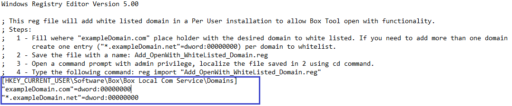
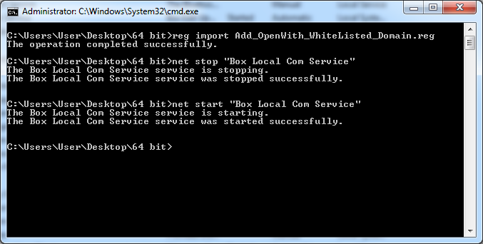

# Box Edit Custom Domains

In order to integrate a third party web application with Box Tools, you will
need to explicitly add your application's URL. On Windows, this is achieved by
adding a registry key. On MacOS, you will need to run few terminal commands to
add and remove domains.

<Message>

Adding domains to a safelist was added in **Box Tools version 4.5.0**.

</Message>

## Safelisting on Windows

Before starting the domain safelisting installation, please download the
required scripts from the provided `.rar`
[here](https://cloud.box.com/s/kvc9cysgq1y2yldpvciwlpt7093ho78l).

### Per User Installation

Open `Add_OpenWith_WhiteListed_Domain.reg` in a text editor.

<ImageFrame border>



</ImageFrame>

<Message>

Additional entries can be added on a new line.

</Message>

Close the file (save changes), open a command prompt with admin privileges, and
navigate to the .reg file and type the following command.

```sh
reg import "Add_OpenWith_WhiteListed_Domain.reg"
```

<ImageFrame border>


</ImageFrame>

### Per Machine Installation

Open the following file in a text editor:

* `x64`: `Per Machine\64 bit\Add_OpenWith_WhiteListed_Domain.reg`
* `x86`: `Per Machine\32 bit\Add_OpenWith_WhiteListed_Domain.reg`

Replace the placeholder domain with the domain you would like allow.

<ImageFrame border>


</ImageFrame>

<Message>

Additional entries may be added on a new line.

</Message>

Close the file (save changes), open a  command prompt with admin privileges, and
navigate the .reg file and type the following command:

```sh
reg import "Add_OpenWith_WhiteListed_Domain.reg"
```

<ImageFrame border>


</ImageFrame>

Restart the Windows service: **Box Local Com Service** (`Box Edit.exe`) using
one of the following methods.

#### Via the command prompt

In a command prompt, enter:

* `net stop "Box Local Com Service"`
* `net start "Box Local Com Service"`

<ImageFrame border>



</ImageFrame>

#### Via the UI

Press `Windows + R` and type `services.msc`.

<ImageFrame border>


</ImageFrame>

Restart `Box Edit.exe` by finding `Box Edit` in the system tray.

<ImageFrame border>


</ImageFrame>

Right click and select **Quit**.

Open `%programfiles%\Box\Box Edit` and run `Box Edit.exe`.

<ImageFrame border>


</ImageFrame>

### Removing

* Run `Remove_ALL_OpenWith_WhiteListed_Domain.reg` to remove all domains at once
* Run `Remove_OpenWith_WhiteListed_Domain.reg` to remove specific domains. Use the instructions above to add domains to this .reg, which will remove domains.

## Safelisting on MacOS

### Steps

Download the bash script
[here](https://cloud.box.com/s/z5qhc7rts6mzrhzfx6cpxeb5ed4ve5u6).

Open the Terminal, go to the folder where the bash script was downloaded, and
add the right permissions by running this command:

```sh
chmod u+rx OpenWith.sh
```

To **add** domains, run the following command in a terminal:

```sh
./OpenWith.sh -a domain1 domain2 ...
```

To **remove** domains, run the following command in a terminal:

```sh
./OpenWith.sh -r domain1 domain2 ...
```

To **clear all** domains, run the following command in a
terminal:

```sh
./OpenWith.sh -c
```

To **list** all domains, run the following command in a terminal:

```sh
./OpenWith.sh -l
```

### Notes

* When safelisting domains ensure you are entering the domains without the HTTP protocol (for example without `https://`) or any trailing path like `yourdomain.com/page/3`.
* All requests most come from a secure origin via HTTPS.
* Safelisting subdomains and ports is possible as the wildcard `*` is supported. For example, all subdomains could be safelisted by adding `*.yourdomain.com` to your list.

## Uninstalling

When Box Tools is uninstalled, all domains will be removed.