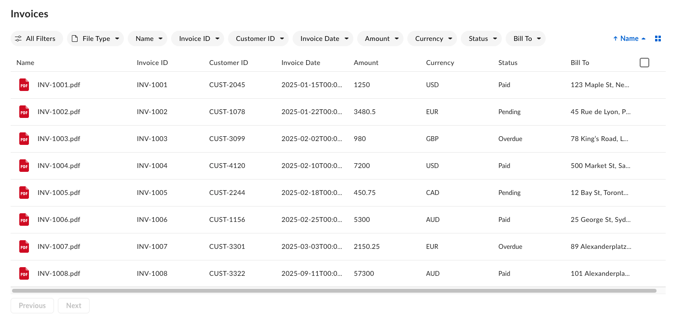
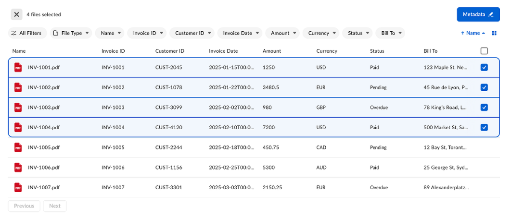
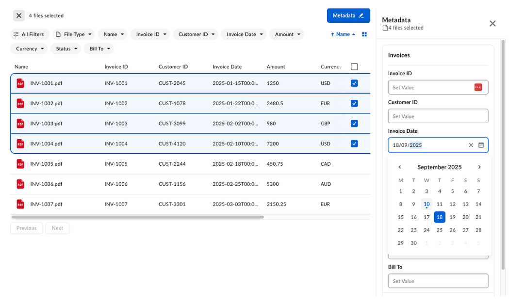
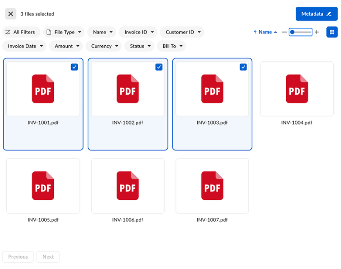

# Content Explorer – metadata view v2

The metadata view of [Content Explorer][content-explorer] allows you to display files and folders based on their metadata.

## Overview

The metadata view `v2` is a ground-up redesign of the original metadata view of the Box Content Explorer UI element. It introduces a streamlined interface tailored for metadata-driven workflows. Key features include filtering and editing interfaces with dedicated UI for each metadata field type, flexible display options with list and grid views, pagination support, and more.



## Prerequisites

Before implementing the metadata view `v2` of Content Explorer, ensure you have:

- The `box-ui-elements` package `v24.0.0`+, React `v18.0.0`, and `Node.js` `v18.0.0`+
- The Box Platform app with proper CORS settings
- A valid [developer token][developer-token]
- A configured metadata template applied to target folder or files. See [creating templates with API][creating-templates-api] or [with the Admin Console][creating-templates-ui].

<Message type='tip'>

Make sure you enable the cascade policy. For detailed instructions, see
[instructions on customizing and applying templates][apply-templates].

</Message>

## Interface areas

The metadata view interface consists of the following areas:

- **Header** – Displays the current view title, navigation, and context-sensitive information like selection counts. The header value can be specified with a `title` prop. If it’s not defined, it defaults to the folder name specified in the `ancestor_folder_id`.
- **Action bar** – Contains filter chips for each metadata field, sort options, and the view mode toggle button (list or grid).
- **Pagination footer** – Provides the **Previous** and **Next** navigation buttons and page indicators.

## Display metadata view

To display the metadata view of Content Explorer, you need the following properties:

| Property | Description |
|---|---|
| `token` | Developer token generated in the Developer Console. |
| `title` | The title of the whole component, if not defined, defaults to the folder name specified in the `ancestor_folder_id`. |
| `defaultView` | Must be set to `metadata`. |
| `features.contentExplorer.metadataViewV2` | Must be set to true to enable the metadata view (v2). |
| `metadataQuery` | Metadata query request body matching the [Metadata Query API][md-queries] schema. |
| `metadataViewProps` | Component configuration. For configuration details, see `metadataViewProps` object. |
| `columns` | Defines the structure and behavior of your metadata table columns. See Columns for details. |

Depending on your needs and setup, Box UI Elements can be used with Vanilla JavaScript or React. You can learn more about installation from the [Installation][installation] guide.

<Message type='notice'>

**Capitalized strings need to be replaced with your custom values.**

</Message>

### Vanilla JavaScript code snippet

```js
const contentExplorer = new Box.ContentExplorer();

contentExplorer.show(FOLDER_ID, ACCESS_TOKEN, {
  container: ".container",
  defaultView: "metadata",
  // metadataQuery must match the query files/folders by metadata API body request:
  // <https://developer.box.com/reference/post-metadata-queries-execute-read/>
  metadataQuery: {
    from: "METADATA_SCOPE.TEMPLATE_KEY", // For example from: "enterprise_123456789.templatename" where the number is the enterprise_123456789 is metadata template scope)
    ancestor_folder_id: "FOLDER_ID"
    // Metadata fields and values pulled to the component
    fields: [
        "metadata.TEMPLATE_SCOPE.TEMPLATE_KEY.FIELD_KEY1",
        "metadata.TEMPLATE_SCOPE.TEMPLATE_KEY.FIELD_KEY2",
        "metadata.TEMPLATE_SCOPE.TEMPLATE_KEY.FIELD_KEY3",  // For example "metadata.enterprise_123456789.templatename.date"
        ...
    ]
    // Optional for filtering data with specific metadata value
    query: "METADATA_FIELD_KEY = :arg1",
    query_params: { arg1: "METADATA_FIELD_VALUE" },
  },
  features: {
    contentExplorer: {
      metadataViewV2: true, // Required for enabling V2
    },
  },
 // NEW dynamic column configuration
  metadataViewProps: {
    columns // Required - for details see section below
    ...
  }
});
```

### React code snippet

```js
import React from 'react';
import { IntlProvider } from 'react-intl';
import ContentExplorer from "box-ui-elements/es/elements/content-explorer"

// Fill with custom values of your metadata template
// You can use this endpoint to get all needed values: https://developer.box.com/reference/get-metadata-templates-id-id-schema/
const metadataScopeAndKey = `${METADATA_TEMPLATE_SCOPE}.${METADATA_TEMPLATE_KEY}`;
const metadataFieldNamePrefix = `metadata.${metadataScopeAndKey}`;
const folderID = "FOLDER_ID"

const metadataQuery = {
   // Check this endpoint for more details on query structure:
   // https://developer.box.com/reference/post-metadata-queries-execute-read/
   from: metadataScopeAndKey,
   ancestor_folder_id: folderID,
   fields: [
      "metadata.METADATA_SCOPE.TEMPLATE_KEY.METADATA_FIELD_KEY1",
      "metadata.METADATA_SCOPE.TEMPLATE_KEY.METADATA_FIELD_KEY2",  // For example "metadata.enterprise_123456789.templatename.date"
      ...
   ]
};

// Required - for details see section below
const columns = [
   {
      textValue: "METADATA_FIELD_DISPLAY_NAME1", // or our your custom value
      id: `${metadataFieldNamePrefix}.${METADATA_FIELD_KEY1}`,
      type: field.type,
      allowsSorting: true,
      minWidth: 150,
      maxWidth: 150,
   },
   {
      textValue: "METADATA_FIELD_DISPLAY_NAME2", // or our your custom value
      id: `${metadataFieldNamePrefix}.${METADATA_FIELD_KEY2}`,
      type: field.type,
      allowsSorting: true,
      minWidth: 150,
      maxWidth: 150,
   },
   ...
];

const componentProps = {
 features: {
   contentExplorer: {
       metadataViewV2: true,
   },
 },
 metadataQuery,
 metadataViewProps: {
   columns
 },
};

const ContentExplorerContainer = () => {
 const { features, metadataQuery, metadataViewProps } = componentProps;
 // Store token in a secure way
 return (
   <IntlProvider locale="en">
     <ContentExplorer
       token={TOKEN}
       defaultView="metadata"
       features={features}
       metadataQuery={metadataQuery}
       metadataViewProps={metadataViewProps}
     />
   </IntlProvider>
 );
};

export default ContentExplorerContainer;
```

## Columns

The columns prop defines the structure and behavior of your metadata table columns.

| Property      | Type    | Required | Description                                                                         |
|---------------|---------|----------|-------------------------------------------------------------------------------------|
| `id`          | string  | Yes      | Metadata field identifier in the following format: `metadata.<scope>.<templateKey>.<field>` |
| `textValue`     | string  | Yes      | Column header display name.                                                         |
| `type`         | string  | Yes      | Box metadata field type (`string`, `number`, `date`, `singleSelect`, `multiSelect`). |
| `allowsSorting` | boolean | No       | Enables column header sorting.                                                      |
| `minWidth`      | number  | No       | Minimum column width in pixels.                                                     |
| `maxWidth`      | number  | No       | Maximum column width in pixels.                                                     |

## Features

### Enabling row selection

You can enable selecting individual rows. When one or more rows are selected, the header updates to show a selection descriptor and a metadata edit button. This allows users to perform single or bulk actions. Row selection is scoped to the paginated content.



To enable the selection feature, set the `isSelectionEnabled` property to `true` within the `metadataViewProps` object:

```js
const contentExplorer = new Box.ContentExplorer();

contentExplorer.show(FOLDER_ID, ACCESS_TOKEN, {
 ...
 metadataViewProps: {
   columns,
   isSelectionEnabled: true
 },
});
```

### Editing metadata values

When one or more items are selected, the component header displays the selected count and the **Metadata** button becomes active. Clicking the **Metadata** button opens a sidebar that lets users view and edit metadata for the selected items.



This behavior is enabled by default; no additional properties are required to activate it.

### Filtering metadata

Filter items by the file type, filter folders, or filter by metadata field values specified in the Box [metadata templates][metadata-guides].

Filter chips are enabled by default. To disable the **All Filters** chip, set the `isAllFiltersDisabled` to `true` in the `actionBarProps` object:

```js
const contentExplorer = new Box.ContentExplorer();

contentExplorer.show(FOLDER_ID, ACCESS_TOKEN, {
 ...
metadataViewProps: {
    columns,
    isSelectionEnabled: true,
    actionBarProps: { 
        isAllFiltersDisabled: true,
    }
  },
});
```

<!-- Add info about custom and bulk actions -->

### Toggling list and grid view

Grid view is available by default through the view mode toggle button in the action bar. When the grid view is active, a zoom control becomes available. Other functionalities like selecting, filtering, and editing are also available within this view.



To disable grid view, set `actionBarProps.isViewModeButtonDisabled` to `true` within the `metadataViewProps` object:

```js
const contentExplorer = new Box.ContentExplorer();

contentExplorer.show(FOLDER_ID, ACCESS_TOKEN, {
 ...
 metadataViewProps: {
   columns,
   actionBarProps: {
     isViewModeButtonDisabled: true,
   }
 },
});
```

### Pagination

The UI Element uses marker-based pagination only, with the footer always visible. You cannot set an offset or page number. Users can navigate using only **Previous** and **Next**. Infinite scrolling is not supported.

## Migrating from v1 to v2

### Npm package

<Message type='notice'>

The `v1` of the metadata view Content Explorer has reached end of support. While `v1` remains available in the `24.0.0` package, it will no longer receive bug fixes or new features. Follow the migration guide and switch to the `v2` metadata view of Content Explorer in order to receive the newest features.

</Message>

To migrate from `v1` to v2 in projects using `box-ui-elements` package:

1. Upgrade the `box-ui-elements` package version to version `24.0.0` or higher.
2. Ensure `box-ui-elements` peer dependencies are added as dependencies in your `package.json` file. Install them with your package manager.
3. Add the `features` flag to enable the enhanced metadata view.

```js
features: {
   contentExplorer: {
       metadataViewV2: true
   }
}
```

4. Convert your metadata `fieldToShow` configuration to the new column object. Add field types that correspond with the values in the Box metadata template. Pass the columns array to the new `metadataViewProps` object.

```js
const columns = [
    {
       textValue: "METADATA_FIELD_DISPLAY_NAME", // Altenratively pass a custom value
       id: `${metadataFieldNamePrefix}.${METADATA_FIELD_KEY}`,
       type: field.type,
       allowsSorting: true, // Optional
       minWidth: 150, // Optional; the default value is 220
       maxWidth: 150, // Optional; the default value is 220
    },
    ...
];
```

5. Optionally, configure additional features described in this guide.

### CDN

To migrate from `v1` to v2 in projects using CDN imports:

1. Ensure that CDN link includes package version with version `24.0.0` or higher.
2. Add the `features` flag to enable the enhanced metadata view.

```js
features: {
   contentExplorer: {
       metadataViewV2: true
   }
}
```

3. Convert your metadata `fieldToShow` configuration to the new column object. Add field types that correspond with the values in the Box metadata template. Pass the columns array to the new `metadataViewProps` object.

```js
const columns = [
    {
       textValue: "METADATA_FIELD_DISPLAY_NAME", // Altenratively pass a custom value
       id: `${metadataFieldNamePrefix}.${METADATA_FIELD_KEY}`,
       type: field.type,
       allowsSorting: true, // Optional
       minWidth: 150, // Optional; the default value is 220
       maxWidth: 150, // Optional; the default value is 220
    },
    ...
];
```

4. Optionally, configure additional features described in this guide.

[content-explorer]: g://embed/ui-elements/explorer/
[terminology]: g://metadata/#metadata-terminology
[creating-templates-api]: g://metadata/templates/create
[creating-templates-ui]: https://support.box.com/hc/en-us/articles/360044194033-Customizing-Metadata-Templates
[developer-token]: g://authentication/tokens/developer-tokens/
[metadata-guides]: g://metadata/templates/
[md-queries]: e://post-metadata-queries-execute-read/
[apply-templates]: https://support.box.com/hc/en-us/articles/360044196173-Using-Metadata
[installation]: g://embed/ui-elements/installation