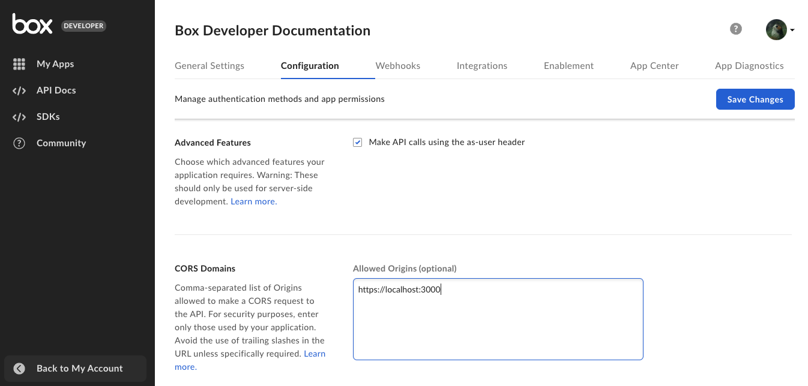
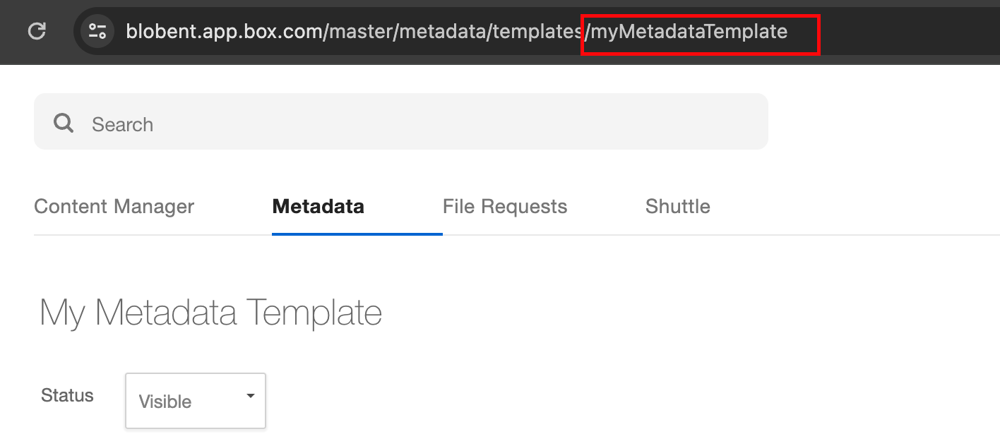

# コンテンツエクスプローラ

Box Content Explorer UI Elementを使用すると、開発者は、Boxに保存されているコンテンツのフォルダビューをデスクトップまたはモバイルウェブアプリに埋め込むことができます。ライブラリはBox APIを介して指定されたフォルダに関する情報を取得した後、メインのBoxウェブアプリと同様にそのコンテンツをフォルダビューにレンダリングします。ユーザーは、そのフォルダ階層内を移動し、名前の変更、削除、共有などのファイル操作を実行できます。

コンテンツエクスプローラで、メタデータビューを使用できるようになりました。このビューでは、メタデータクエリを使用して、メタデータに基づいてファイルやフォルダを検索できます。データは埋め込みのビューに表示されます。

## インストール

NPMまたはBox CDN経由でBox UI Elementsをインストールする方法は、[こちら](g://embed/ui-elements/installation)を参照してください。

## 認証

UI Elementは認証に依存しない方法で設計されているため、Boxアカウントを持つユーザー (管理対象ユーザー) とBox以外のアカウントを持つユーザー (App User) のどちらにUI Elementを使用するかどうかに関係なく、UI Elementを使用するのに特別な設定は必要ありません。その理由は、UI Elementは認証のために「トークン」を受け取ることのみを予期しており、Boxにはトークンの生成方法としてOAuthとJWTの2つがあるからです。

<CTA to="g://authentication/select">

認証方法の選択について確認する

</CTA>

## サンプルHTML

```html
<!DOCTYPE html>
<html lang="en-US">
    <head>
        <meta charset="utf-8" />
        <title>Box Content Explorer Demo</title>

        <!-- Latest version of the explorer css for your locale -->
        <link
            rel="stylesheet"
            href="https://cdn01.boxcdn.net/platform/elements/{VERSION}/en-US/explorer.css" />
    </head>
    <body>
        <div class="container" style="height:600px"></div>
        <!-- Latest version of the explorer js for your locale -->
        <script src="https://cdn01.boxcdn.net/platform/elements/{VERSION}/en-US/explorer.js"></script>
        <script>
            var folderId = "123";
            var accessToken = "abc";
            var contentExplorer = new Box.ContentExplorer();
            contentExplorer.show(folderId, accessToken, {
                container: ".container",
            });
        </script>
    </body>
</html>

```

## デモ

<iframe height="560" scrolling="no" title="Box Content Explorer" src="//codepen.io/box-platform/embed/wdWWdN/?height=560&theme-id=27216&default-tab=result&embed-version=2&editable=true" frameborder="no" allowtransparency allowfullscreen style="width: 100%;">

</iframe>

## API

```js
const { ContentExplorer } = Box;
const contentExplorer = new ContentExplorer();

/**
 * Shows the content explorer.
 *
 * @param {string} folderId - The root folder id
 * @param {string} accessToken - Box API access token
 * @param {Object} [options] - Options
 * @return {void}
 */
contentExplorer.show(folderId, accessToken, options);

/**
 * Hides the content explorer, removes all event listeners, and clears out the
 * HTML.
 *
 * @return {void}
 */
contentExplorer.hide();

/**
 * Clears out the internal in-memory
 * cache for the content explorer forcing
 * re-load of items via the API.
 *
 * @public
 * @return {void}
 */
contentExplorer.clearCache();

/**
 * Adds an event listener to the content explorer. Listeners should be added
 * before calling show() so no events are missed.
 *
 * @param {string} eventName - Name of the event
 * @param {Function} listener - Callback function
 * @return {void}
 */
contentExplorer.addListener(eventName, listener);

/**
 * Removes an event listener from the content explorer.
 *
 * @param {string} eventName - Name of the event
 * @param {Function} listener - Callback function
 * @return {void}
 */
contentExplorer.removeListener(eventName, listener);

/**
 * Removes all event listeners from the content explorer.
 *
 * @return {void}
 */
contentExplorer.removeAllListeners();

```

### パラメータ

| パラメータ         | 型      | 説明                                                                                                                  |
| ------------- | ------ | ------------------------------------------------------------------------------------------------------------------- |
| `folderId`    | String | BoxフォルダのID。中を移動するフォルダのIDになります。Boxの \[すべてのファイル] フォルダを使用する場合は、`folderId`として`0`を使用します。                                 |
| `accessToken` | String | 使用するBox APIアクセストークン。このトークンには、上記のフォルダに対する読み取り/書き込みアクセス権限が必要です。このトークンのために渡される値は、エクスプローラの表示中は有効期限切れにならないことが前提となっています。  |
| `options`     | Object | 省略可能なオプション。詳細は以下を参照してください。たとえば、`contentExplorer.show(FOLDER_ID, TOKEN, {canDelete: false})`を使用すると、削除オプションが非表示になります。 |

### オプション

| パラメータ                  | 型        | デフォルト                                   | 説明                                                                                                                                                                                                               |
| ---------------------- | -------- | --------------------------------------- | ---------------------------------------------------------------------------------------------------------------------------------------------------------------------------------------------------------------- |
| `container`            | String   | `document.body`                         | コンテンツエクスプローラが配置されるコンテナのCSSセレクタ。hide() を呼び出すと、このコンテナは空になります。                                                                                                                                                      |
| `sortBy`               | String   | `name`                                  | コンテンツリストの最初の並べ替え基準オプション。値は`id`、`name`、`date`または`size`になります。                                                                                                                                                      |
| `sortDirection`        | String   | `ASC`                                   | コンテンツリストの最初の並べ替え方向オプション。値は`ASC`または`DESC`になります。                                                                                                                                                                   |
| `logoUrl`              | String   |                                         | ヘッダーに表示するカスタムロゴのURL。この値が「box」という文字列の場合は、Boxのロゴが表示されます。                                                                                                                                                           |
| `canPreview`           | Boolean  | `true`                                  | このオプションが`true`に設定されていて、ファイルに対する`can_preview`権限が`true`の場合、コンテンツエクスプローラでファイルをクリックできます。ファイルをクリックするとそのファイルのプレビューが開始されます。ファイルに対する権限`can_preview`が`false`に設定されている場合、このオプションによる効果はありません。このオプションは、プレビュー可能なファイルのみに適用できます。 |
| `canDownload`          | Boolean  | `true`                                  | これを`false`に設定すると、ダウンロードオプションが非表示になります。このオプションを非表示にするだけではダウンロードを防ぐことはできず、ファイルに対する権限でも`can_download`を`false`に設定する必要があります。ファイルに対する権限`can_download`が`false`に設定されている場合、このオプションによる効果はありません。このオプションは、ファイルのみに適用できます。     |
| `canDelete`            | Boolean  | `true`                                  | これを`false`に設定すると、削除オプションが非表示になります。このオプションを非表示にするだけでは削除を防ぐことはできず、項目に対する権限でも`can_delete`を`false`に設定する必要があります。項目に対する権限`can_delete`が`false`に設定されている場合、このオプションによる効果はありません。                                            |
| `canRename`            | Boolean  | `true`                                  | これを`false`に設定すると、名前の変更オプションが非表示になります。このオプションを非表示にするだけでは名前の変更を防ぐことはできず、項目に対する権限でも`can_rename`を`false`に設定する必要があります。                                                                                                |
| `canUpload`            | Boolean  | `true`                                  | これを`false`に設定すると、アップロードオプションが非表示になります。このオプションを非表示にするだけではアップロードを防ぐことはできず、現在のフォルダに対する権限でも`can_upload`を`false`に設定する必要があります。フォルダに対する権限`can_upload`が`false`に設定されている場合、このオプションによる効果はありません。                             |
| `canCreateNewFolder`   | Boolean  | `true`                                  | フォルダの新規作成オプションが非表示になります。このオプションを非表示にするだけではフォルダの新規作成を防ぐことはできず、フォルダ項目に対する権限でも`can_upload`を`false`に設定する必要があります。フォルダ項目に対する権限`can_upload`が`false`に設定されている場合、このオプションによる効果はありません。                                       |
| `canShare`             | Boolean  | `true`                                  | `false`に設定すると、共有ボタンが非表示になります。このボタンを非表示にするだけでは共有を防ぐことはできず、項目の`permissions`でも`can_share`をfalseに設定する必要があります。項目に対する権限`can_share`が`false`に設定されている場合、このオプションによる効果はありません。                                               |
| `canSetShareAccess`    | Boolean  | `true`                                  | `false`に設定すると、共有権限の変更を許可する共有ドロップダウン選択が非表示になります。この選択のドロップダウンを非表示にするだけでは共有権限の変更を防ぐことはできず、項目に対する権限でも`can_set_share_access`を`false`に設定する必要があります。項目に対する権限`can_set_share_access`が`false`に設定されている場合、このオプションによる効果はありません。 |
| `sharedLink`           | String   |                                         | 共有リンクのURL。フォルダが共有されており、アクセストークンがファイルの所有者またはコラボレータに属していない場合は必須です。                                                                                                                                                 |
| `sharedLinkPassword`   | String   |                                         | 共有リンクのパスワード。共有リンクにパスワードが設定されている場合は必須です。                                                                                                                                                                          |
| `size`                 | String   | `undefined`                             | コンテンツエクスプローラがコンテナの幅の大小に合わせて表示されるように示します。値には空白か、`small`または`large`を指定できます。空白にした場合、UI Elementはそのコンテナに合わせて調整され、自動で`small`の幅と`large`の幅が切り替わります。                                                                       |
| `isTouch`              | Boolean  | デフォルトでは、ブラウザとデバイスのデフォルトのタッチサポートが設定されます。 | コンテンツエクスプローラがタッチ対応デバイスにレンダリングされることを示します。                                                                                                                                                                         |
| `autoFocus`            | Boolean  | `false`                                 | `true`に設定すると、初回読み込み時に項目グリッドに焦点が当てられます。                                                                                                                                                                           |
| `defaultView`          | String   | `files`                                 | 値は`files`、`recents`、または`metadata`になります。`recents`に設定すると、デフォルトで、通常のファイル/フォルダ構造ではなく、最近使用した項目が表示されます。コンテンツエクスプローラでメタデータビューを表示するには、`metadata`を指定する必要があります。指定しない場合、通常のフォルダビューが表示されます。                                  |
| `requestInterceptor`   | Function |                                         | リクエストをインターセプトする関数。例については、[このCodePen](https://codepen.io/box-platform/pen/jLdxEv)を参照してください。基盤となるXHRライブラリは`axios.js`で、[インターセプタでは同様のアプローチ](https://github.com/axios/axios#interceptors)に従っています。                     |
| `responseInterceptor`  | Function |                                         | レスポンスをインターセプトする関数。例については、[このCodePen](https://codepen.io/box-platform/pen/jLdxEv)を参照してください。基盤となるXHRライブラリは`axios.js`で、[インターセプタでは同様のアプローチ](https://github.com/axios/axios#interceptors)に従っています。                     |
| `ContentOpenWithProps` | Object   | `{ show: false }`                       | エクスプローラからプレビューする際にOpen With Elementを表示できます。                                                                                                                                                                      |
| `token`                | String   |                                         | 開発者コンソールで生成された開発者トークン。                                                                                                                                                                                           |
| `metadataQuery`        | Object   |                                         | メタデータビューの情報を取得するために使用されるメタデータクエリ。                                                                                                                                                                                |
| `rootFolderID`         | String   |                                         | メタデータテンプレートが適用されているフォルダのID。`metadataQuery`はこのフォルダに適用されます。                                                                                                                                                        |
| `fieldsToShow`         | Object   |                                         | 表示するメタデータフィールド/列 - メタデータテンプレートの有効なフィールド名を指定する必要があります。                                                                                                                                                            |

### イベント

| イベント名      | イベントデータ                             | 説明                     |
| ---------- | ----------------------------------- | ---------------------- |
| `select`   | `Array<File \| Web Link \| Folder>` | 項目行が選択されたときに発生します。     |
| `rename`   | `File \| Web Link \| Folder`        | 項目の名前が変更されたときに発生します。   |
| `preview`  | `File`                              | ファイルがプレビューされたときに発生します。 |
| `download` | `Array<File>`                       | 項目がダウンロードされたときに発生します。  |
| `delete`   | `Array<File>`                       | 項目が削除されたときに発生します。      |
| `upload`   | `Array<File>`                       | 項目がアップロードされたときに発生します。  |
| `navigate` | `Folder`                            | フォルダ内に移動したときに発生します。    |
| `create`   | `Folder`                            | 新しいフォルダが作成されたときに発生します。 |

## キーボードショートカット

クリックによって手動で、またはJavaScriptや上記の`autoFocus`プロパティによってプログラムで項目グリッドがフォーカスされていると、以下のキーボードショットカットが機能します (対応する操作が適切で許可されている場合)。

| キー                      | 動作                  |
| ----------------------- | ------------------- |
| `Arrow Up`              | 前の項目行               |
| `Arrow Down`            | 次の項目行               |
| `Ctrl/Cmd + Arrow Up`   | 最初の項目行              |
| `Ctrl/Cmd + Arrow Down` | 最後の項目行              |
| `/`                     | 検索                  |
| `Shift + X`             | 項目行を選択              |
| `Delete`                | 選択した項目を削除           |
| `Enter`                 | 選択した項目を開く           |
| `Shift + R`             | 選択した項目の名前を変更        |
| `Shift + S`             | 選択した項目を共有           |
| `Shift + D`             | 選択した項目をダウンロード       |
| `g then f`              | ルートフォルダに移動          |
| `g then u`              | 現在のフォルダにアップロード      |
| `g then b`              | ルートフォルダの階層リンクをフォーカス |
| `g then r`              | 最近使用した項目            |

##  スコープ 

アプリケーションで、エンドユーザーがコンテンツエクスプローラ機能のサブセットのみにアクセスできるようにする必要がある場合は、[ダウンスコープ][downscope]を使用して、アクセストークンを適切にダウンスコープして必要な権限のセットを含むトークンを生成し、コンテンツエクスプローラを初期化するエンドユーザークライアントに安全に渡すことができます。

以下は、ダウンスコープと一緒に使用する、UI Element固有の新しいスコープのセットです。こうしたスコープにより、開発者は、ダウンスコープされたトークンに適切なスコープを構成して、コンテンツエクスプローラのUIコントロールを有効/無効にすることができます。詳細については、[Box UI Elementsの専用スコープ][scopes]を参照してください。

### 基本スコープ

| スコープ名           | 付与される権限                                            |
| --------------- | -------------------------------------------------- |
| `base_explorer` | ユーザー/ファイル/トークンの権限に基づいて、フォルダツリー内のコンテンツへのアクセスを許可します。 |

### 機能のスコープ

| スコープ名           | 付与される権限                                                            |
| --------------- | ------------------------------------------------------------------ |
| `item_preview`  | ユーザーがクリックしたときにファイルのプレビューを自動的に有効にします (プレビューUI Elementを参照する必要があります)。 |
| `item_download` | ファイル/フォルダのコンテンツのダウンロードを許可します。                                      |
| `item_rename`   | ファイル/フォルダの名前変更を許可します。                                              |
| `item_share`    | ダウンスコープリクエストの「resource」で指定されたリソースの共有を許可します。                        |
| `item_delete`   | ファイル/フォルダの削除を許可します。                                                |

### サンプルのシナリオ

| シナリオ                                                       |  スコープ                                                                                                             |
| ---------------------------------------------------------- | ----------------------------------------------------------------------------------------------------------------- |
| ユーザーがフォルダ構造内を移動する (基本機能)                                   | `base_explorer`                                                                                                   |
| ユーザーが基本機能とプレビューを必要とする                                      | `base_explorer` + `item_preview`                                                                                  |
| ユーザーが基本機能、プレビュー、およびダウンロードを必要とする                            | `base_explorer` + `item_preview` + `item_download`                                                                |
| ユーザーが基本機能、プレビュー、ダウンロード、およびファイル/フォルダ名の変更を必要とする              | `base_explorer` + `item_preview` + `item_download` + `item_rename`                                                |
| ユーザーがすべての機能 (基本、プレビュー、ダウンロード、名前の変更、共有、アップロード、および削除) を必要とする | `base_explorer` + `item_preview` + `item_download` + `item_rename` + `item_delete` + `item_share` + `item_upload` |

## メタデータビュー

コンテンツエクスプローラを使用すると、メタデータに基づいてファイルやフォルダを表示することもできます。このビューはメタデータビューと呼ばれ、メタデータテンプレートとメタデータクエリを使用して、表示するデータを探します。

### 前提条件

以下がインストールされていることを確認してください。

* Nodeのバージョン: `>=18.18.2 <20.11.0`
* Reactのバージョン: `>=17.0.2 <18.0.0`
* BUIEのバージョン: `19.0.0`

### アプリの作成と構成

1. [Boxアプリを作成します][box-app]。
2. \[CORSドメイン] にローカルでの開発用のアドレスを追加します。 
3. [開発者トークン][token]を生成します。

### メタデータテンプレートの作成

次の手順では、コンテンツエクスプローラにデータを設定するために使用するメタデータテンプレートを作成します。

1. メタデータテンプレートを作成します。これには、[メタデータAPI][creating-templates-api]または[管理コンソール][creating-templates-ui]を使用できます。
2. すでに作成済みのテンプレートをBoxフォルダに適用します。必ずカスケードポリシーを有効にするようにしてください。詳細な手順については、[テンプレートのカスタマイズと適用の手順][apply-templates]を参照してください。

### メタデータビューの表示

作業を簡単にするために、[サンプルプロジェクト][metadata-project]を使用してメタデータビューを起動できます。

1. メタデータのサンプルプロジェクトを複製します。
2. [`App.js`][appjs]内のプレースホルダを実際の値で更新します。

   | パラメータ                    | 説明                                                                                                                                                                                                                                         |
   | ------------------------ | ------------------------------------------------------------------------------------------------------------------------------------------------------------------------------------------------------------------------------------------ |
   | `DEVELOPER_TOKEN`        | 開発者コンソールで生成された[開発者トークン][token]。                                                                                                                                                                                                            |
   | `ENTERPRISE_ID`          | アプリケーションの \[**一般設定**] タブからコピーしたEnterprise ID。                                                                                                                                                                                              |
   | `METADATA_TEMPLATE_NAME` | 作成済みのメタデータテンプレートの名前。**注**: 適切な名前を指定済みであることを確認するには、[メタデータAPI][get-template]を使用して名前を取得するか、管理コンソールでURLから名前をコピーします。 UIでテンプレート名を変更しても、変更されるのはラベルのみです。コンポーネントで使用する名前は、常に最初に指定した名前になります。 |
   | `ROOTFOLDER_ID`          | メタデータテンプレートを適用したBoxフォルダのID。                                                                                                                                                                                                                |

`defaultView`、`fieldsToShow`、`metadataQuery`の各パラメータは、以下の例に示すように、すでにサンプルプロジェクトで定義されています。

メタデータクエリの詳細については、[こちらのガイド][metadata-query]を参照してください。

3. コンテンツエクスプローラコンポーネントに必須パラメータを渡します。

```js
    [...]

      function App() {
          [...]

          return (
              <IntlProvider locale="en">
                <div className="App">
                  <header className="App-header">
                    <h2>Metadata view in Content Explorer</h2>
                  </header>
                  <section>
                    <div className="metadata-based-view">
                      <ContentExplorer
                        rootFolderId={rootFolderID}
                        token={token}
                        metadataQuery={metadataQuery}
                        fieldsToShow={fieldsToShow}
                        defaultView={defaultView}
                      />
                    </div>
                  </section>
                </div>
              </IntlProvider>
          );
      }

      export default App;

```

コンテンツエクスプローラのメタデータビューを含むReactコンポーネントのサンプルコードは次のようになります。

```js
function App() {
    // Get the token from Developer Console (app's configuration tab)
    const token = "<DEVELOPER_TOKEN>";

    // Folder ID with a metadata template applied
    // The metadataQuery will apply to this folder
    const rootFolderID = "<ROOTFOLDER_ID>";

    // Get ENTERPRISE_ID from Developer Console (app's general settings)
    const EID = "<ENTERPRISE_ID>";

    // Get templatekey from Admin Console (Content -> Metadata -> check url for ID)
    const templateName = "<METADATA_TEMPLATE_NAME>";

    // Define metadata source
    // Example: enterprise_123456789.metadatatemplate
    const metadataSource = `metadata.enterprise_${EID}.${templateName}`;

    const metadataQuery = {
        from: metadataSource,

        // Filter items in the folder by existing metadata key
        query: "key = :arg1",

        // Display items with value
        query_params: { arg1: "value" },

        // Define the ancestor folder ID
        ancestor_folder_id: 0,

        // Define which other metadata fields you'd like to display
        fields: [
            `${metadataSource}.name`,
            `${metadataSource}.last_contacted_at`,
            `${metadataSource}.industry`,
            `${metadataSource}.role`,
        ],
    };

    // The metadata fields/columns to view - must be valid field names from the metadata template
    const fieldsToShow = [
        // Determine if the user can edit the metadata directly from Content Explorer component
        { key: `${metadataSource}.name`, canEdit: false },

        // Determine label alias on metadata column with displayName prop
        { key: `${metadataSource}.industry`, canEdit: false, displayName: "alias" },
        { key: `${metadataSource}.last_contacted_at`, canEdit: true },
        { key: `${metadataSource}.role`, canEdit: true },
    ];

    // defaultView - a required prop to paint the metadata view.
    // If not provided, you'll get regular folder view.
    const defaultView = "metadata";

    return (
        <IntlProvider locale="en">
            <div className="App">
                <header className="App-header">
                    <h2>Metadata view in Content Explorer</h2>
                </header>
                <section>
                    <div className="metadata-based-view">
                        <ContentExplorer
                            rootFolderId={rootFolderID}
                            token={token}
                            metadataQuery={metadataQuery}
                            fieldsToShow={fieldsToShow}
                            defaultView={defaultView}
                        />
                    </div>
                </section>
            </div>
        </IntlProvider>
    );
}

export default App;

```

<Message type="notice">

**ヒント**: 詳細なフローについては、[メタデータビューに関するブログ記事][blogpost]を参照してください。

</Message>

[downscope]: guide://authentication/tokens/downscope

[scopes]: guide://api-calls/permissions-and-errors/scopes

[box-app]: g:///applications/app-types

[token]: g://authentication/tokens/developer-tokens

[templates]: g://metadata/templates

[metadata-project]: https://github.com/box-community/content-explorer-metadata/tree/main

[creating-templates-api]: g:///metadata/templates/create

[creating-templates-ui]: https://support.box.com/hc/en-us/articles/360044194033-Customizing-Metadata-Templates

[apply-templates]: https://support.box.com/hc/en-us/articles/360044196173-Using-Metadata

[appjs]: https://github.com/box-community/content-explorer-metadata/blob/main/src/App.js

[blogpost]: https://medium.com/box-developer-blog/metadata-view-in-box-content-explorer-4978e47e97e9

[metadata-query]: g://metadata/queries

[get-template]: g://metadata/templates/get/#get-a-metadata-template-by-name
