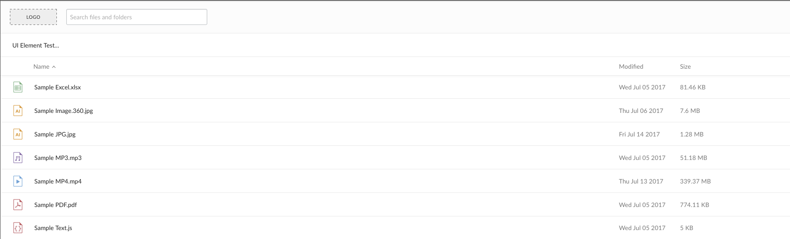

# ロゴのカスタマイズ

それぞれのBox UI Elementsでは、埋め込まれたコンテナの左上隅に配置するカスタムロゴを指定できます。

<ImageFrame border>



</ImageFrame>

デフォルトでは、それぞれのUI Elementでロゴとして汎用的なプレースホルダが使用されます。このプレースホルダは、Boxのロゴまたはカスタムロゴ(会社のロゴなど)に置き換えられます。

UI Elementにロゴを追加するには、JavaScript設定コードでロゴのURLをオプションとして指定します。コンテンツプレビューUI Elementを使用したこの追加方法の例を以下に示します。

```js
var preview = new Box.Preview();
preview.show(fileId, accessToken, {
    container: '.preview-container',
    sharedLink: 'https://app.box.com/v/foo',
    sharedLinkPassword: 'bar',
    collection: [FILE_ID, '123', '234', ...],
    header: 'light',
    logoUrl: 'http://i.imgur.com/xh8j3E2.png',
    showAnnotations: true,
    showDownload: true
});
```

<Message>

# Boxのロゴ

UI ElementにBoxのロゴを表示するには、文字列`box`を`logoURL`オプションとして指定してください。

</Message>

## 画像サイズ

画像ファイルは、高さの最大値32ピクセル、幅の最大値80ピクセルに収まります。画像がそれより大きい場合は、このサイズに合わせて縮小されます。
