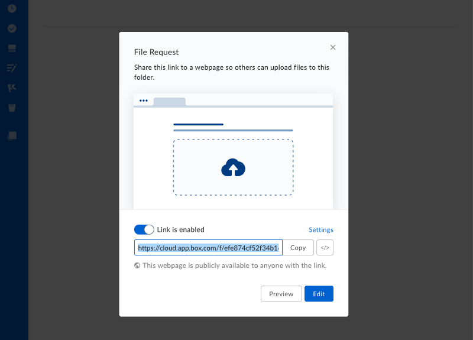

---
related_endpoints:
  - post_file_requests_id_copy
related_guides:
  - file-requests/copy
required_guides: []
related_resources:
  - file_request
category_id: file-requests
subcategory_id: null
is_index: false
id: file-requests/template
rank: 1
type: guide
total_steps: 5
sibling_id: file-requests
parent_id: file-requests
next_page_id: file-requests/copy
previous_page_id: ''
source_url: >-
  https://github.com/box/developer.box.com/blob/main/content/guides/file-requests/1-template.md
fullyTranslated: true
---
# テンプレートのファイルリクエストの作成

現在、このAPIで可能なのは、別のフォルダに関連付けられた既存のファイルリクエストをコピーして新しいファイルリクエストを作成することだけです。テンプレートのファイルリクエストを使用したテンプレートフォルダの作成に関する以下のガイドを確認してください。

## 1. テンプレートフォルダ

最初に、テンプレートのファイルリクエストを関連付けることができるテンプレートフォルダを作成します。これは実際にはどのフォルダでもかまいませんが、この目的でのみ使用されるフォルダを使用することをお勧めします。

フォルダはBoxウェブインターフェースまたはモバイルインターフェース、あるいは[`POST /folders`](e://post_folders) APIを使用して作成できます。

<Message notice>

サーバー側JWT認証を使用する場合は、アプリケーションの[サービスアカウント](page://platform/user-types/#service-account/)が所有するフォルダを作成することをお勧めします。こうすることで、通常のBoxユーザーが誤ってこのフォルダを削除することはなくなります。

</Message>

## 2. テンプレートのファイルリクエスト

ファイルリクエストを作成するには、ウェブアプリのテンプレートフォルダに移動し、ページの上部にある3つの点をクリックします。その後、メニューから \[**ファイルリクエスト**] を選択します。

<ImageFrame center shadow>


</ImageFrame>

次の設定パネルで、\[**編集**] ボタンをクリックして、ファイルリクエストの設定ページにアクセスします。

<ImageFrame center shadow>



</ImageFrame>

設定ページで、ページを保存する前に、タイトルと説明を設定できます。

このページには、URLに含まれるファイルリクエストのIDも表示されます。URLの末尾の数字がファイルリクエストのIDなので、このURLを書き留めてください。これは、APIを使用する際に必要になります。

```sh
https://*.app.box.com/filerequest/2338423584

```

<Message warning>

テンプレートフォルダがJWTユーザーに属している場合は、管理対象Boxユーザーをフォルダに[招待](e://post-collaborations)し、そのフォルダがウェブアプリに表示されるようにする必要があります。自分自身をフォルダに招待すると、自分でこのアプリを使用してファイルリクエストをフォルダに追加できます。

</Message>

## 3. テンプレートの使用

テンプレートのファイルリクエストを使用すると、[`POST /file-requests/:id/copy`](e://post_file_requests_id_copy) APIによって新しいコピーを作成できます。新しいフォルダのIDを取得したら、[1回のAPIコール](g://file-requests/copy)で既存のリクエスト (タイトル、説明、フォームの設定を含む) を新しいフォルダにコピーできます。
