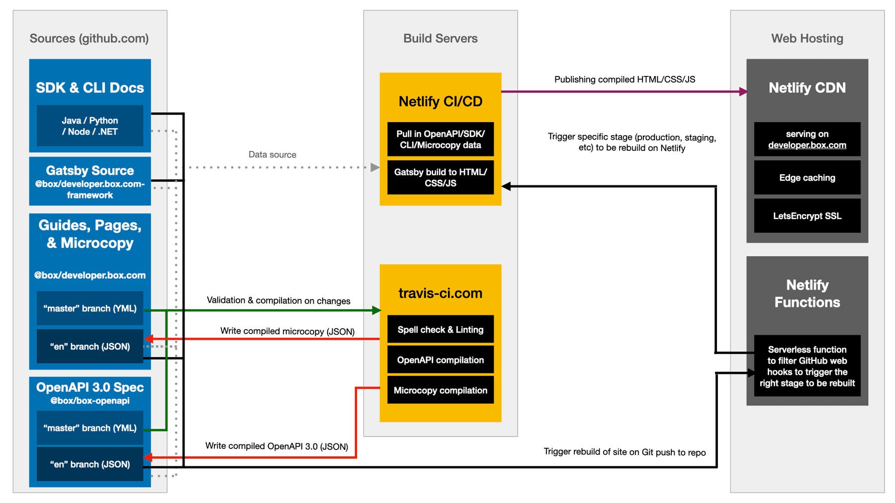

<!-- does not need translation -->

# 開発者向けドキュメントのアーキテクチャ

新しい[開発者向けドキュメント][developer documentation]サイトのビルドシステムの概要を以下に示します。

## アーキテクチャの概要

開発者向けドキュメントのビルドアーキテクチャは、3つの部分に分かれています。

* 開発者向けドキュメントのビルドに使用されたソースの検証と解決
* ソースが変更されたときのソースの取得とサイトのコンパイル
* Boxのホスティングプロバイダへのサイトの公開

<ImageFrame center shadow border>

</ImageFrame>

## ステージの概要

以下の表に、現在展開されているすべてのステージの概要と、各ステージでのソースの取得元を示します。

<!-- markdownlint-disable line-length -->

| ソース                             | 実稼動環境                                   | ステージング                                     | 日本                                      |           |
| ------------------------------- | --------------------------------------- | ------------------------------------------ | --------------------------------------- | --------- |
|                                 | `developer.box.com`, `box.dev`          | `staging.developer.box.com`                | `ja.developer.box.com`                  | `box.dev` |
| OpenAPI                         | `@box/openapi#main`                     | `@box/openapi#staging`                     |                                         |           |
| OpenAPI (コンパイル済み) (英語)          | `@box/openapi#en`                       | `@box/openapi#en-staging` `@boxopenapi#jp` |                                         |           |
| MicrocopyとGuides (英語)           | `@box/developer.box.com#main`           | `@box/developer.box.com#staging`           |                                         |           |
| MicrocopyとGuides (コンパイル済み) (英語) | `@box/developer.box.com#en`             | `@box/developer.box.com#en-staging`        | `@box/developer.box.com#jp`             |           |
| Gatsbyサイト                       | `@box/developer.box.com-framework#main` | `@box/developer.box.com-framework#staging` | `@box/developer.box.com-framework#main` |           |

<!-- markdownlint-enable line-length -->

## 概要ビデオ

以下のビデオでは、開発者向けドキュメントサイト、ビルドシステム、およびサービスの概要を紹介しています。

* [概要に関する座談会][High level fireside chat]
* 詳細な技術分析:
* [録画][Screen recording]
* [音声のみ][Audio only]

[developer documentation]: https://developer.box.com

[High level fireside chat]: https://cloud.box.com/s/bf7yfygd56ffes5awyw7xr5n7hrg3tiz

[Screen recording]: https://cloud.box.com/s/lmcj5kamjsxxwfad08d0iy78jmzsk7be

[Audio only]: https://cloud.box.com/s/mtbfmfwgxm4sn0m0xfz92rzlrv3239bh
