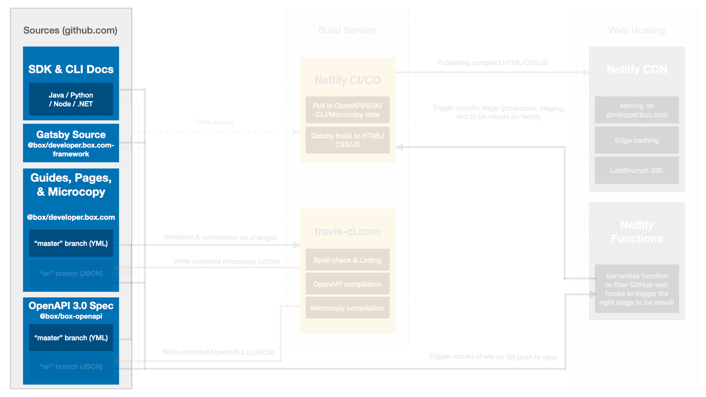

<!-- does not need translation -->

# ソース

(Developer Relationsチームと協力して) Technical Publicationsチームや他のチームが管理する一連のソースは、Box Developerドキュメントのコンテンツをビルドするために使用されます。このソースはGitHubリポジトリに保存されています。

<ImageFrame center shadow border>

</ImageFrame>

## Tech PubsチームとDev Relチームが管理するサイトのソース

* [Box Platform API][Box Platform API] - Box Platform APIのOpen API 3.0仕様を表す一連のファイル。これらのファイルには、APIエンドポイントの最新コンテンツが記述されています。
* [developer.box.com、box.dev][developer.box.com, box.dev] - Developerドキュメントサイトのマイクロコピー、ロケール構成、ガイド、ページを表す一連のファイル。
* [フレームワーク][Framework] - DeveloperドキュメントサイトのGatsbyテンプレートとインポータのソース。
* [変更ログ][Changelog] - Box Platform (API、SDK、UI Elements、CLI) に関するすべてのリリースノートに対応したマークダウンソース。

## 他のチームが管理するサイトのソース

* [CLI][CLI] - Box CLIのコードサンプルを含むソースコードとドキュメント。
* [Python SDK][Python SDK] - Box Python SDKのコードサンプルを含むソースコードとドキュメント。
* [Node SDK][Node SDK] - Box Node SDKのコードサンプルを含むソースコードとドキュメント。
* [Java SDK][Java SDK] - Box Java SDKのコードサンプルを含むソースコードとドキュメント。
* [.NET SDK][.NET SDK] - Box .NET SDKのコードサンプルを含むソースコードとドキュメント。

## ソースの検証

OpenAPI 3.0仕様は、コントリビュータが編集しやすくなるように個別のファイルに保持されています。何らかの変更があると、ソースは検証およびテストされてから解決されます。

Boxでは、OpenAPI 3.0仕様について、以下のことを確認しています。

* ファイルがOpenAPI 3.0仕様に準拠している
* すべての説明とタイトルが`en-US`ロケールのスペルチェックに合格している
* ドキュメントに不適切な用語が含まれていない
* サイトのビルドに必要なすべての情報が仕様に含まれている

すべての検証は、Jest、Spectral、AlexJS、GitHub Actionsを使用して処理されます。ビルドのステータスはGitHubと`#devrel-build` Slackチャンネルで監視できます。

## ソースの解決

**OpenAPI 3.0仕様**、**Microcopy、ロケール**、**ガイド**のソースは複数のファイルとして公開されているため、[StoplightのJSONリゾルバ][Stoplight's JSON Resolver]を使用して1つのファイルにコンパイルされます。この解決されたコンテンツは、英語コンテンツのソースの`en`ブランチに戻されます。その後、翻訳チームがそのファイルを取得して翻訳し、各翻訳用に追加されたブランチ (`jp`など) に書き込みます。

[Box Platform API]: https://github.com/box/box-openapi

[developer.box.com]: https://github.com/box/developer.box.com

[Framework]: https://github.com/box/developer.box.com-framework

[Changelog]: https://github.com/box/box-developer-changelog

[CLI]: https://github.com/box/boxcli

[Python SDK]: https://github.com/box/box-python-sdk

[Node SDK]: https://github.com/box/box-node-sdk

[Java SDK]: https://github.com/box/box-java-sdk

[.NET SDK]: https://github.com/box/box-windows-sdk

[Stoplight's JSON Resolver]: https://github.com/stoplightio/json-ref-resolver
