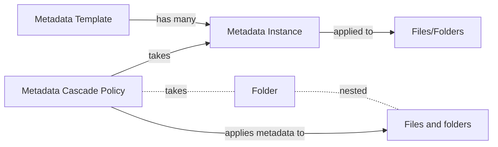

# メタデータ

メタデータを使用すると、ユーザーやアプリケーションは、ファイルやフォルダに関連付けられたカスタムデータを定義、格納できます。

<ImageFrame border center>

</ImageFrame>

メタデータは、ファイルまたはフォルダに割り当てられているキー/値ペアで構成されます。たとえば、重要な契約には、`clientNumber: 820183`と`clientName: bioMedicalCorp`のキー/値ペアが使用されている場合があります。

## メタデータの用語

メタデータを操作するには、開発者は異なる数種類のリソースを使用する必要があります。

* **テンプレート:** [メタデータテンプレート][template]には、ファイルに割り当てることができる再利用可能な一連のキー/値ペアが記載されています。たとえば、`invoiceData`テンプレートでは、請求書に関するデータを保持するため、請求書IDと顧客IDのフィールドが設定されています。
  * **フィールド:** [メタデータテンプレートフィールド][field]には、メタデータテンプレート内の特定のデータが記載されています。たとえば、請求書のIDを`invoiceData`テンプレートの`id`フィールドとして表すことができます。
* **インスタンス:** [メタデータインスタンス][instance]には、各フィールドに割り当てられている値など、テンプレートとファイルやフォルダ間の関係が記載されています。たとえば、ユーザーは、`invoiceData`メタデータテンプレートをファイルに割り当て、2つの値を指定しています。この場合、1つは請求書ID用、もう1つは顧客ID用です。
* **カスケードポリシー**: [メタデータカスケードポリシー][cascade]には、フォルダに適用されているメタデータインスタンスを、そのフォルダ内の項目にどのように適用するかが記載されています。たとえば、ユーザーは、同じ`invoiceData`メタデータテンプレートをプロジェクトフォルダに割り当てると(2つの値を含む)、そのプロジェクトフォルダ内のすべてのファイルとフォルダに自動的に適用できます。
* **クエリ:** [メタデータクエリ][query]を使用すると、ファイルやフォルダに追加されているメタデータを検索して、そのファイルやフォルダを見つけることができます。たとえば、特定のIDが付いた請求書についてすべてのファイルを検索するには、クエリで、その請求書に適用されている`invoiceData`テンプレートと値`id = :id` (この場合、`:id`は請求書の値)が設定されたすべてのファイルとフォルダを検索することができます。

## メタデータの目的

メタデータは多くの目的で使用できます。会社がマーケティングチーム向けにデジタルアセットを効率よく編成する場合もあれば、開発者がワークフローや承認の促進のような高度なコンテンツ機能を提供する場合もあります。

たとえば、`marketingCollateral`テンプレートでは、特定のマーケティングコンテンツを使用する状況とタイミングを定義できます。ユーザーは、Boxウェブアプリでテンプレートのレプリゼンテーションを確認すると同時に、ファイルのプレビューに移動できます。

詳細については、[Boxコミュニティの記事][community]を参照してください。

[community]: https://community.box.com/t5/Organizing-and-Tracking-Content/Using-Metadata/ta-p/30765

[template]: g://metadata/templates

[instance]: g://metadata/instances

[cascade]: g://metadata/cascades

[field]: g://metadata/fields

[query]: g://metadata/queries
