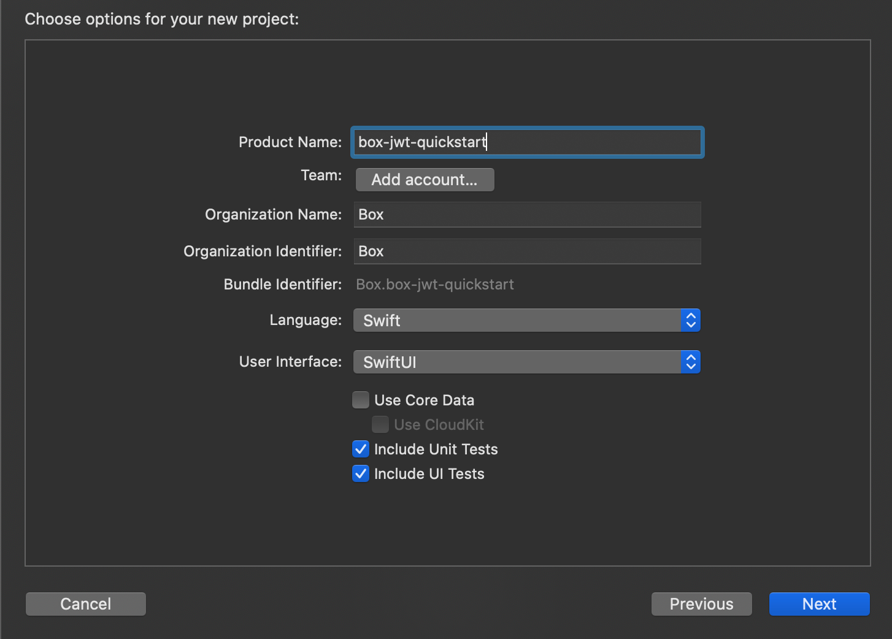

# iOSアプリの作成

Box iOS SDKをインストールする前に、依存関係を追加できるiOSアプリケーションを用意しておく必要があります。ここでは、新しい空のアプリケーションを作成します。

## iOSアプリのセットアップ

このクイックスタートガイドでは、iOSアプリケーションの作成と編集にXcodeというツールを使用します。Xcodeをお持ちでない場合は、[Appleの開発者向けサイト](https://developer.apple.com/xcode/)からダウンロードしてください。

今回Xcodeでのアプリケーションの作成が初めてである場合も、すでにアプリケーション開発の経験がある場合も、Box iOS SDKと新しい空のアプリケーションの統合から開始します。

1. Xcodeを起動します。
2. 上部のメニューから、\[**File**] -> \[**New**] -> \[**Project...**]を選択します。
3. \[**Single View App**]のオプションを選択します。
   <ImageFrame center>

</ImageFrame>

4. `Product Name`、`Organization Identifier`、`Organization Name`など、アプリケーションの設定情報を入力します。
   <ImageFrame center>

</ImageFrame>

5. アプリケーション用のローカルのストレージの場所を選択し、\[**Create**]をクリックします。

</Choice>

## まとめ

* Xcodeで新しい空のiOSアプリケーションが作成されました。

<Next>

空のiOSアプリケーションを作成しました

</Next>
