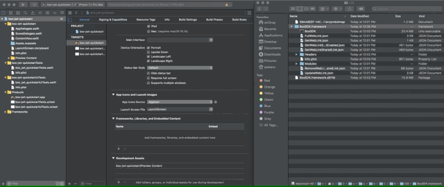

# iOS SDKのインストール

iOSアプリケーションを設定したら、使用可能なパッケージマネージャオプションのいずれかを使用して、必要な**Box iOS SDK**依存関係をプロジェクトにインポートする必要があります。

## 使用するパッケージマネージャの選択

<Grid columns="3">

<Choose option="ios.pm_type" value="carthage" color="blue">

# Carthage

Carthageは、SwiftプロジェクトおよびObjective-C Cocoaプロジェクト向けの分散型の依存関係マネージャです。これは、オープンソースで、Swiftで構築されています。

</Choose>

<Choose option="ios.pm_type" value="cocoapods" color="none">

# CocoaPods

CocoaPodsは、SwiftプロジェクトおよびObjective-C Cocoaプロジェクト向けの集中型の依存関係マネージャです。これは、オープンソースで、Rubyで構築されています。

</Choose>

<Choose option="ios.pm_type" value="swift" color="blue">

# Swift Package Manager

Swift Package Managerは、ソースコードの配布を管理するためのツールで、自作のコードの共有や他の人のコードの再利用を容易にします。

</Choose>

</Grid>

<Choice option="ios.pm_type" value="carthage" color="blue">

# Carthageを使用してiOS SDKをインストールする

1. ターミナルウィンドウから`brew install carthage`を実行して、Carthageをインストールします。他のインストール方法については、[Carthageのドキュメント][carthage-docs]を参照してください。
2. `{APPNAME}.xcodeproj`がある、iOSアプリケーションフォルダのルートに、`Cartfile`という名前の新しいファイルを拡張子なしで作成します。
3. `Cartfile`を開き、`git "https://github.com/box/box-ios-sdk.git" ~> 3.0`を使用して**Box iOS SDK**の依存関係を追加した後、ファイルを保存して閉じます。
4. ターミナルから、`Cartfile`が存在するフォルダで、`carthage update --platform iOS`を実行してすべての依存関係を更新します。このディレクトリに`Cartfile.resolved`ファイルと`Carthage`ディレクトリが作成されます。 
5. Finderまたはエクスプローラウィンドウで、**Carthage** -> **Build** -> **iOS**ディレクトリを読み込みます。ここには、`BoxSDK.framework`という名前のフレームワークファイルがあります。このウィンドウは、次の手順でこのフレームワークをプロジェクトに追加する際に使用するため、開いたままにしておきます。
6. Xcodeプロジェクトで、左側のプロジェクトナビゲータの上部にあるアプリケーションの名前をクリックします。表示されるコンテンツで、\[**TARGETS**]オプションの下にあるプロジェクトの名前をクリックします。\[**Frameworks, Libraries, and Embedded Content**]まで下にスクロールします。 
7. Finderウィンドウから`BoxSDK.framework`をフレームワークセクション上にドラッグします。

<ImageFrame center>

</ImageFrame>

</Choice>

<Choice option="ios.pm_type" value="cocoapods" color="blue">

# CocoaPodsを使用してiOS SDKをインストールする

1. ターミナルウィンドウから`sudo gem install cocoapods`を実行して、CocoaPodsをインストールします。
2. `APPNAME.xcodeproj`がある、iOSアプリケーションフォルダのルートで、`pod init`を実行して、スマートデフォルトで新しい`Podfile`を作成します。
3. `Podfile`を読み込み、`pod 'BoxSDK', '~> 3.0'`を実行して`# Pods for {APPNAME}`の下に**Box iOS SDK**の依存関係を追加した後、保存して閉じます。
4. ターミナルから、`Podfile`が存在するフォルダで、`pod install`を実行してすべての依存関係をダウンロードします。
5. `open {APPNAME}.xcworkspace`を実行して`.xcworkspace`をXcodeで開き、プロジェクトをビルドします。

</Choice>

<Choice option="ios.pm_type" value="swift" color="blue">

# Swift Package Managerを使用してiOS SDKをインストールする

1. Xcodeプロジェクトで、左側のプロジェクトナビゲータの上部にあるアプリケーションの名前をクリックします。表示されるコンテンツで、\[**PROJECT**]オプションの下にあるプロジェクトの名前をクリックします。
2. \[**Swift Packages**]をクリックし、`+`をクリックしてパッケージを追加します。
3. リポジトリのURL `https://github.com/box/box-ios-sdk.git`を入力し、\[Next]をクリックします。
4. デフォルト設定のままにし、\[Next]をクリックしてインポートを終了します。

<ImageFrame center>

</ImageFrame>

</Choice>

## まとめ

* Carthageを使用したiOS依存関係のインストールを選択しました。
  * Carthageをインストールしました。
  * Box iOS SDKの依存関係を持つ`Cartfile`を作成しました。
  * iOS SDKの依存関係をインストールしました。
  * 構築した依存関係をXcodeプロジェクトのフレームワークリストに手動でインポートしました。
* **CocoaPods**の使用を選択しました。
  * CocoaPodsをインストールしました。
  * Box iOS SDKの依存関係を持つ新しい`Podfile`を作成しました。
  * iOS SDKの依存関係をインストールしました。
  * Xcodeでプロジェクトをビルドしました。
* **Swift Package Manager**の使用を選択しました。
  * SwiftパッケージにiOS SDKの`.git`リポジトリをインポートしました。

<Observe option="ios.pm_type" value="carthage,cocoapods,swift">

<Next>

Box iOS SDKの依存関係をインストールしました

</Next>

</Observe>

[carthage-docs]: https://github.com/Carthage/Carthage#installing-carthage
