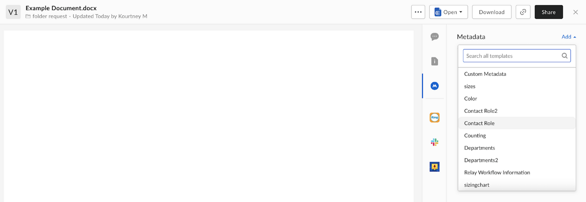
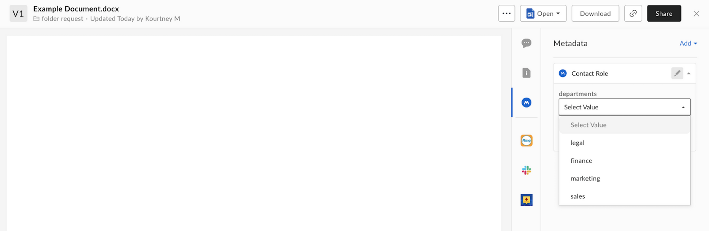
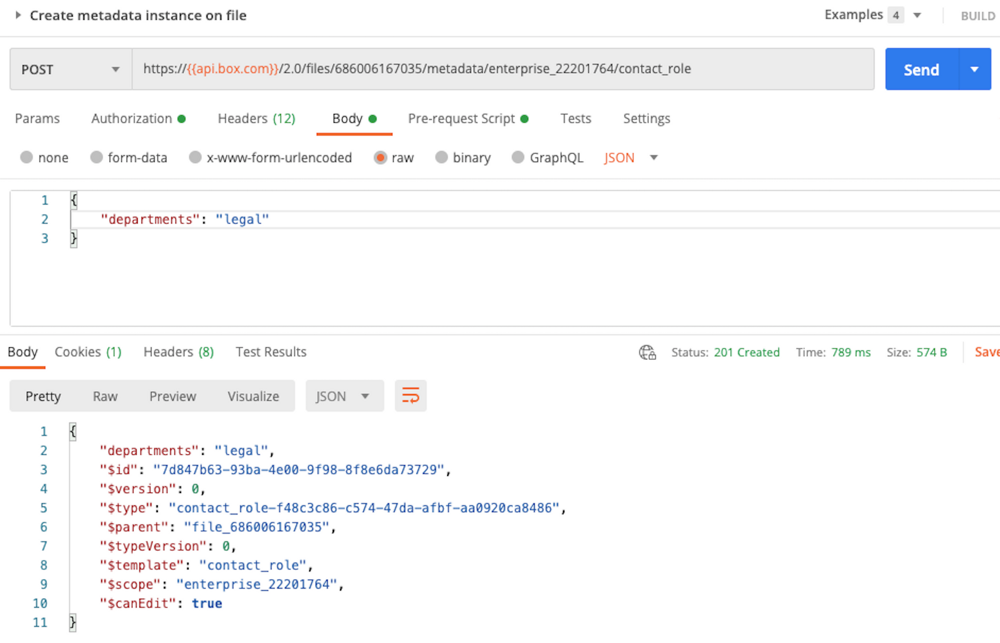

# ファイルへのメタデータテンプレートの追加

メタデータテンプレートは、手順4で結果が得られるように1つ以上のファイルに適用する必要があります。ファイルにメタデータを追加するには、UIを使用する方法とAPIを使用する方法の2とおりあります。

## UI

UIを使用してファイルにメタデータを適用するには、ファイルに移動し、プレビューを開きます。\[**メタデータ**] タブを使用して、\[**追加**] をクリックします。手順1で作成したメタデータテンプレートを見つけて、値を選択し、必ず \[**保存**] をクリックします。

<ImageFrame center>

</ImageFrame>

## API

ファイルにメタデータテンプレートを追加するには、[ファイルにメタデータインスタンスを作成エンドポイント][add-metadata]を使用する必要があります。また、前の手順で確認した`scope`および`templateKey`テンプレート値も必要になります。上記のUIを使用した方法で示したのと同じメタデータを適用するAPIコールの例を以下に示します。

<ImageFrame center>

</ImageFrame>

<Message warning>

規模を考慮したことにより、メタデータテンプレートが10,000を超えるファイルまたはフォルダに適用されると、403エラーが返されます。

</Message>

<Next>

1つ以上のファイルにテンプレートを適用しました

</Next>

[add-metadata]: e://post-files-id-metadata-id-id/
