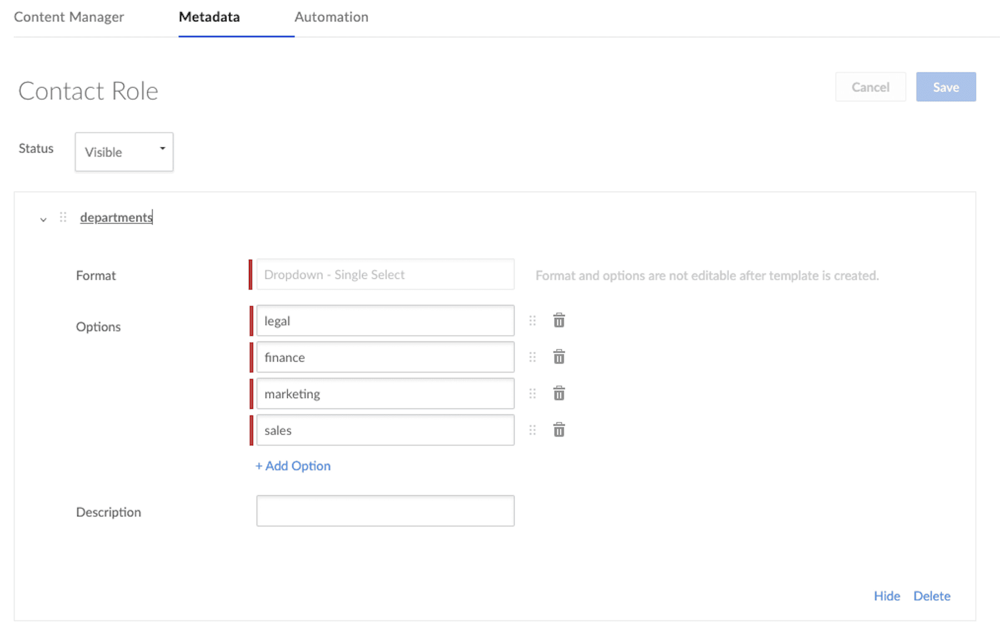

# メタデータテンプレートの作成

新しいメタデータテンプレートを作成するには、管理コンソールを使用する方法とAPIで管理者のアクセストークンを使用する方法の2とおりあります。使用するメタデータテンプレートをすでに作成している場合は、次の手順に進むことができます。

## 管理コンソール

管理コンソールでテンプレートを作成するには、次の場所に移動します。

\[**管理コンソール**] > \[**コンテンツ**] タブ > \[**メタデータ**] > \[**新規作成**]

<ImageFrame center>

</ImageFrame>

<Message warning>

メタデータは、Business Plus以上のアカウント向けの機能です。アカウントをアップグレードするには、Boxアカウントチームまでお問い合わせください。

</Message>

\[**新規作成**] を選択すると、以下に示す、新しいテンプレートを作成するためのフォームが表示されます。\[**ドロップダウン - 単一選択**] 形式を選択します。

<Message warning>

\[ドロップダウン - 複数選択] 形式を選択すると、このクイックスタートの後の手順でクエリの構造が変わります。

</Message>

<ImageFrame center>

</ImageFrame>

## API

APIを使用してメタデータテンプレートを作成するには、**会社のメタデータテンプレートを作成、編集する**権限を持つBox管理者または共同管理者に関連付けられた[アクセストークン][at]が必要です。トークンが誰に関連付けられているかがわからない場合は、[現在のユーザーを取得エンドポイント][current-user]に対してAPIコールを実行してください。これらの要件を満たすトークンを取得するには、管理者または共同管理者としてログインし、[開発者コンソール][dc]でアプリケーションを見つけて、\[**構成**] タブの \[**開発者トークンを生成**] をクリックする方法が最も簡単です。[開発者トークン][dt]は、必ず、このボタンがクリックされたときに開発者コンソールにログインしているユーザーに関連付けられます。

[Postman][postman]および[Box Postmanコレクション][post-collab]を使用している場合に、上記の管理コンソールを使用して作成したのと同じメタデータテンプレートを作成するAPIコールの例を以下に示します。

<ImageFrame center>

</ImageFrame>

<Message tip>

\[ドロップダウン - 単一選択] 以外のテンプレート形式を使用する場合は、APIコールの本文が上記の例とは異なるため、Boxのリファレンスドキュメントを確認してください。

</Message>

このAPIコールに対するレスポンスでは、後で必要になる重要な情報が示されます。UIを使用してテンプレートを作成した場合は、この情報の取得方法を次の手順で確認してください。

<Next>

メタデータテンプレートを作成しました

</Next>

[at]: g://authentication/tokens/

[current-user]: e://get-users-me/

[dc]: https://account.box.com/developers/console

[dt]: g://authentication/tokens/developer-tokens/

[postman]: https://postman.com/

[post-collab]: g://tooling/postman/
