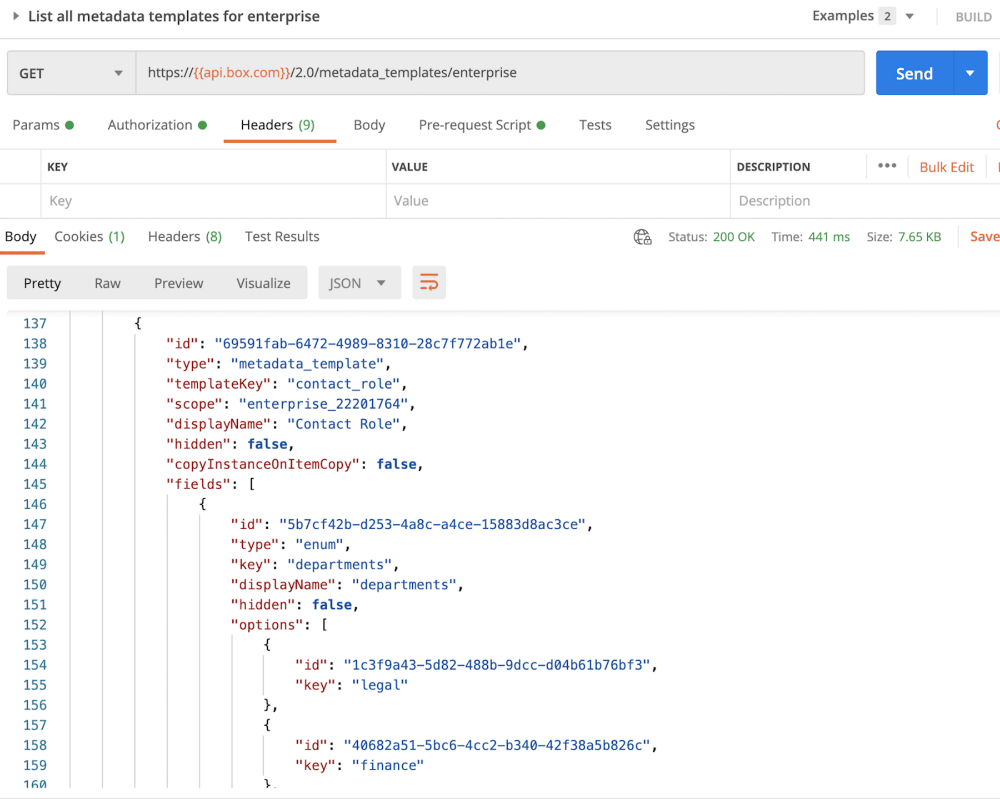

# メタデータテンプレートに関する情報を確認する

<Message warning>

APIを使用してメタデータテンプレートを作成し、成功を示すレスポンスが返ってきた場合は、この手順をスキップできます。

</Message>

管理コンソールでメタデータテンプレートを作成した場合は、**会社のメタデータテンプレートを作成、編集する**権限を持つ管理者または共同管理者の[アクセストークン][at]を取得する必要があります。手順1で説明したとおり、これらの要件を満たすトークンを取得するには、管理者または共同管理者としてログインし、[開発者コンソール][dc]でアプリケーションを見つけて、\[**構成**] タブの \[**開発者トークンを生成**] をクリックする方法が最も簡単です。

以下に示すように、このトークンを使用して、[企業のすべてのメタデータテンプレートのリストを取得エンドポイント][metadata-list]に対してAPIコールを実行すると、テンプレートに関する情報をレスポンス内で確認できます。特に、`scope`と`templateKey`に注意してください。

<ImageFrame center>

</ImageFrame>

<Next>

テンプレートに関する詳細を取得しました

</Next>

[at]: g://authentication/tokens/

[dc]: https://account.box.com/developers/console

[metadata-list]: e://get-metadata-templates-enterprise/
