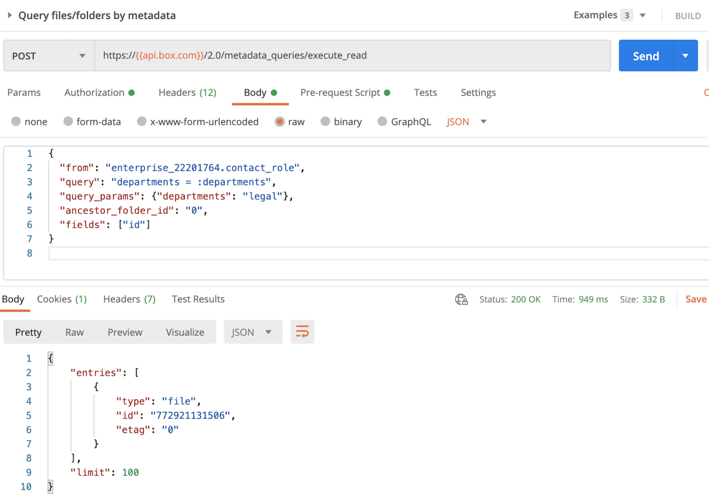

# メタデータクエリAPIの使用

最後に、[メタデータクエリAPIコール][mq]を作成します。このAPIコールの本文の例を以下に示します。

```json
{
  "from": "enterprise_22201764.contact_role",
  "query": "departments = :departments",
  "query_params": {"departments": "legal"},
  "ancestor_folder_id": "0",
  "fields": ["id"]
}

```

このAPIコールでは、以下の条件を満たすファイルIDが返されます。

* Contact Roleテンプレートが適用されている
* departmentsの値がlegalである
* ルートフォルダの下のいずれかの場所にある (「0」は`ancestor_folder_id`であるため)

以下に示すように、この結果、呼び出しは成功し、手順2でテンプレートを追加したファイルに関する情報が表示されます。

<ImageFrame center>



</ImageFrame>

<Next>

検索クエリを使用してコンテンツが見つかりました

</Next>

[mq]: e://post-metadata-queries-execute-read/
